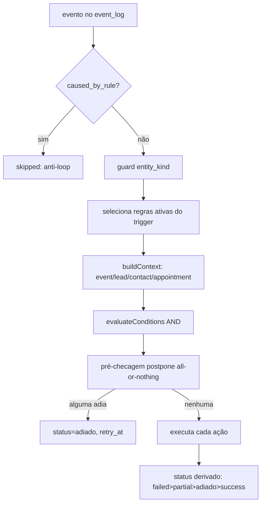
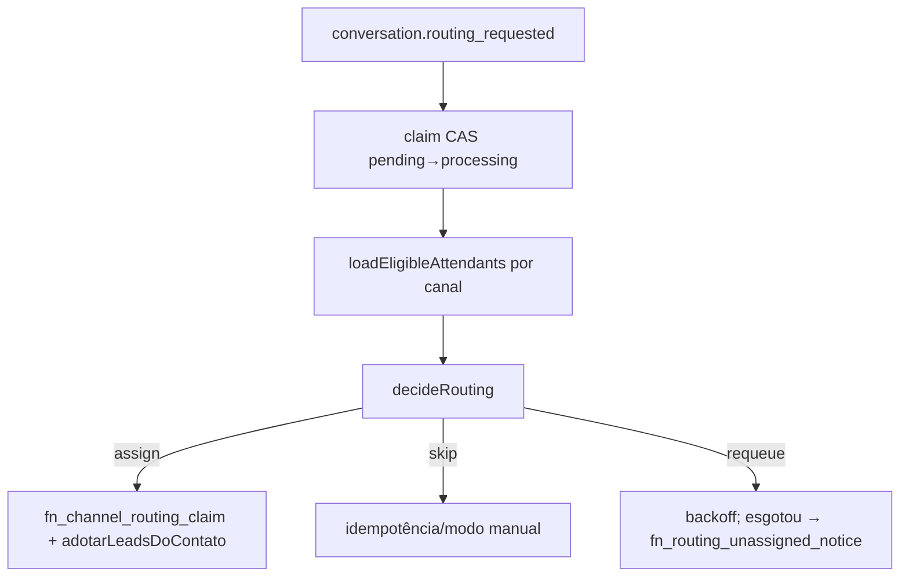
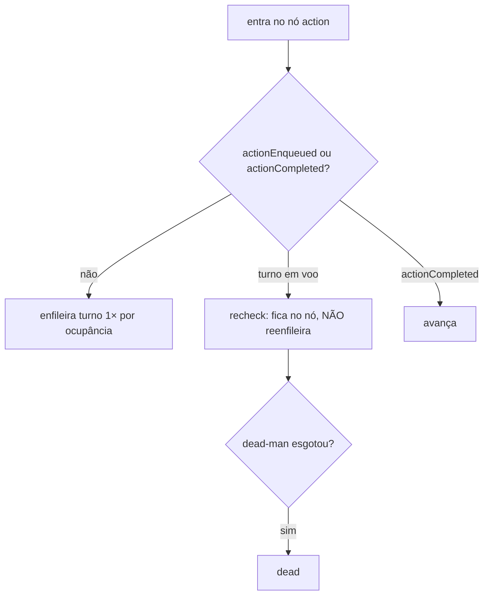
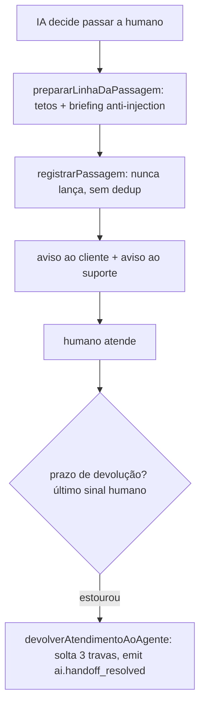

# Automação e Roteamento — Fluxos

> Confiança: 🟢 CONFIRMADO · 🟡 INFERIDO · 🔴 LACUNA.

## Fluxo 1 — Motor de regras por evento


## Fluxo 2 — Roteamento por rodízio


## Fluxo 3 — Follow-up: nó de espera (estado por eventos)
```mermaid
flowchart TD
  A[processEnrollment] --> B[resolveWaitPhase por ${nodeId}:${steps-1}]
  B -->|1ª entrada| C[arma timer / enqueue_turn]
  B -->|2ª entrada após next_eval_at| D[avança pela edge]
  C --> E[applyResult: evento idempotente ${node}:${steps}]
  D --> E
```

## Fluxo 4 — Nó action (envio at-most-once)


## Fluxo 5 — Passagem e devolução

🟢
