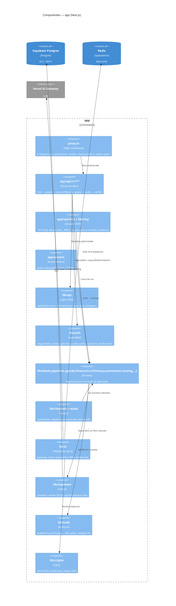
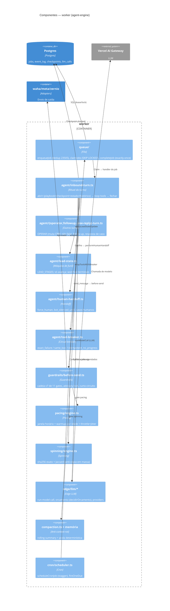

# C4 — Nível 3: Componentes — DeskcommCRM

> Gerado pelo **Arquiteto** (Reversa) · nível **detalhado** · 🟢 CONFIRMADO salvo nota
> Detalha os dois containers mais relevantes: **app** (superfície HTTP + domínio) e **worker**
> (agent-engine). Fonte: `code-analysis.md`, `data-dictionary.md`, `domain.md`.

## A. Container `app` — superfície HTTP + domínio

### Componentes-chave do `app` 🟢

| Componente | Arquivo canônico | Papel |
|---|---|---|
| Borda | `proxy.ts` | Auth de borda, `X-Request-Id`, impersonation |
| Guard RBAC | `lib/auth/require-role.ts` (`requireRole`) | Rank de papéis via `fn_user_role_in_org` |
| Sessão | `lib/auth/server.ts` (`loadAuthUser`, `resolveActiveOrg`) | `getUser()`, org ativa |
| Resposta | `lib/api/wrappers.ts` (`ok()`/`fail()`), `errors.ts` | Formato + `X-Request-Id` |
| Auth dual | `lib/api/auth-dual.ts` | Cookie OU bearer, org de fonte confiável |
| Idempotência | `lib/api/idempotency.ts` | Reserva antes do efeito (409 in_progress vs conflict) |
| Servidor MCP | `lib/mcp/server.ts`, `tools/*` | Pipeline higieniza→ctx→scope+role→handler→motivoDoVazio→audit |
| Clients | `lib/supabase/{browser,server,admin}.ts` | RLS vs service role |

## B. Container `worker` — agent-engine (o ritual do turno)

### Regras estruturais do `worker` 🟢

- **Enviar é sempre `send_message` (tool call)** — texto direto do modelo é descartado (RN-04). Tudo
  passa pela cadeia `before_send` (11 gates, versão 7): `stop, lgpd, pacing, messaging_window,
  spinning, promise, semantic_promise, case_promise, internal_vocabulary, agenda_stall, disclosure`.
- **Fechamento sempre acontece** — o checkpoint é uma 2ª chamada de LLM (`purpose:'checkpoint'`), não
  uma tool (RN-05).
- **Idempotência evento→job** por `unique(organization_id, source_event_id)` + captura `23505`;
  **efeito exactly-once** no `completeJob` (guard de lease). Uma lane por contato por vez.
- **Papel FALAR vs OPERAR** — o operador muta o CRM e nunca fala (separação por ausência da tool
  `send_message`).
- **Máx. 3 envios físicos por turno** (`DEFAULT_MAX_SENDS_PER_TURN`).
- **Orçamento nunca bloqueia sem aviso prévio**; ao estourar, avisa o lead com texto de código, roda
  handoff e re-lança.

## Componentes transversais (ambos os containers) 🟢

| Componente | Onde | Papel |
|---|---|---|
| `lib/event-log` | app + worker | `event_log` + dispatcher; `EventRow`/`HandlerResult` |
| `lib/audit` | app + worker | Trilha fire-and-forget, redação de PII |
| `lib/crypto/aes_gcm` | app + worker | `EncryptedSecret` (IV 12B, tag 16B), `last4` exposto |
| `lib/tempo` / `lib/relogio` | app + worker | Relógio da org (fuso), DST-safe via `Intl` |
| `lib/env` | app + worker | Contrato de env vars (Zod); app não sobe sem obrigatórias |
| `lib/branding` | app | Marca resolve do banco (nunca lança; roda em `layout.tsx`) |

## Nota de confiança
🟢 Componentes e arquivos vêm de `code-analysis.md`. Os diagramas são uma visão de dependência
lógica; a ordem exata dos gates e as regras numéricas estão em `domain.md` e `data-dictionary.md`.
