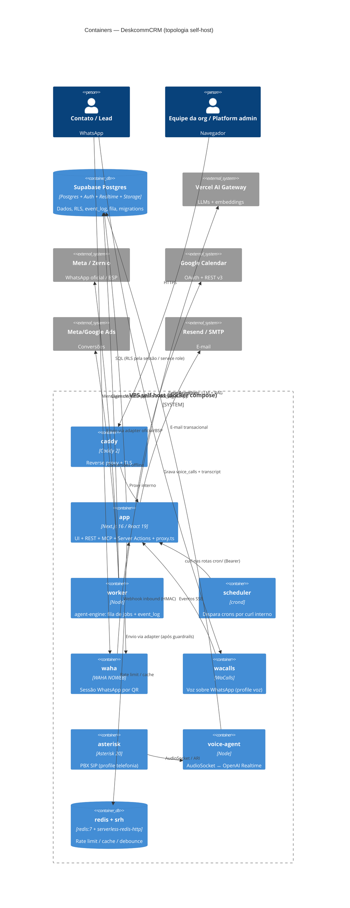

# C4 — Nível 2: Containers — DeskcommCRM

> Gerado pelo **Arquiteto** (Reversa) · nível **detalhado** · 🟢 CONFIRMADO salvo nota
> Containers = unidades executáveis/de dados. Fonte primária: `docker-compose.prod.yml`,
> `inventory.md`, `code-analysis.md`, Dockerfiles (`Dockerfile`, `.worker`, `.scheduler`,
> `.voice-agent`).

## Containers e tecnologia

| Container | Serviço compose | Tecnologia | Responsabilidade |
|---|---|---|---|
| **app** | `app` | Next.js 16 (App Router, Turbopack), React 19, Node ≥22 | UI do tenant/plataforma + route handlers REST + MCP + Server Actions + borda (`proxy.ts`). Pico medido ~335 MiB. |
| **worker** | `worker` | Node (`workers/agent-worker/main.ts`) | Drena a fila de jobs do agent-engine e o `event_log`; roda o ritual do turno. Pico ~230 MiB. |
| **scheduler** | `scheduler` | crond interno batendo curl na rede interna | Dispara crons por minuto (sem `docker.sock`); alimenta `cron/`. |
| **waha** | `waha` | WAHA 2026.7.2 (engine NOWEB) | Sessão WhatsApp por QR; emite webhooks. Pico ~893 MiB. Só rede interna. |
| **redis** | `redis` | redis:7-alpine | Rate limit, cache, debounce (fallback local). |
| **srh** | `srh` | serverless-redis-http | Fala o REST do Upstash sobre o redis local — mantém `@upstash/redis` sem tocar código. |
| **wacalls** | `wacalls` (profile `voz`) | serviço WaCalls | API de voz sobre WhatsApp; só rede interna. |
| **asterisk** | `asterisk` (profile `telefonia`) | Asterisk 20-alpine | PBX SIP (ARI + AudioSocket). |
| **voice-agent** | `voice-agent` (profile `telefonia`) | Node (`workers/voice-agent/`) | Ponte AudioSocket ↔ OpenAI Realtime; transcrição e resposta de voz. Pico ~512 MiB. |
| **caddy** | `caddy` | caddy:2-alpine | Reverse proxy + TLS (quando a VPS não tem proxy próprio; senão `docker-compose.traefik.yml`). |
| **Postgres/Supabase** | externo (Supabase gerenciado ou local) | Postgres + Auth + Realtime + Storage | Plano de dados: RLS, RPCs `SECURITY DEFINER`, `event_log`, fila, migrations. |

## Diagrama de containers

## Comunicação entre containers 🟢

- **app ↔ Postgres:** cliente RLS (sessão) para dados de tenant; service role (admin) filtra
  `organization_id` manualmente. Realtime (`postgres_changes`/`broadcast`) para inbox/kanban.
- **worker ↔ Postgres:** claim de dois estágios na fila (`DISTINCT ON` lane + `FOR UPDATE SKIP
  LOCKED`) e advisory lock por `maxConcurrency`; drena `event_log` com backoff.
- **scheduler → app:** crond bate `curl` nas rotas `app/api/v1/cron/` com Bearer
  `INTERNAL_CRON_SECRET`, sem `docker.sock`. Resolução de 1 min.
- **waha → app:** webhook inbound; **worker → waha:** envio de saída após a cadeia before-send.
- **redis + srh:** o SDK `@upstash/redis` fala REST via `srh`, que traduz para o redis local — assim
  o código não muda entre self-host e Upstash gerenciado.
- **asterisk ↔ voice-agent:** AudioSocket (TCP porta 9092, frame tipo UUID `0x01`) + ARI; profiles
  `telefonia`/`voz` mantêm voz opcional.
- **Redes:** tudo na rede `internal` (bridge); só `caddy` expõe portas ao host. Um teste
  (`portas-do-compose`) reprova quem publicar porta indevida.

## Notas de packaging (ADR-0009) 🟢
Todo serviço de `docker-compose.prod.yml` declara `image:` publicada pelo CI; `build:` é só escape
ao lado. Serviço build-only é pulado por `docker compose pull` e nunca atualizado. Bump de versão
não pode exigir edição manual na VPS. `latest` = topo da `main`; `stable` = última release.

## Nota de confiança
🟢 Serviços, memórias de pico e redes vêm de `docker-compose.prod.yml`. 🟡 A escolha entre Supabase
gerenciado e Postgres local depende da instalação (o baseline serve os dois).
