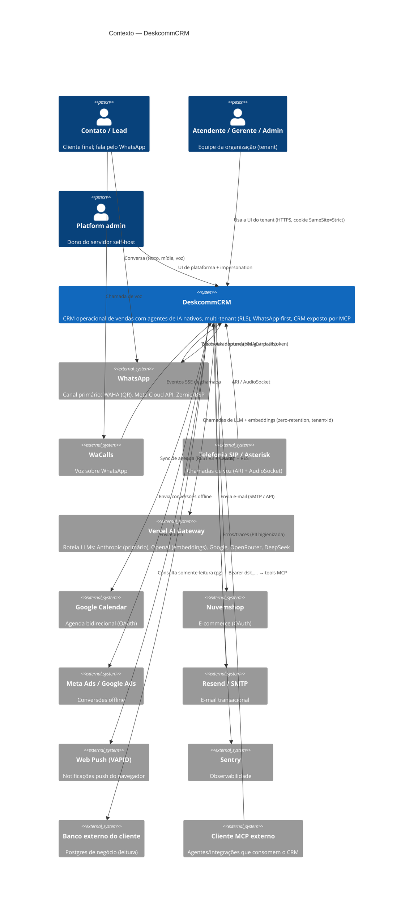

# C4 — Nível 1: Contexto do Sistema — DeskcommCRM

> Gerado pelo **Arquiteto** (Reversa) · nível **detalhado** · 🟢 CONFIRMADO salvo nota
> O sistema no centro, personas ao redor, sistemas externos e protocolos.

## Personas 🟢

| Persona | Quem é | Como usa |
|---|---|---|
| **Contato / Lead** | A pessoa do outro lado da conversa (cliente final) | Fala pelo WhatsApp (texto, mídia, voz); recebe respostas do agente de IA ou de um humano |
| **Atendente** (`agent`) | Membro da org que atende conversas | Inbox, kanban, agenda; assume conversas em handoff |
| **Gerente** (`manager`) | Configura funil, automações, roteamento | Painel do tenant; publica agentes, playbooks, follow-ups |
| **Administrador da org** (`admin`) | Dono da empresa cliente | Configura marca, LGPD, MFA, integrações, orçamento de IA |
| **Platform admin** | Dono do servidor (self-host / revenda) | UI de plataforma (`app/admin/`); impersonation de suporte |
| **Agente de IA** (`ai_operator`) | O agente publicado, não-humano | Consome o CRM via MCP com token efêmero; nunca é papel humano |
| **Operador da VPS** | Quem instala/atualiza o self-host | Roda `install.sh`/`update.sh`; não edita arquivo à mão |

## Diagrama de contexto

## Contratos de entrada (superfícies) 🟢

| Fronteira | Protocolo | Autenticação |
|---|---|---|
| UI do tenant / plataforma | HTTPS | Cookie `sb-deskcomm-auth` (SameSite=Strict, HttpOnly); `getUser()` no server |
| REST `app/api/v1/**` | HTTPS/JSON (snake_case) | Cookie de sessão, ou bearer via `auth-dual.ts` em rotas específicas |
| Webhooks de canal (`webhooks/`) | HTTPS | HMAC `timingSafeEqual` (fail-closed) + path token; `MIN_SECRET_LEN=16` |
| Cron (`cron/`) | HTTPS | Bearer `INTERNAL_CRON_SECRET` (fail-closed) |
| Interno (`internal/`) | HTTPS | Header `x-internal-secret` |
| MCP (`mcp/`) | HTTPS/JSON-RPC | Bearer `dsk_...` (SHA256 contra `api_tokens`), escopos `mcp:read`/`mcp:write`, `role:<r>` |

## Contratos de saída (integrações) 🟢

| Destino | Protocolo | Nota de segurança |
|---|---|---|
| Vercel AI Gateway | HTTP (AI SDK) | Injeta `X-AI-Gateway-Zero-Retention` e `X-AI-Gateway-Tenant-Id` por chamada |
| Provedores LLM (fallback/BYOK) | HTTP | Credencial cifrada AES-GCM; resolução binding → org → padrão |
| Google Calendar | REST v3 + OAuth | Tokens cifrados; escopos `calendar.events`, `calendar.readonly` |
| Nuvemshop | REST + OAuth | State CSRF assinado (TTL 10min); token não expira |
| Meta/Google Ads | REST | Idempotência por `<leadId>:<evento>`; telefone hasheado no transporte |
| E-mail (SMTP/Resend) | SMTP / REST | Senha SMTP cifrada; domínio verificado |
| Egress genérico (webhooks de automação, fetch) | HTTP | `allowlistedFetch` fail-closed, re-checa host no redirect |

## Nota de confiança
🟢 Todas as integrações acima têm código-fonte confirmado nos módulos citados. As personas e papéis
refletem `permissions.md` e `domain.md`.
