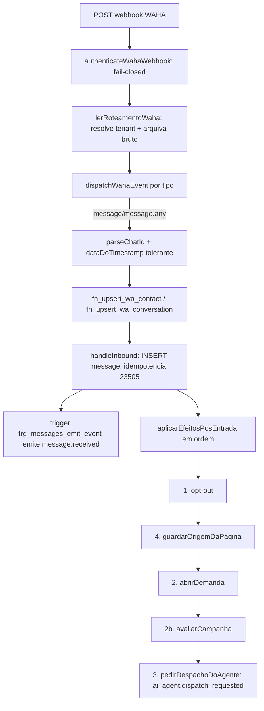
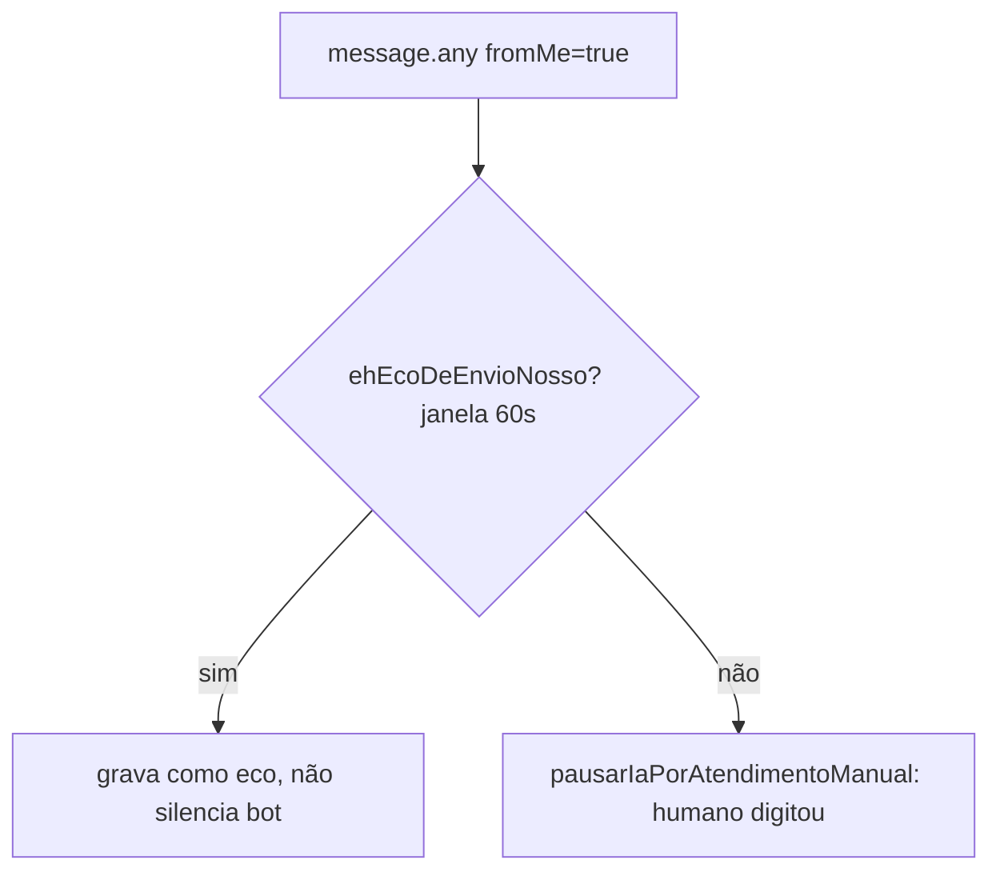
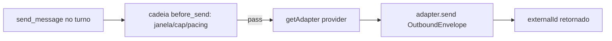
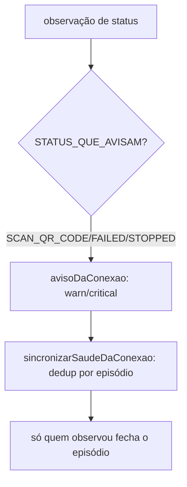

# Canais e Mensageria — Fluxos

> Fluxos distintos não cobertos totalmente no `design.md`. Confiança: 🟢 CONFIRMADO · 🟡 INFERIDO · 🔴 LACUNA.

## Fluxo 1 — Mensagem inbound (WAHA/QR) até o despacho do agente

## Fluxo 2 — Eco de envio pelo celular do operador

Regra: gravar é tolerante (dupe > perda); silenciar é estrito (não silencia na dúvida). 🟢

## Fluxo 3 — Envio de saída (outbound) via adapter

Regra: o adapter não decide janela/cap — só traduz formato e envia. 🟢

## Fluxo 4 — Saúde da conexão

🟢
