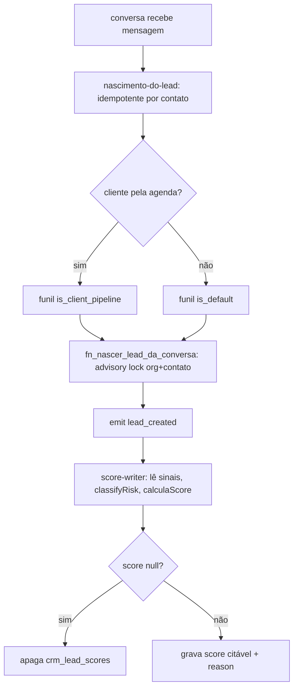
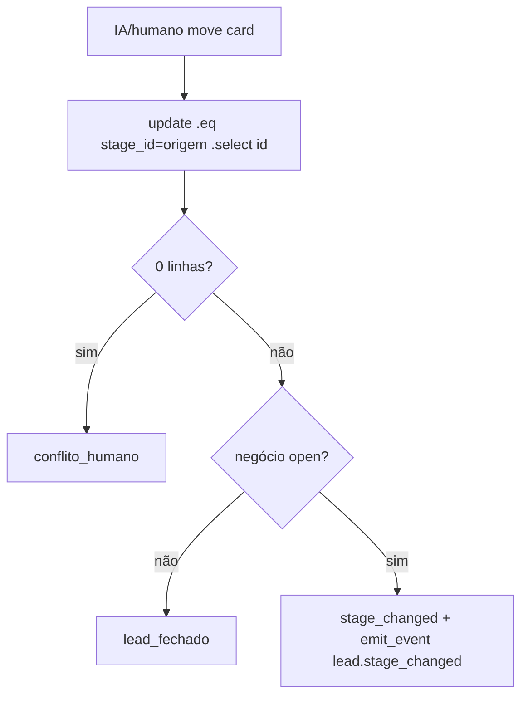
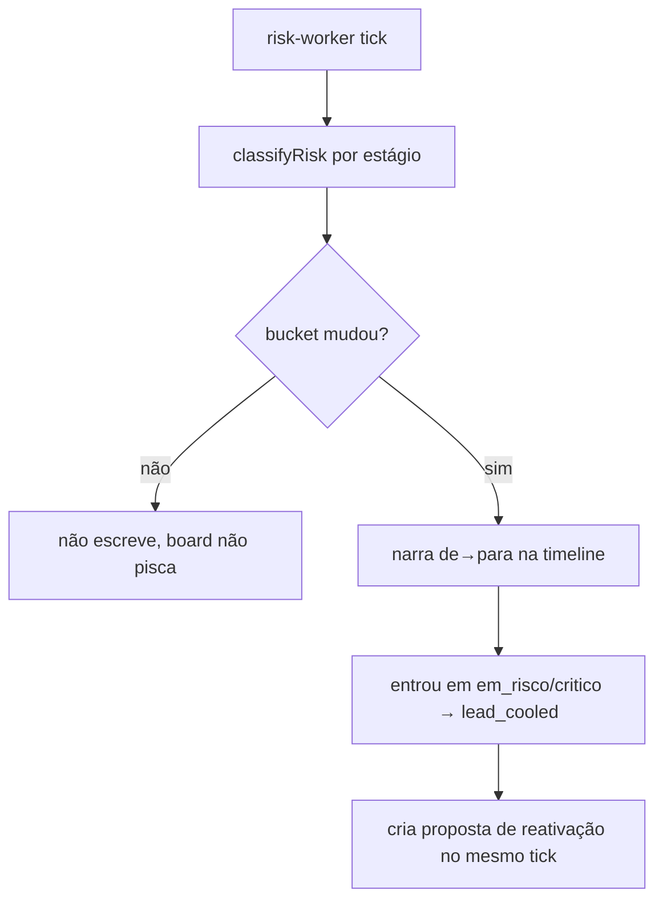
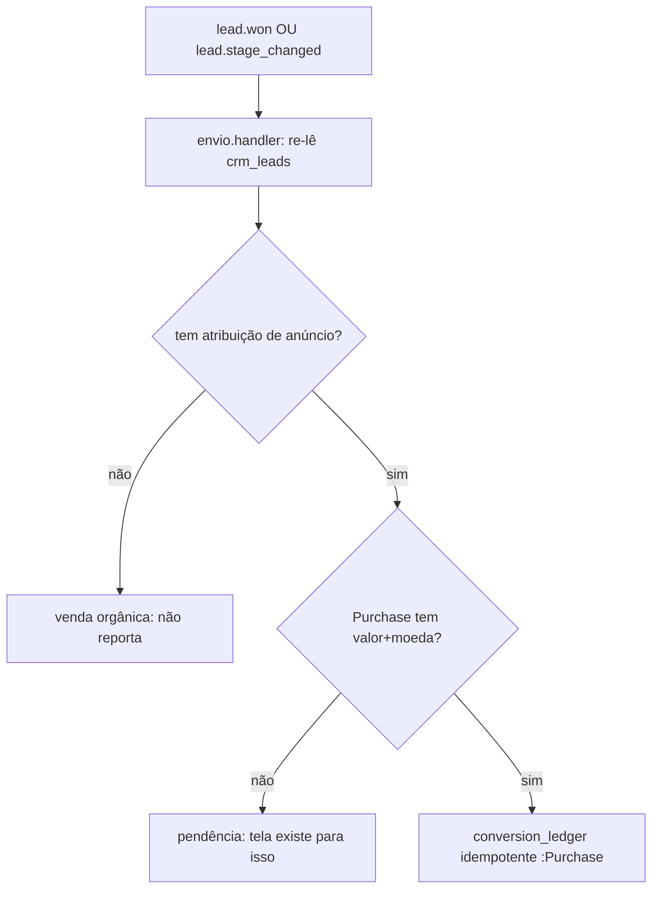
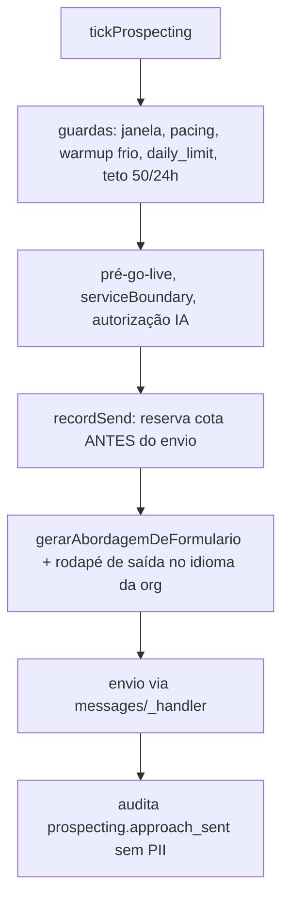

# CRM e Funil — Fluxos

> Confiança: 🟢 CONFIRMADO · 🟡 INFERIDO · 🔴 LACUNA.

## Fluxo 1 — Nascimento do lead até o score

## Fluxo 2 — Movimentação de card com trava otimista

## Fluxo 3 — Esfriamento e reativação (risk-worker)

## Fluxo 4 — Reporte de conversão ao anúncio

## Fluxo 5 — Prospecção fria (a única linha que fala primeiro)

🟢
