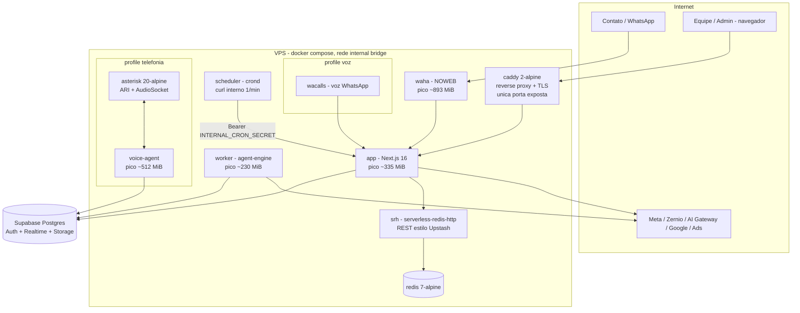

# Deployment & Infraestrutura — DeskcommCRM

> Gerado pelo **Arquiteto** (Reversa) · nível **detalhado** · 🟢 CONFIRMADO salvo nota
> Fonte: `docker-compose.prod.yml`, `docker-compose.traefik.yml`, Dockerfiles
> (`Dockerfile`, `.worker`, `.scheduler`, `.voice-agent`), `Caddyfile`, `hostgator-setup-kit/`,
> `inventory.md`, doutrina de packaging (ADR-0009).

## 1. Modelo de distribuição

🟢 O produto é **self-host em VPS**, distribuído como código + imagens Docker publicadas pelo CI.
Quem instala roda `hostgator-setup-kit/install.sh` (e `update.sh` para atualizar). **Nenhum serviço
de `docker-compose.prod.yml` constrói na máquina do cliente** — cada serviço declara `image:` de uma
imagem publicada; `build:` fica só ao lado como escape (ADR-0009). Publicação é ato do CI
(`.github/workflows/publish-image.yml`), nunca da máquina do dev.

- `latest` = topo da `main`; `stable` = última release; instalação de cliente aponta para número de
  versão.
- Bump de versão **não pode** exigir edição manual de arquivo na VPS.
- O que o self-host aplica no banco é `supabase/baseline.sql` (dump + apêndice idempotente).

## 2. Topologia (docker compose)

## 3. Serviços, imagens e limites 🟢

| Serviço | Imagem / build | Perfil | Memória (pico medido) | Portas |
|---|---|---|---|---|
| `caddy` | `caddy:2-alpine` | sempre | — | única exposta ao host (80/443) |
| `app` | imagem publicada (`Dockerfile`) | sempre | ~335 MiB | só rede interna |
| `worker` | imagem publicada (`Dockerfile.worker`) | sempre | ~230 MiB | interna (healthcheck) |
| `scheduler` | imagem publicada (`Dockerfile.scheduler`) | sempre | — | interna |
| `waha` | WAHA 2026.7.2 (tag fixa upstream) | sempre | ~893 MiB | interna |
| `redis` | `redis:7-alpine` | sempre | — | interna |
| `srh` | serverless-redis-http | sempre | — | interna |
| `wacalls` | imagem WaCalls | `voz` | 256m (limite) | interna |
| `asterisk` | `asterisk:20-alpine` (digest imutável, multi-arch) | `telefonia` | 256m | SIP/RTP conforme config |
| `voice-agent` | imagem publicada (`Dockerfile.voice-agent`) | `telefonia` | 512m | AudioSocket 9092 (interna) |

Volumes: `waha-data`, `waha-media`, `wacalls-data`, `asterisk-data`, `asterisk-logs`, `caddy-data`,
`caddy-config`. Logging: `json-file`, `max-size 10m`, `max-file 3` (evita encher o disco da VPS).

## 4. Rede e exposição 🟢

- Rede única `internal` (bridge). **Só `caddy` publica portas** ao host; um teste
  (`tests/unit/portas-do-compose.test.ts`) reprova quem publicar porta indevida.
- WAHA e WaCalls ficam **só na rede interna**, alcançáveis por `app` e `worker`.
- Em VPS com proxy próprio (Hostinger/Coolify/Dokploy), usa-se **os dois arquivos de compose**:
  `docker compose -f docker-compose.prod.yml -f docker-compose.traefik.yml --env-file .env up -d app`.
  Esquecer o segundo `-f` recria o contêiner sem labels de roteamento → domínio responde 404 com o
  contêiner `healthy` (o healthcheck é um probe TCP interno).

## 5. Cron sem docker.sock 🟢

O `scheduler` roda um `crond` interno que bate `curl` nas rotas `app/api/v1/cron/` pela rede
interna, com Bearer `INTERNAL_CRON_SECRET` (fail-closed). Resolução de 1 min — o menor passo do
crond e o piso de latência dos jobs agendados. Não monta o socket do Docker (superfície de ataque
menor).

## 6. Telefonia (opcional, profiles) 🟢

- `asterisk` (PBX SIP) expõe **ARI** (WebSocket) e **AudioSocket** (TCP 9092, frame tipo UUID
  `0x01`) para o `voice-agent`.
- `voice-agent` faz a ponte AudioSocket ↔ OpenAI Realtime; grava `voice_calls` + `transcript`.
- Áudio μ-law (ITU-T G.711, `BIAS 0x84`, `CLIP 32635`); PCM clampado a `[-1, 1]`.
- Trunk SIP por org em `voip_trunk_settings` (senha AES-GCM); `endpoint_name =
  org-<uuid>-trunk-endpoint` bate com `pjsip.conf`.

## 7. Observabilidade 🟢

- **Sentry** (`@sentry/nextjs`), boot em `instrumentation.ts`/`instrumentation-client.ts` e
  `sentry.{server,edge}.config.ts`. `beforeSend` higieniza PII; `tunnelRoute: "/monitoring"` evita
  ad-blocker.
- Log estruturado JSON (`lib/logger.ts`); `console.log` proibido em código merged.
- `X-Request-Id` em toda resposta, correlacionado com o audit log.

## 8. CI/CD 🟢

`.github/workflows/`: `ci.yml` (verify), `e2e.yml`, `perf.yml` (build-and-size),
`publish-image.yml`, `release.yml`, `relogio.yml`, `acolhida.yml`, `vigia-de-colisao.yml`.
Checks obrigatórios na `main`: `verify`, `build-and-size`, `invariants`, `e2e`, `imagens-ok`.

## 9. Configuração (env) 🟢

Env vars validadas por Zod em `lib/env.ts`; template em `.env.example` (+ `.env.hostgator.example`,
`.env.voip.example`). Segredos notáveis: `INTERNAL_CRON_SECRET`, `INTERNAL_SECRET`,
`IMPERSONATE_COOKIE_SECRET`, `LGPD_SIGNING_KEY`, `UPSTASH_REDIS_*`, `GOOGLE_CALENDAR_CLIENT_ID/SECRET`,
`VAPID_PUBLIC_KEY/PRIVATE_KEY`. App não sobe sem as obrigatórias. `.env*` nunca é lido/logado; só
`.env.example` é template.

## Nota de confiança
🟢 Serviços, imagens, limites de memória, volumes e redes vêm de `docker-compose.prod.yml`. 🟡 A
posição do Postgres (Supabase gerenciado vs local no compose) depende da instalação escolhida pelo
operador — o `baseline.sql` atende ambos.
