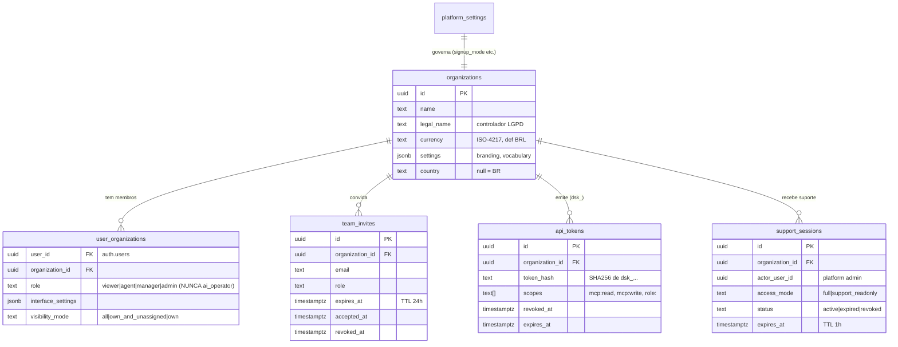
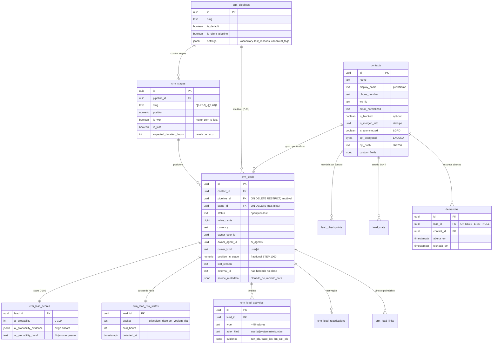
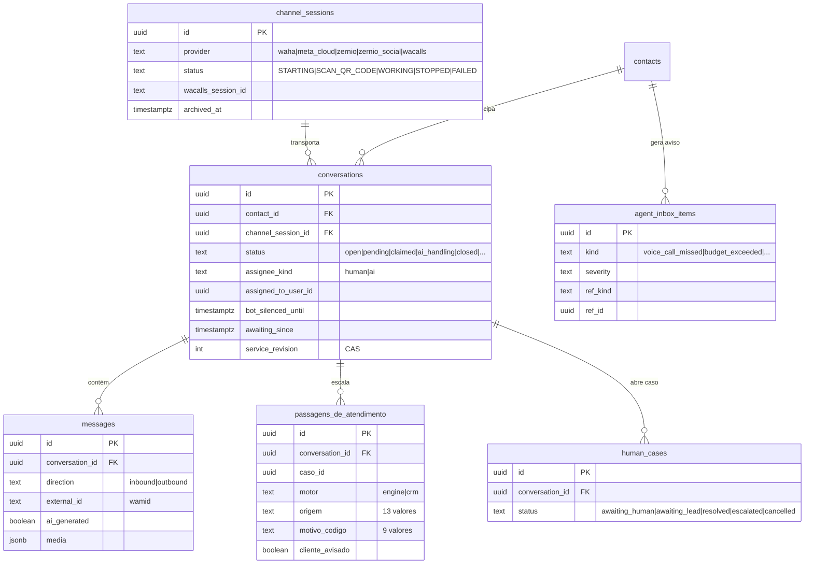
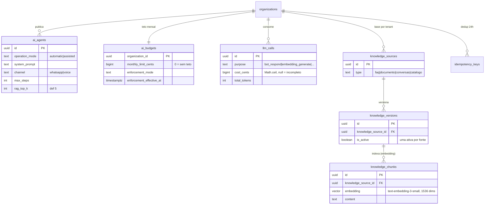
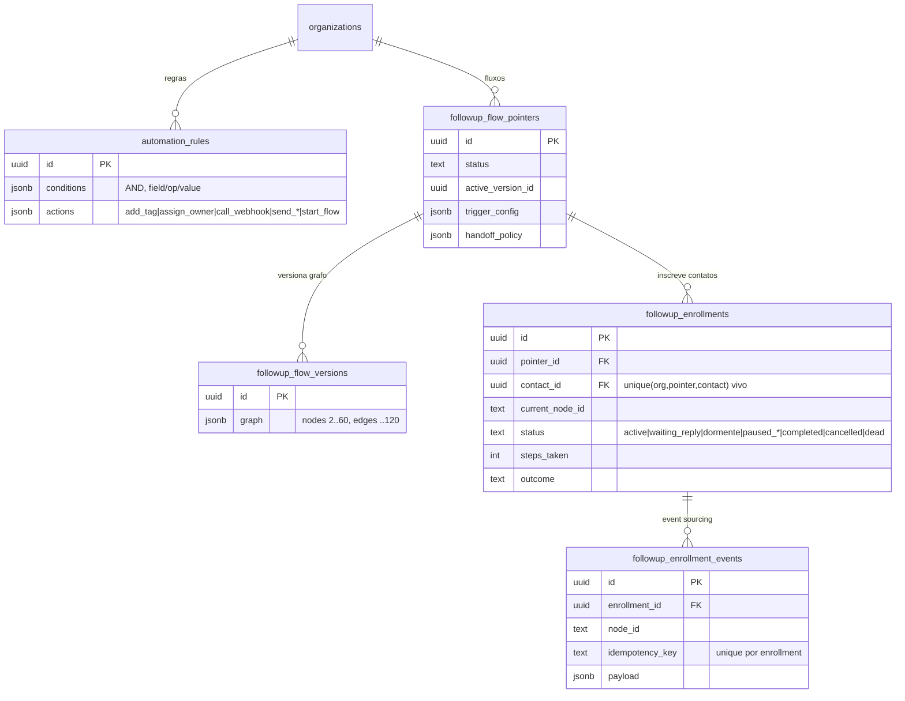
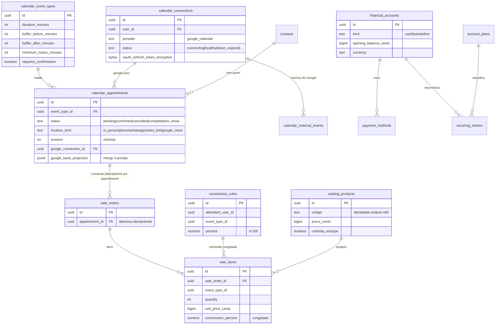
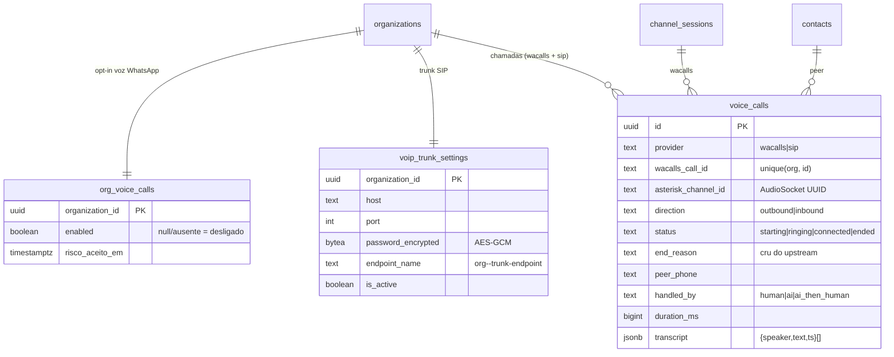
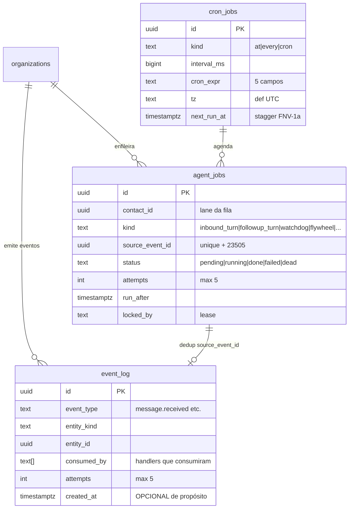
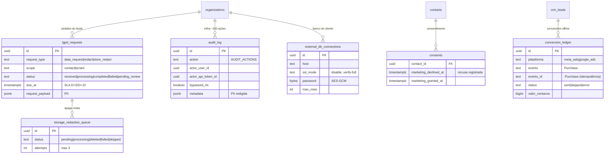

# ERD Completo — DeskcommCRM

> Gerado pelo **Arquiteto** (Reversa) · nível **detalhado**
> 🟢 CONFIRMADO (colunas lidas no código/`data-dictionary.md`) · 🟡 INFERIDO · 🔴 LACUNA
>
> ⚠️ O ERD físico definitivo (todas as colunas, tipos exatos, todos os índices) é trabalho do
> **Data Master**, que lê o schema. Este ERD reflete o que a Escavação e a Interpretação
> confirmaram no código. Toda tabela tenant-aware tem `organization_id uuid not null references
> organizations(id) on delete cascade` (RLS via `fn_user_org_ids()`), omitido nos blocos por
> concisão exceto onde é chave da relação.

## 1. Tenancy, auth e plataforma

## 2. CRM, funil e contatos

## 3. Conversa, canal e escalação

## 4. Agente de IA, orçamento e conhecimento (RAG)

## 5. Automação e follow-up (event sourcing do fluxo)

## 6. Agenda, financeiro e catálogo

## 7. Voz e telefonia

## 8. Plano de trabalho (eventos, fila, cron)

## 9. Compliance e integrações

## Cardinalidades e regras notáveis 🟢

- `crm_leads.pipeline_id` / `stage_id`: **`ON DELETE RESTRICT`** — pipeline é imutável; mover é
  clonar (P-01, ADR-0007).
- `followup_enrollments`: unique parcial **um vivo por (org, pointer, contact)**.
- `crm_lead_scores` / `crm_lead_risk_states`: **1:1** com o lead (PK = `lead_id`); apagadas quando o
  valor vira null.
- `agent_jobs.source_event_id`: **unique** + captura `23505` = idempotência evento→job.
- `knowledge_versions`: índice único **uma ativa por fonte** (activate desativa a anterior antes).
- `sale_orders.appointment_id`: abertura **idempotente** por compromisso.
- `voice_calls`: **`unique(organization_id, wacalls_call_id)`**; `id` interno é o que vaza ao
  frontend, nunca `wacalls_call_id`.

## Lacunas para o Data Master 🔴
- Colunas físicas exatas de `sale_orders`/`sale_items`, `conversations`, `messages`, `ai_agents`
  (só os campos lidos no código estão aqui).
- Tipos SQL exatos, defaults e a lista completa de índices (o código expõe só um subconjunto).
- Tabelas de plataforma/onboarding/branding não tocadas nas unidades analisadas.
