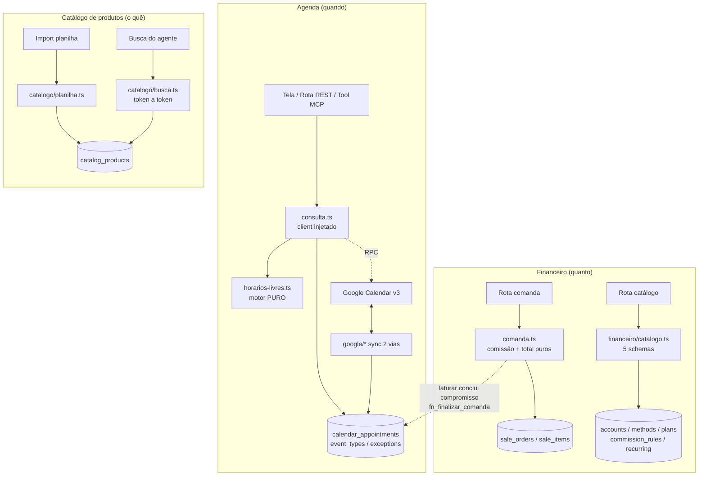
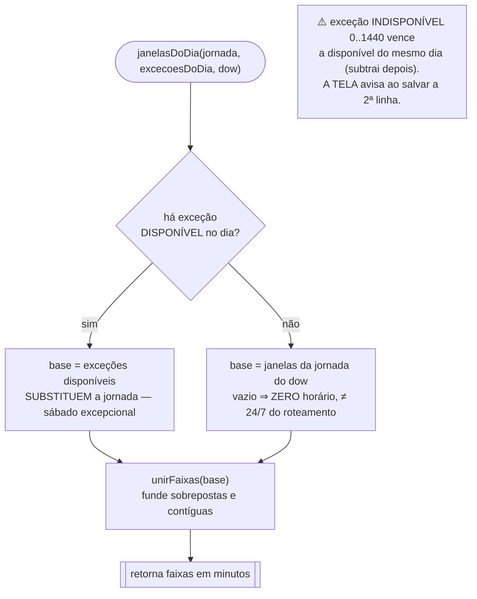
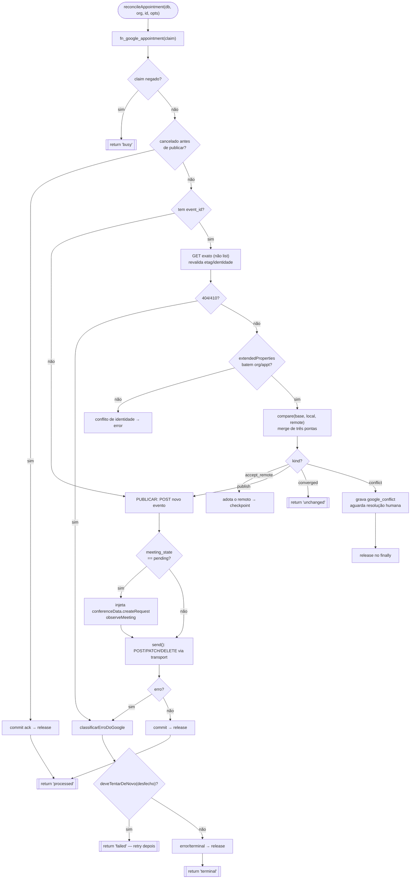
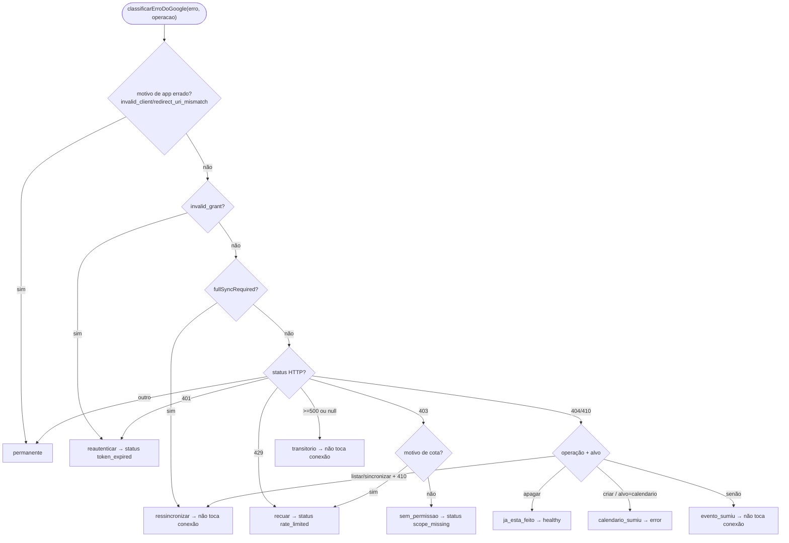
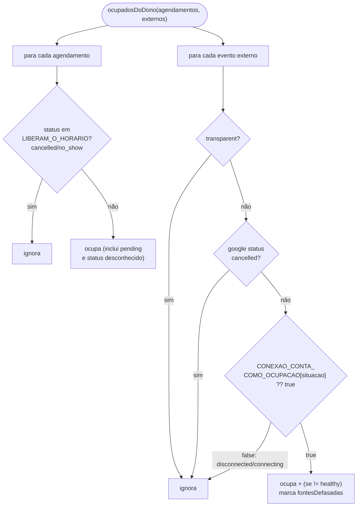
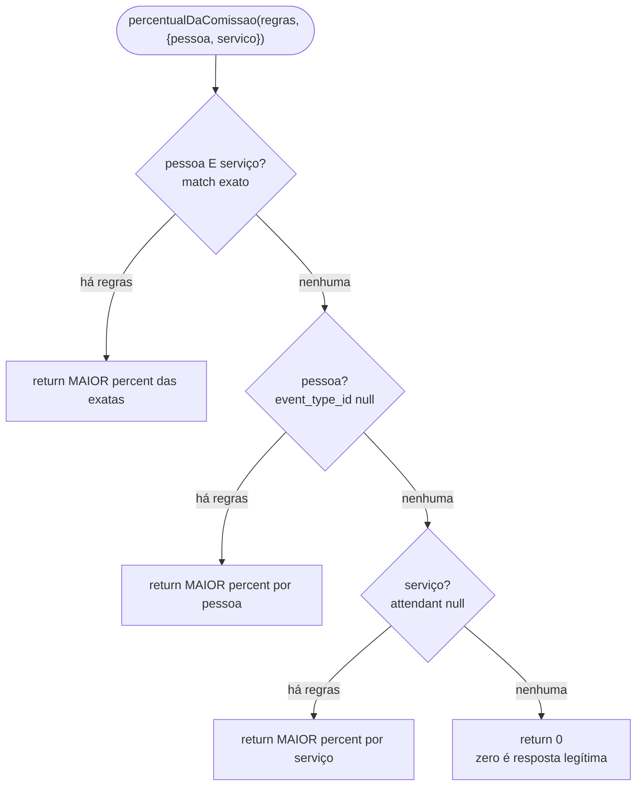
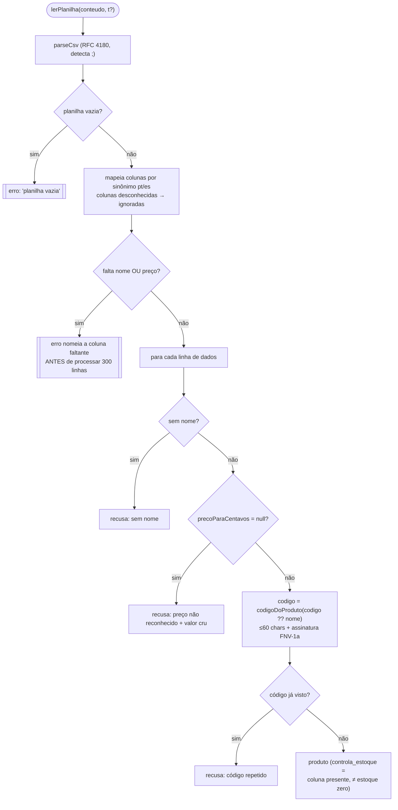

# Fluxogramas — Unidade 6: Agenda e Financeiro

> Gerado pelo Arqueólogo (Reversa) — nível **detalhado**
> Cobre `lib/agenda/` (motor de horários, sync Google, Meet, lembretes), `lib/financeiro/`
> (comanda, catálogo financeiro) e `lib/catalogo/` (busca difusa, planilha, moeda).
> Escala: 🟢 CONFIRMADO · 🟡 INFERIDO · 🔴 LACUNA

---

## 6.0 Visão geral — três domínios, um laço comercial 🟢



---

## 6.1 Motor de horários livres — `horariosLivres()` 🟢 (PURO, sem banco, sem relógio)

```mermaid
flowchart TD
  Start(["horariosLivres(entrada)"]) --> P0{passo<=0 ou<br/>duracaoMin<=0?}
  P0 -->|sim| Vazio1[[return []]]
  P0 -->|não| Cortes[naoAntesDe = max de, agora+avisoMinimo<br/>naoDepoisDe = min ate, agora+janelaDias]
  Cortes --> P1{naoAntesDe ><br/>naoDepoisDe?}
  P1 -->|sim| Vazio2[[return []]]
  P1 -->|não| Loop[para cada DIA LOCAL<br/>1 dia de margem cada lado]
  Loop --> Ancora[meioDia local = âncora<br/>lê dow seguro do DST]
  Ancora --> Jan["janelasDoDia(jornada, excecoes, dow)"]
  Jan --> Bloq["bloqueiosDoDia =<br/>compromissos + exceções indisponíveis<br/>(DECISÃO 12: bloqueio É ocupado)"]
  Bloq --> Grade[grade fixa: início da faixa,<br/>+passo em +passo — NÃO se move]
  Grade --> Fim{slot cabe na faixa?<br/>fim > fimDaFaixa}
  Fim -->|não| Grade
  Fim -->|sim| Corte2{inicio dentro de<br/>naoAntesDe..naoDepoisDe?}
  Corte2 -->|não| Grade
  Corte2 -->|sim| Buffer["slotInflado(bufferAntes/Depois)"]
  Buffer --> Colide{"colide com algum<br/>bloqueio? (estrito)"}
  Colide -->|sim| Grade
  Colide -->|não| Push[adiciona slot]
  Push --> Grade
  Loop --> Dedup["dedup por instante<br/>(hora que desliza no DST)"]
  Dedup --> Ordena[[ordena por início asc]]
```

### `janelasDoDia()` — a régua do `windows` vazio 🟢



---

## 6.2 Conversão de fuso — `instanteDe()` (duas passagens, DST-safe) 🟢

```mermaid
flowchart TD
  I(["instanteDe(paredePedida, fuso)"]) --> A[chute = Date.UTC das partes]
  A --> B["offset1 = offsetEmMinutos(chute, fuso)"]
  B --> C[candidato1 = chute - offset1]
  C --> D["offset2 = offsetEmMinutos(candidato1, fuso)"]
  D --> E{offset1 == offset2?}
  E -->|sim| Ok[[instante = candidato1]]
  E -->|não| F["candidato2 = chute - offset2<br/>(fronteira de DST)"]
  F --> G{hora inexistente<br/>(primavera)?}
  G -->|sim| Max["return Math.max cand1, cand2<br/>(DECISÃO 15: min cairia no dia anterior<br/>em offset positivo — Beirute/Teerã)"]
  G -->|não| Min["hora ambígua (outono):<br/>return o primeiro"]
```

---

## 6.3 Sincronização Google — `reconcileAppointment()` (máquina de estados) 🟢



### `classificarErroDoGoogle()` — a tabela de desfechos 🟢



> ⚠️ **O 410 tem duplo sentido** (o coração do módulo): num DELETE significa "já foi apagado"
> (`ja_esta_feito`); num sync incremental significa que o `syncToken` morreu (`ressincronizar`) —
> tratar como sucesso apagaria a agenda inteira em silêncio.

---

## 6.4 O que ocupa o horário — `ocupadosDoDono()` 🟢



> Princípio: **oferecer de menos se recupera; marcar em dobro não** → na dúvida, OCUPA.
> "BLOQUEIA, A MENOS QUE UM HUMANO TENHA MANDADO PARAR" (só `disconnected` é decidido por gente).

---

## 6.5 Comissão da comanda — `percentualDaComissao()` 🟢



> Precedência **pessoa+serviço > pessoa > serviço > zero**; empate no mesmo nível → MAIOR percentual
> (errar a favor de quem trabalhou). Comissão errada é dinheiro errado no bolso de quem trabalhou.

---

## 6.6 Busca difusa de produto — `buscarComRelaxamento()` 🟢

```mermaid
flowchart TD
  B(["buscarComRelaxamento(produtos, consulta)"]) --> Tok["tokenizar: palavras (difuso)<br/>vs números (exato + unidade)"]
  Tok --> Empty{sem palavra<br/>e sem número?}
  Empty -->|sim| VazioB[[achados: [], ignorados: []]]
  Empty -->|não| Ex["pontuarTodos (filtro numérico DURO)<br/>número ausente ELIMINA o produto"]
  Ex --> Achou{achou algo OU<br/>sem números?}
  Achou -->|sim| RetEx[[achados exatos, ignorados: []]]
  Achou -->|não| Conhece["numerosQueOCatalogoConhece"]
  Conhece --> Ign[ignorados = números que o catálogo NÃO conhece]
  Ign --> TemIgn{há ignorados?}
  TemIgn -->|não| RetEx2[[achados exatos vazio, ignorados: []]]
  TemIgn -->|sim| Relax["pontuarTodos só com números conhecidos<br/>(256 numa loja com 256 e 128 ainda elimina o 128)"]
  Relax --> SoPalavra{sobrou palavra?}
  SoPalavra -->|não| VazioR[[[] — 'quero 2' não vira catálogo inteiro]]
  SoPalavra -->|sim| RetRelax[["achados relaxados + ignorados<br/>→ agente CONFIRMA, não responde preço"]]
```

> **PALAVRA é difusa, NÚMERO é exato.** O número filtra (não ranqueia): quem pede 256GB nunca vê o
> 128GB. `ignorados` não vazio é contrato: não responda como se fosse o pedido — confirme.
> Notas medidas: inicial vale mais que distância; prefixo ≥3 letras; distância 1 (≥4), distância 2 (≥5).

---

## 6.7 Leitura de planilha de produtos — `lerPlanilha()` 🟢



> A planilha vem suja e recusar é a função: o ambíguo vira linha recusada com o valor cru, nunca chute
> (chute aqui é preço errado dito ao cliente). Código estável faz reimportar ATUALIZAR, não duplicar.

---

## Lacunas de fluxo 🔴🟡
- 🔴 A lógica interna das RPCs (`fn_google_appointment`, `fn_google_calendar`, `fn_meet_action`,
  `fn_finalizar_comanda`, etc.) vive em `supabase/baseline.sql` — os fluxogramas acima param na
  fronteira da chamada. Detalhamento é do Data Master.
- 🟡 O gate de entrega do Meet (`fn_meet_delivery_policy` + fronteira de serviço + comando humano/gate
  de IA) é referenciado como caixa única; o desenho completo depende de `lib/atendimento/fronteira`
  e `lib/ai/elegibilidade` (unidades vizinhas).
- 🟡 O cron mensal que materializa `recurring_entries` em lançamentos é citado em `financeiro/catalogo.ts`
  mas vive em `workers/` (cobertura na unidade de eventos/workers).
