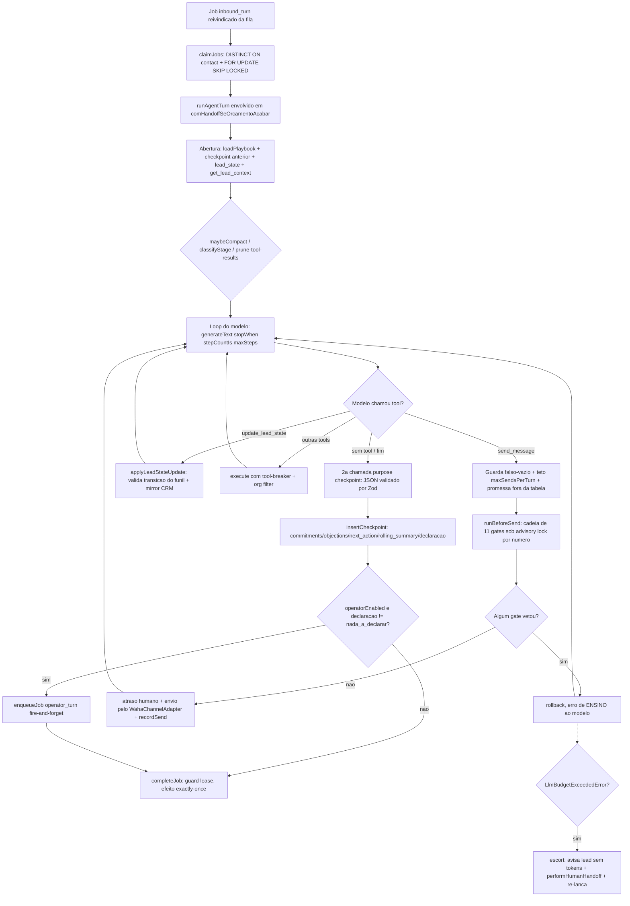
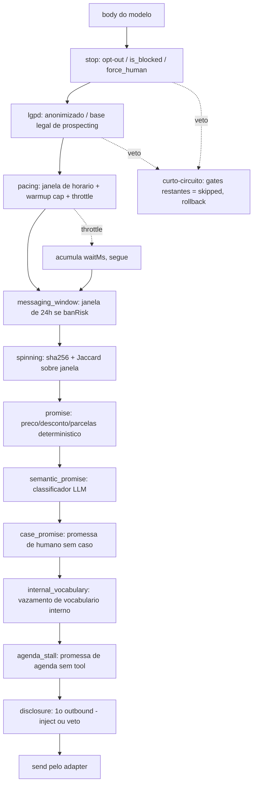
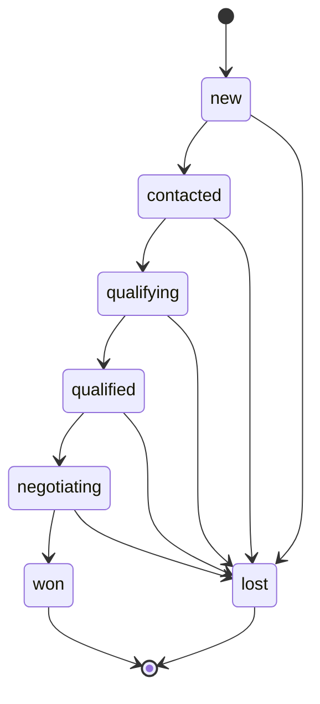
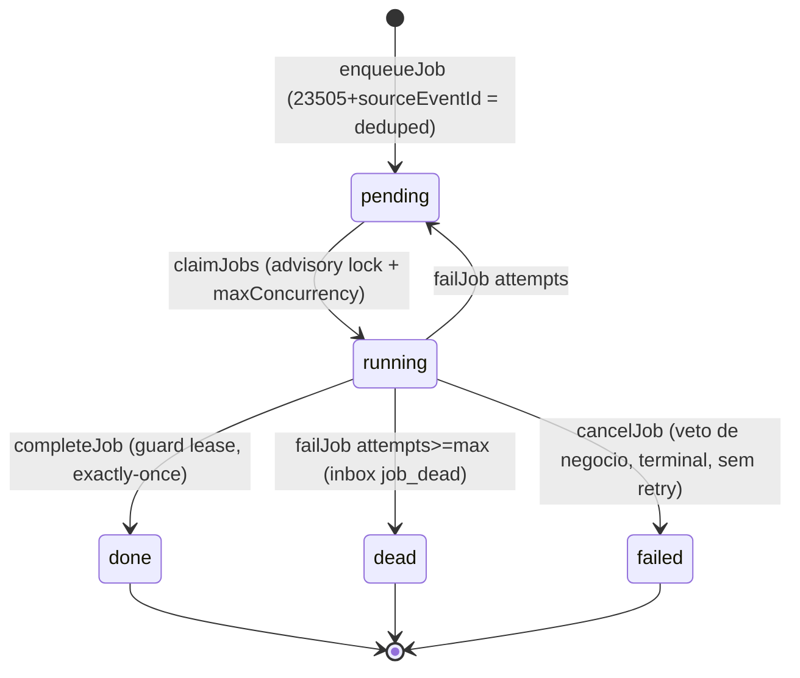
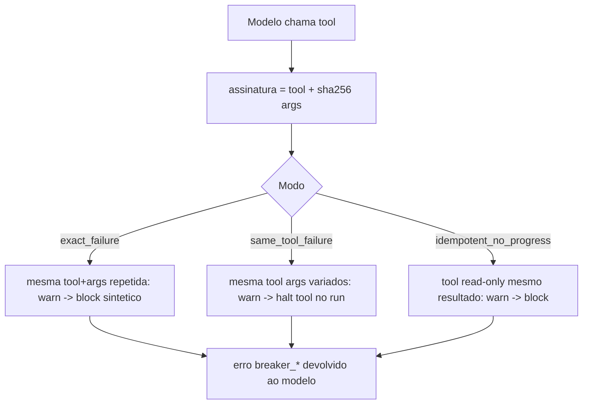
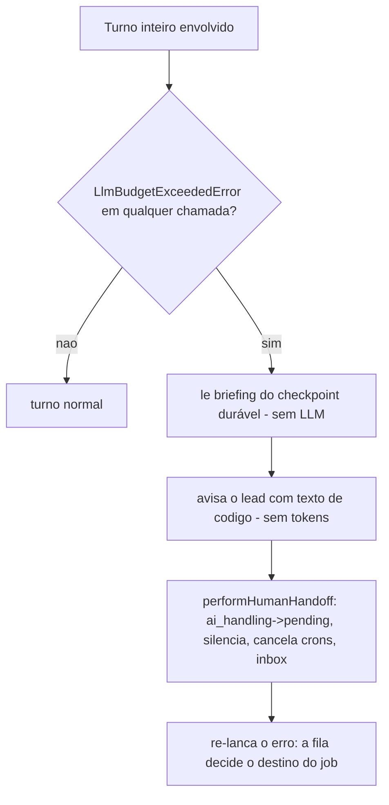

# Fluxogramas — Núcleo de IA (`lib/agent-engine/`)

> 🟢 CONFIRMADO salvo indicação. Fonte: `lib/agent-engine/agent/inbound-turn.ts` e módulos irmãos.

## Turno inbound (ritual completo)

## Cadeia before-send (11 gates, versao 7)

## Máquina de estados do funil (`lead-state.ts`)

> Transições fora do grafo são rejeitadas com erro de ENSINO ao modelo. Regressão é proibida.
> `won` e `lost` são terminais. Fonte: `LEAD_STAGE_TRANSITIONS` em `lead-state.ts:37-45`.

## Ciclo de vida do job na fila (`queue/queue.ts`)

## Circuit breaker de tools (`tool-breaker.ts`)

## Escort de orçamento de IA (`comHandoffSeOrcamentoAcabar`)

