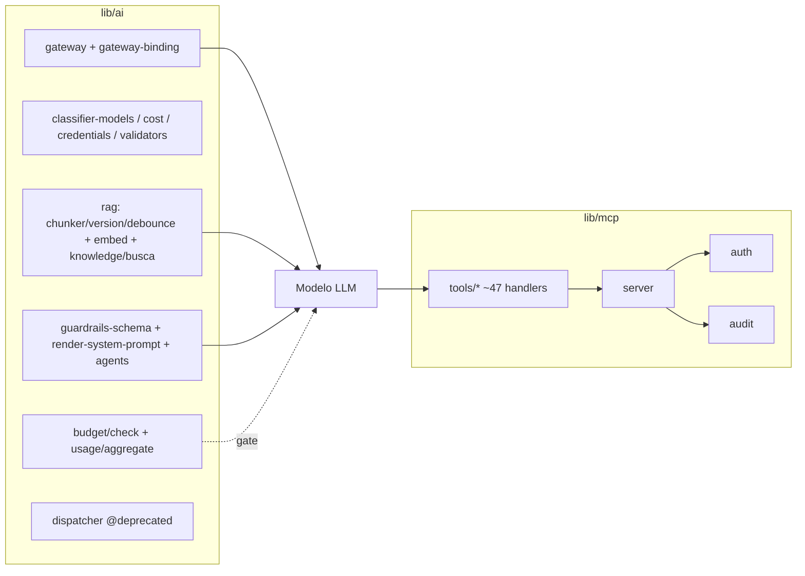
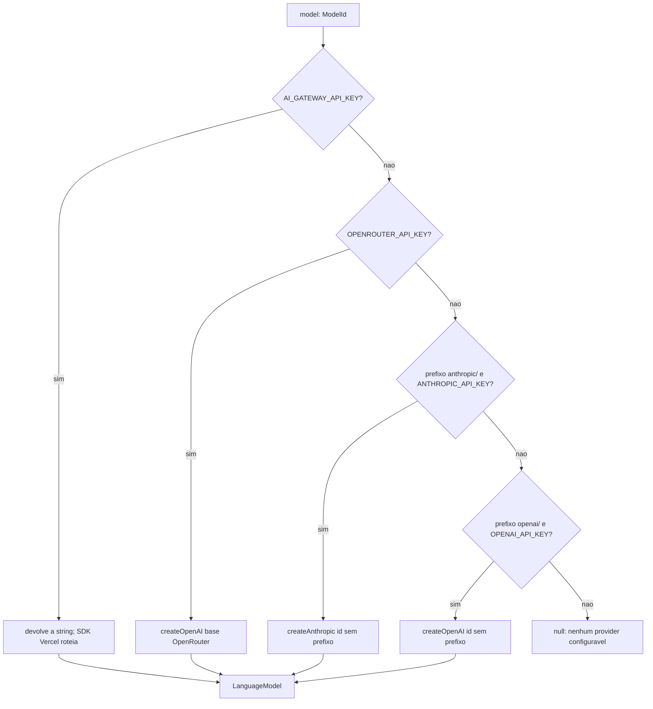
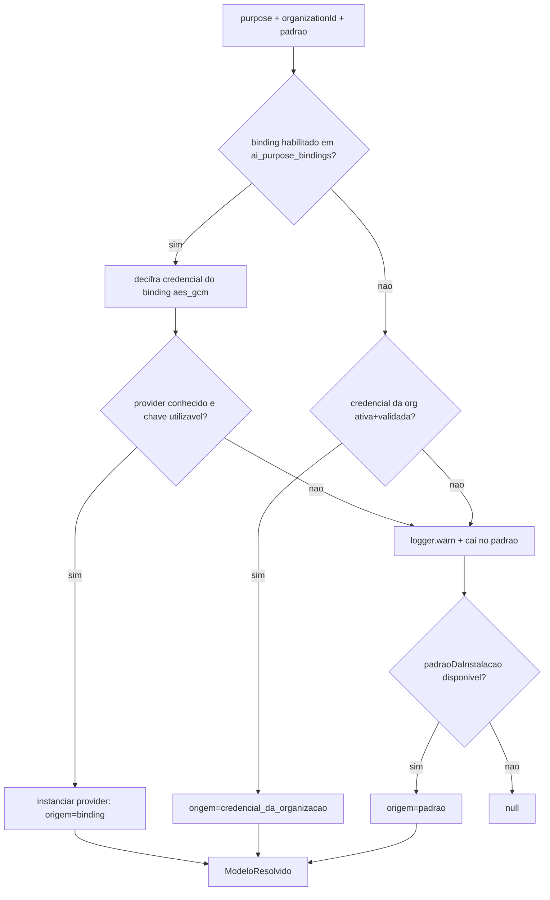
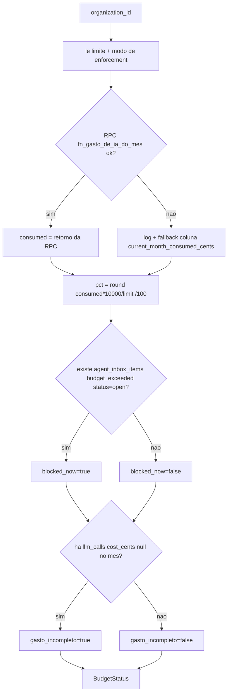
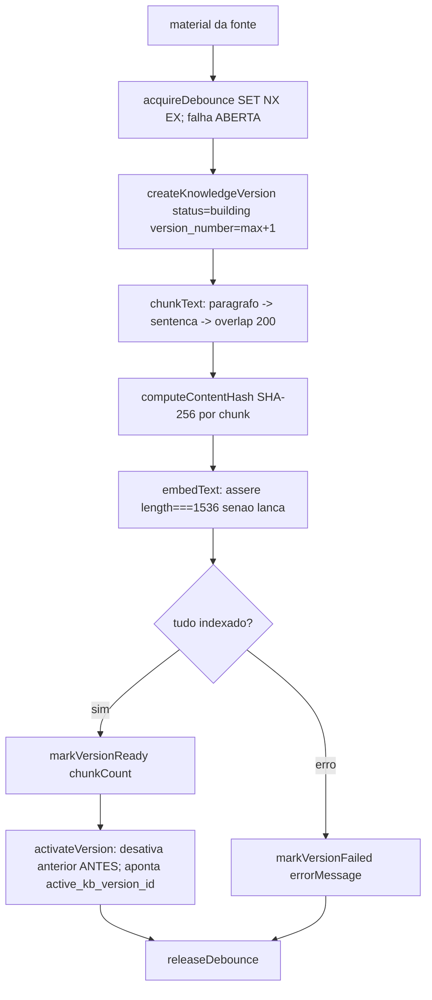
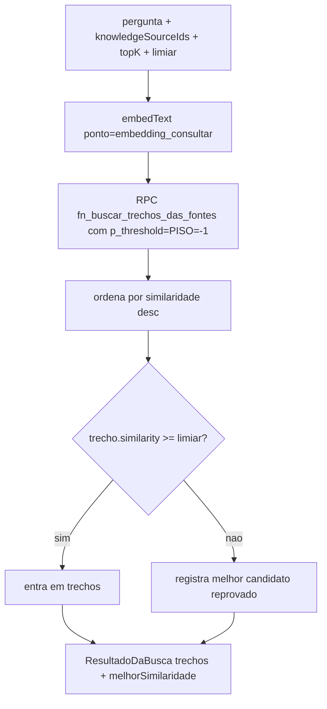
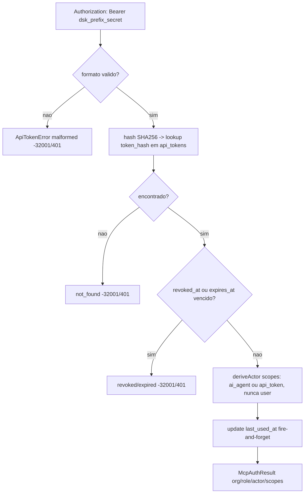
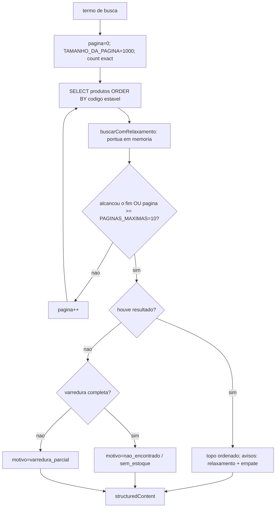
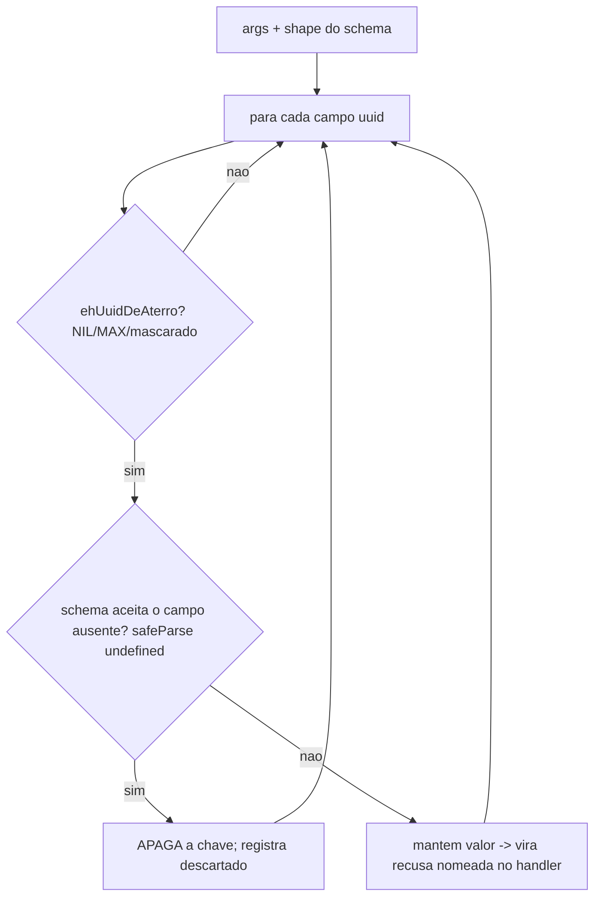

# Fluxogramas — IA de suporte (`lib/ai/` + `lib/mcp/`)

> 🟢 CONFIRMADO salvo indicação. Fontes: `lib/ai/**` e `lib/mcp/**`.
> Nível `detalhado`: um fluxo por módulo + fluxos por função principal com lógica não-trivial.

## Visão geral da unidade



## `resolveLanguageModel` — fallback de provider (`gateway.ts:74`)



## `resolverModeloDoPonto` — binding → credencial → padrão (`gateway-binding.ts:60`)



## `getBudgetStatus` — nunca lança, degrada (`budget/check.ts:170`)



## RAG — ingestão e versão por fonte (`rag/version.ts` + `rag/chunker.ts` + `embed.ts`)



## `buscarConhecimento` — piso vs limiar (`knowledge/busca.ts:70`)



## Servidor MCP — pipeline por chamada de tool (`server.ts:37`)

```mermaid
flowchart TD
  A[Modelo chama tool com args] --> B[higienizarUuidsDeAterro args]
  B --> C[monta McpContext org/role/actor/supabase admin]
  C --> D{ensureScope mcp:read|mcp:write ok?}
  D -- nao --> X[McpAuthError -32002/403] --> AUD
  D -- sim --> E{ensureRole >= requiresRole?}
  E -- nao --> X
  E -- sim --> F[tool.handler args, ctx]
  F --> G{handler lancou erro?}
  G -- sim --> H[content isError + code no metadata] --> AUD
  G -- nao --> I[motivoDoVazio? define success da auditoria]
  I --> AUD[auditMcpToolCall redige PII + trunca >500]
  AUD --> J[retorna content[] + structuredContent]
```

## `validateBearerToken` / `resolveApiToken` — auth MCP (`auth.ts:196`)



## `crm_search_products` — varredura paginada com motivo de vazio (`tools/comercio.ts`)



## `higienizarUuidsDeAterro` — UUID inventado pelo modelo (`uuid-de-aterro.ts:120`)


