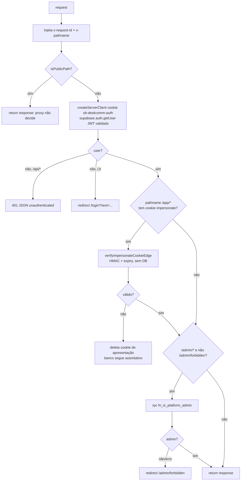
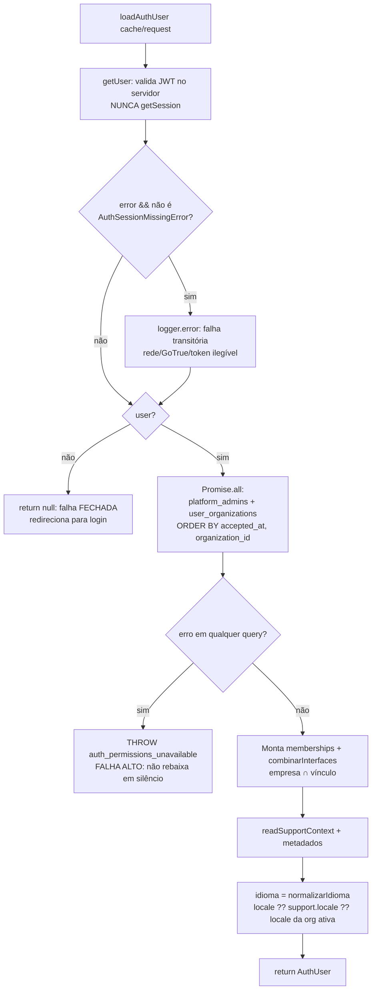
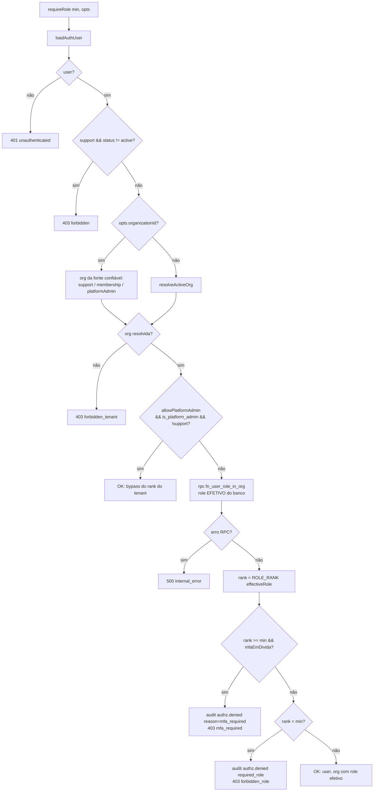
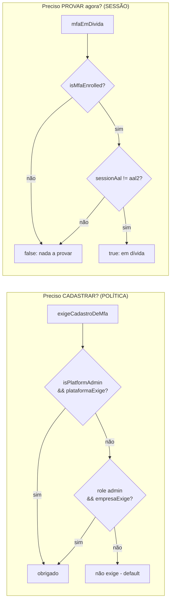
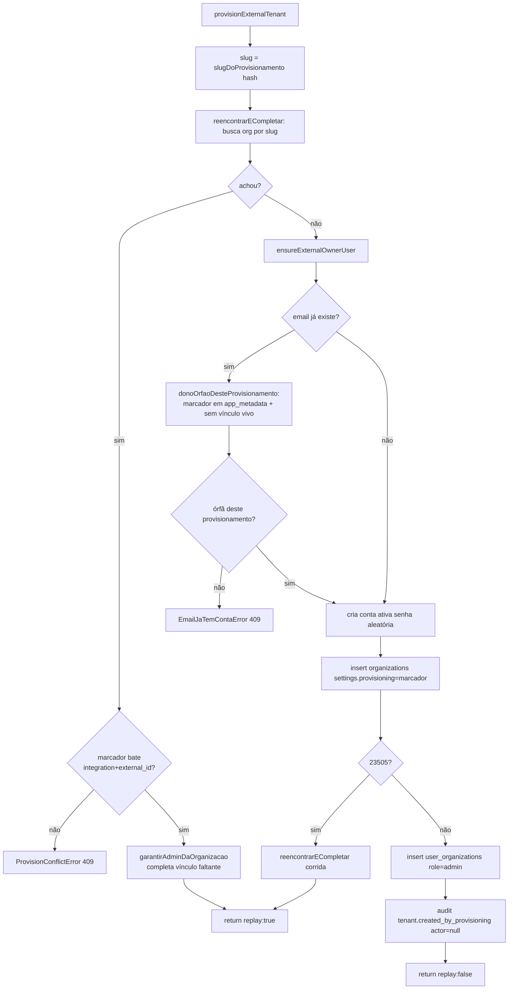
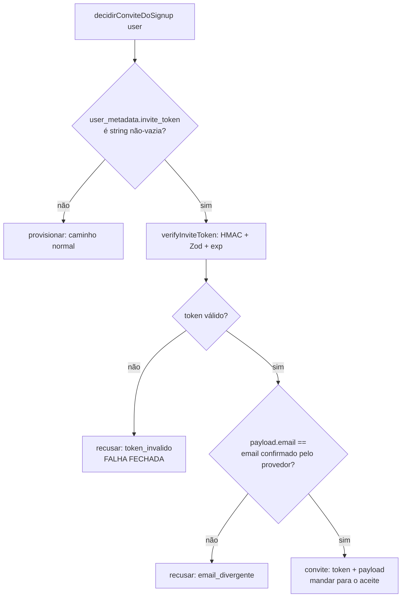
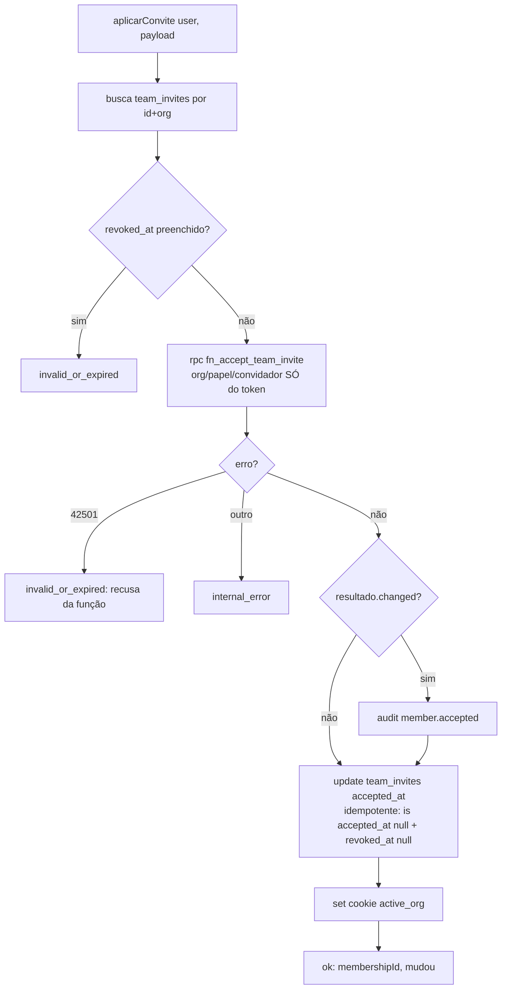
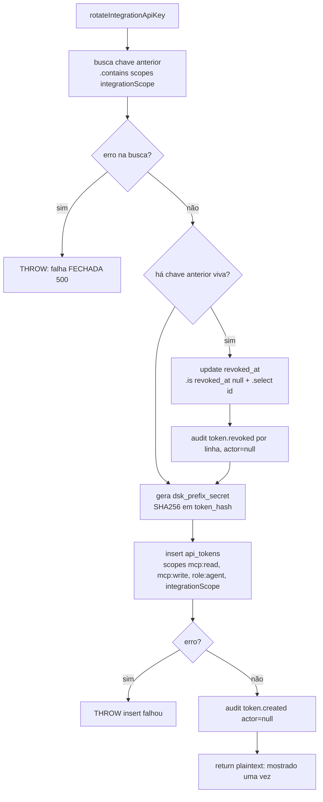

# Fluxogramas — Auth, tenancy e RBAC

> Gerado pelo Arqueólogo (Reversa) — Unidade 8.
> Cobre `lib/auth/`, `lib/tenants/`, `lib/team/`, `lib/users/`, `lib/impersonate/`, `proxy.ts`.
> Nível de documentação `detalhado`: fluxograma por módulo + por função de lógica não-trivial.

---

## 1. Guard de borda — `proxy.ts` (middleware Next 16)

---

## 2. Sessão — `loadAuthUser` (`auth/server.ts`)

---

## 3. Guard canônico de RBAC — `requireRole` (`auth/require-role.ts`)

> Ordem deliberada: o gate de MFA fica DEPOIS do rank e ANTES do sucesso — quem não tem papel leva 403
> por falta de papel, sem a resposta revelar o estado de MFA de quem nem chegaria lá.

---

## 4. MFA: as duas perguntas que não são a mesma

> As duas origens de política SOMAM, nunca se anulam. A sessão NÃO consulta a política: quem TEM fator
> prova sempre (senão o cadastro opcional viraria buraco).

---

## 5. Provisionamento externo — `provisionExternalTenant` (`auth/provision.ts`)

---

## 6. Convite no signup — `decidirConviteDoSignup` (`auth/convite-no-signup.ts`) — PURA

> ⚠️ `user_metadata` é gravável pelo próprio usuário — nada dali é autoridade. Quem manda é a assinatura
> HMAC + a comparação com o e-mail que o provedor confirmou. Sem a comparação, um token alheio vira porta
> de entrada.

---

## 7. Aceite de convite — `aplicarConvite` (`auth/aplicar-convite.ts`)

---

## 8. Emissão / rotação de API key — `rotateIntegrationApiKey` (`tenants/api-key.ts`)

> Sem `actor:ai_agent` de propósito: o parceiro é integração, não IA — a ausência faz `deriveActor`
> devolver `api_token`. Papel `agent` (menor privilégio) cobre 46 das 63 tools.
