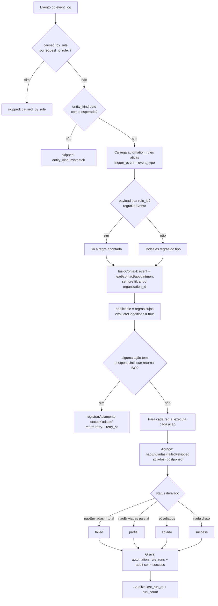
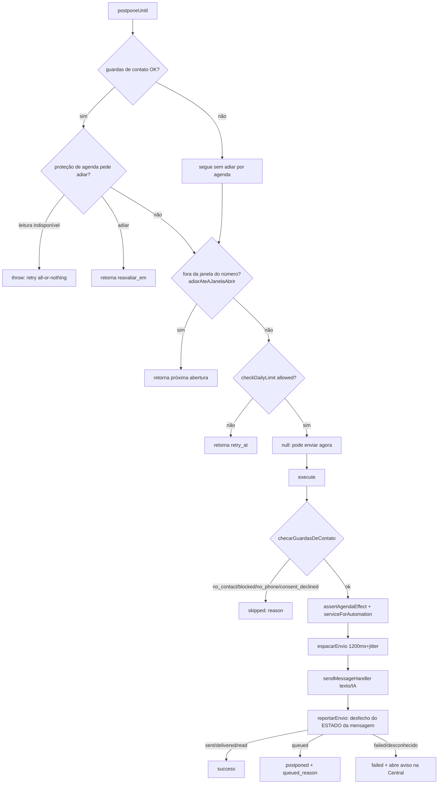
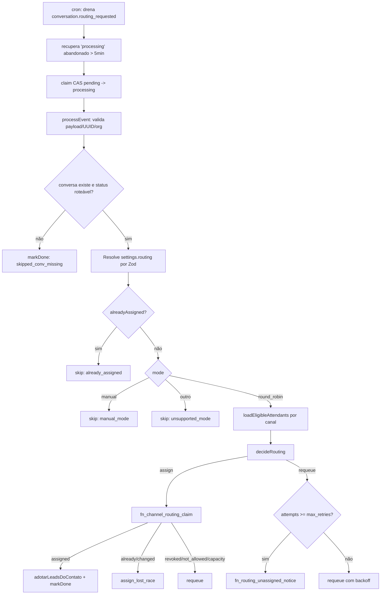
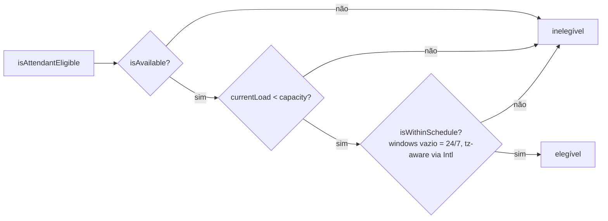
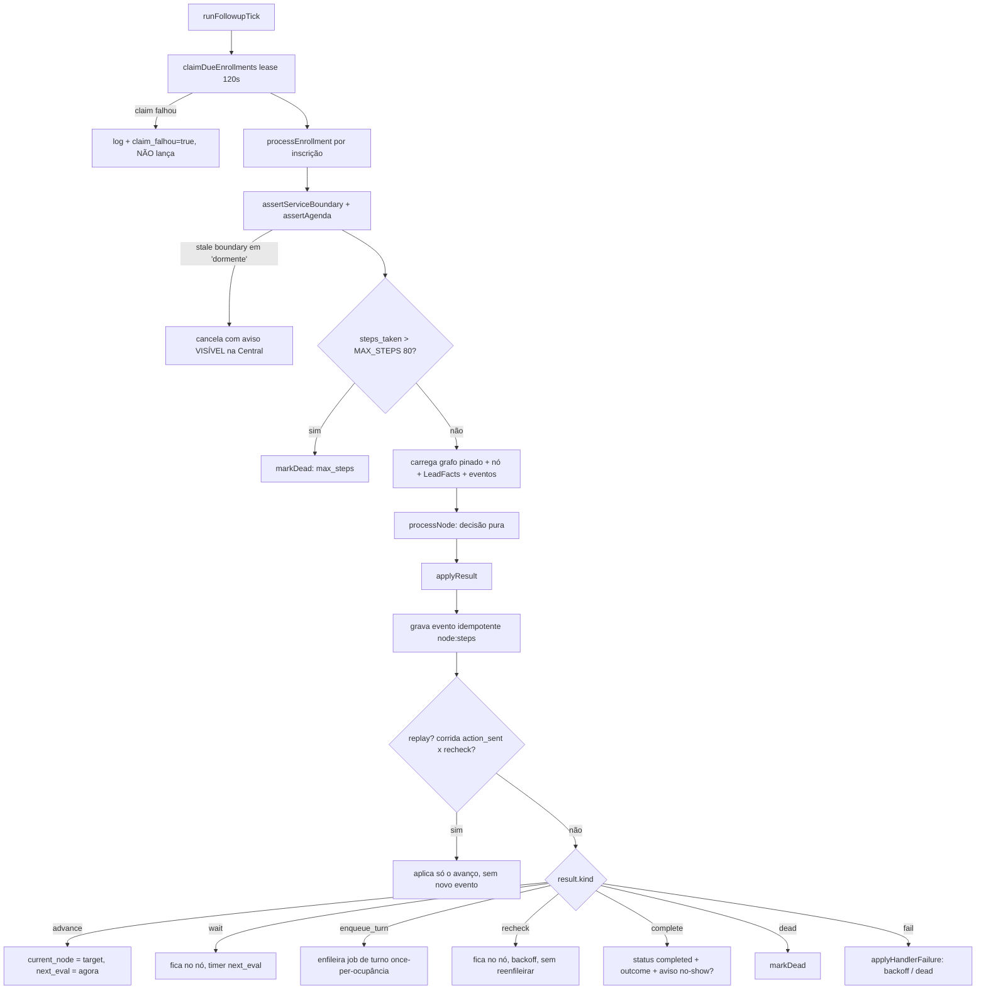
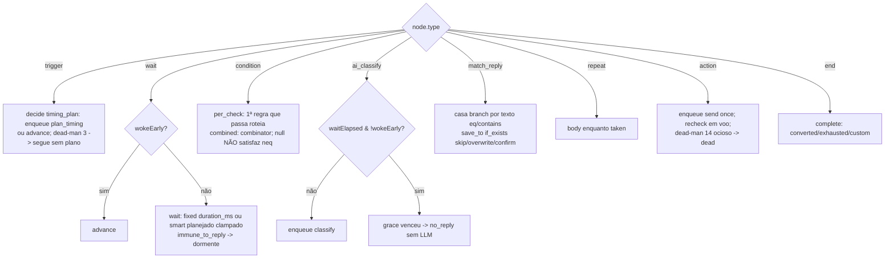
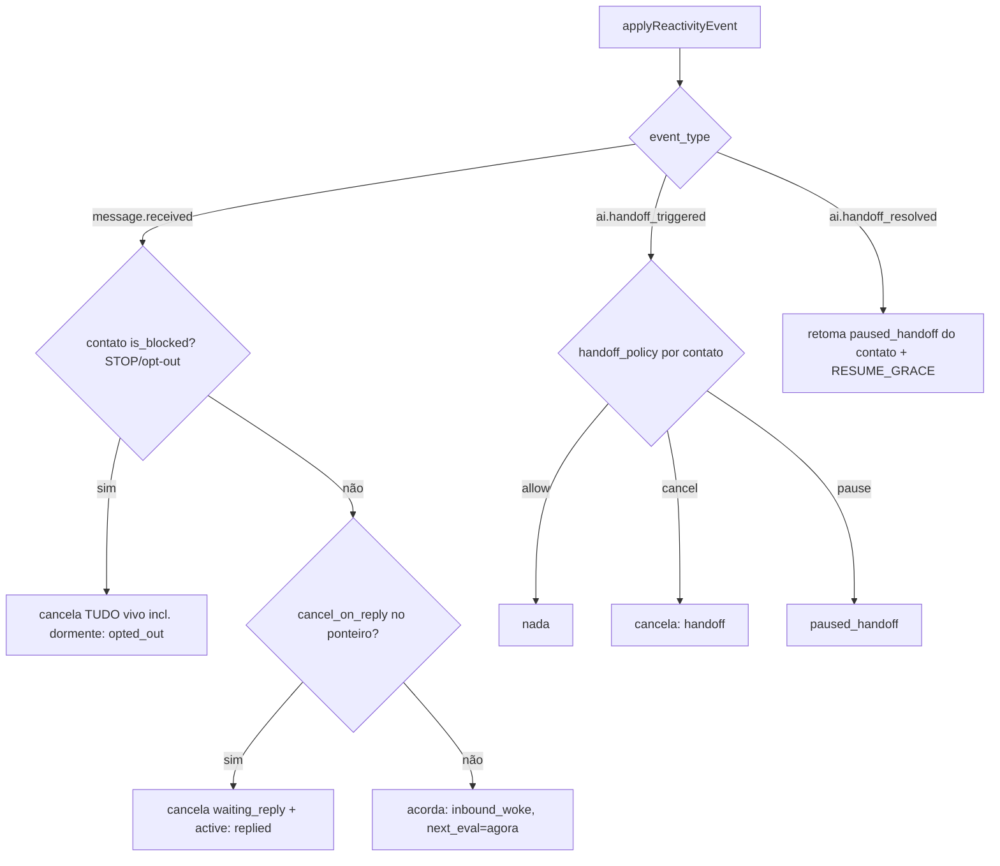
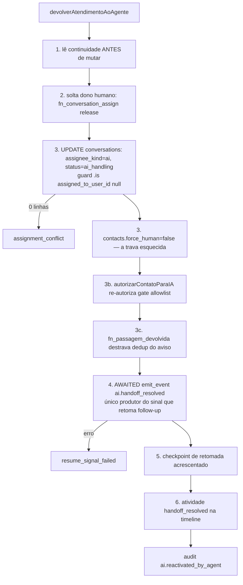
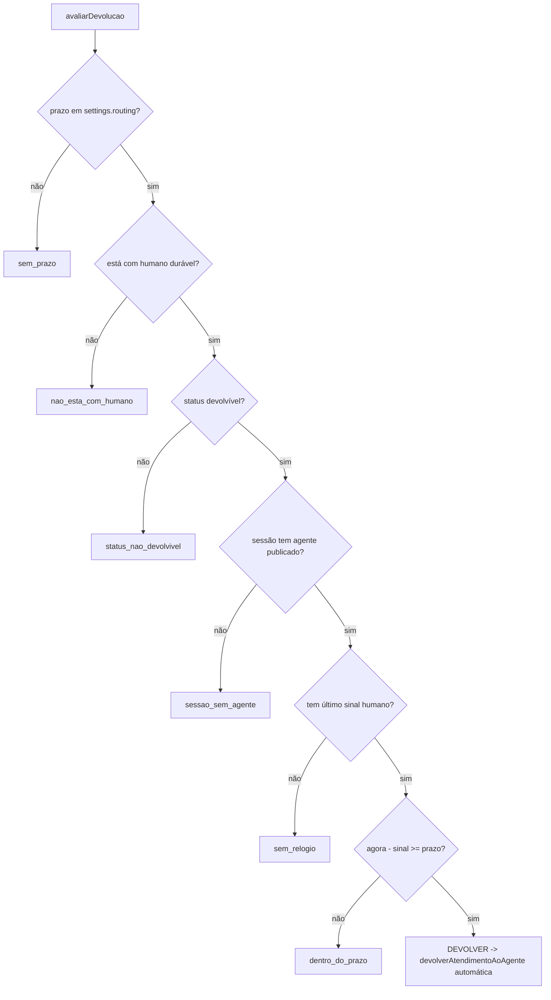
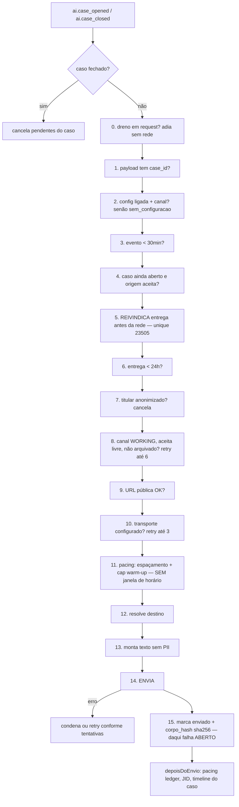

# Fluxogramas — Automação e roteamento

> Gerado pelo Arqueólogo (Reversa) — Unidade 7.
> Cobre `lib/automation/`, `lib/routing/`, `lib/followup/`, `lib/escalacao/`.

---

## 1. Motor de regras — `runAutomationForEvent` (`automation/engine.ts`)

---

## 2. Ação de envio — `send_whatsapp_message` / `send_ai_message`

---

## 3. Roteamento — `runRoutingWorker` + `decideRouting`

### Elegibilidade (pura, `routing/eligibility.ts`)

---

## 4. Follow-up — tick do worker e decisão por nó

### `processNode` por tipo de nó

### Reatividade (`followup/reactivity.ts`)

---

## 5. Escalação — devolução à IA e devolução automática

### Devolução automática (cron, pura — `devolucao-automatica.ts`)

---

## 6. Escalação — aviso ao suporte (`aviso-ao-suporte.ts`)

