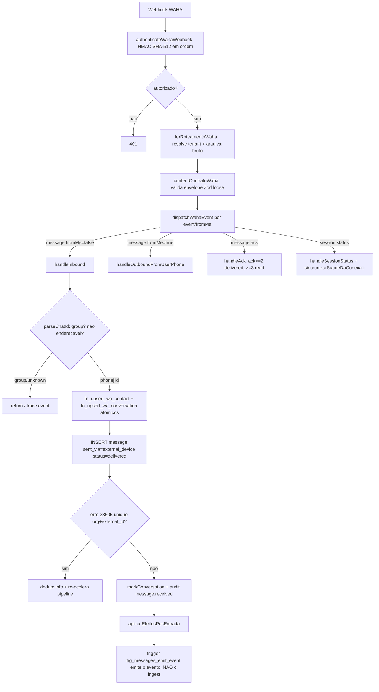
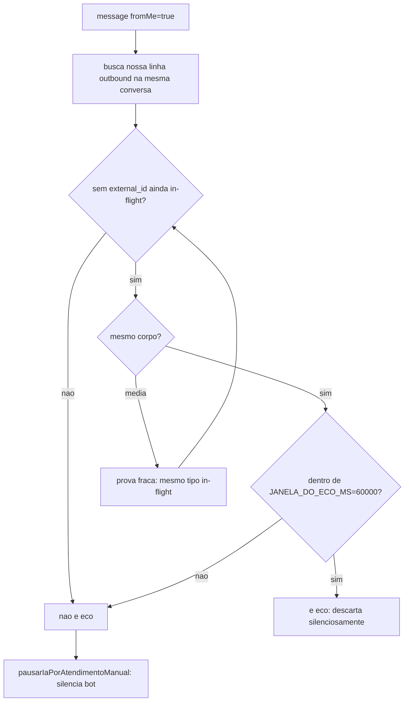
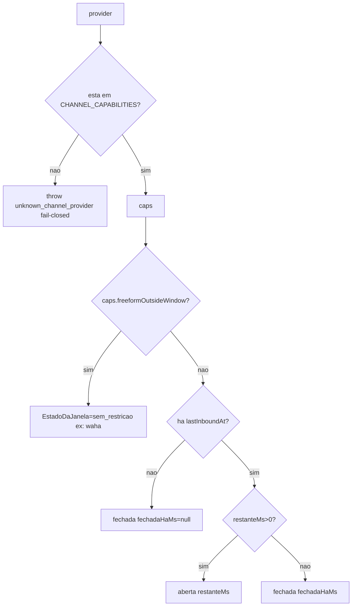
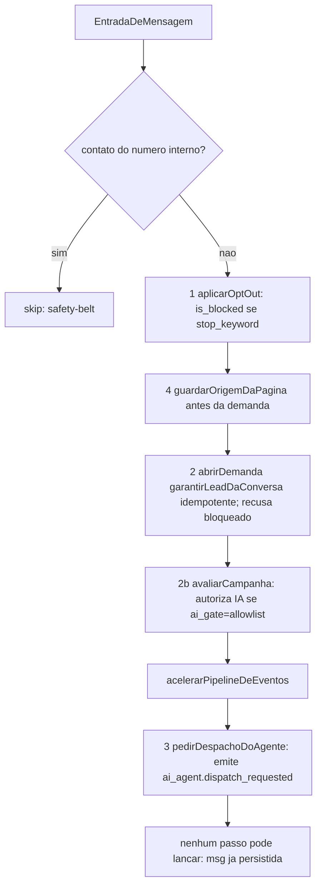
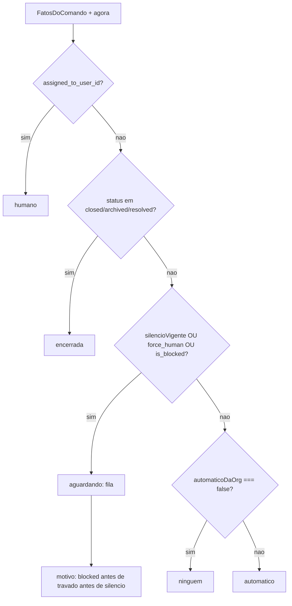
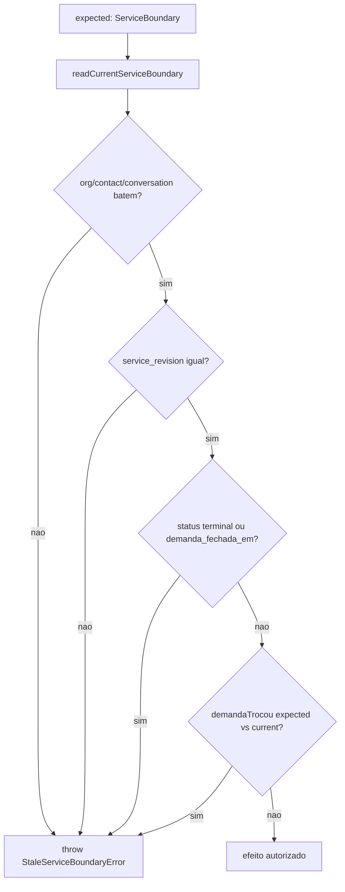
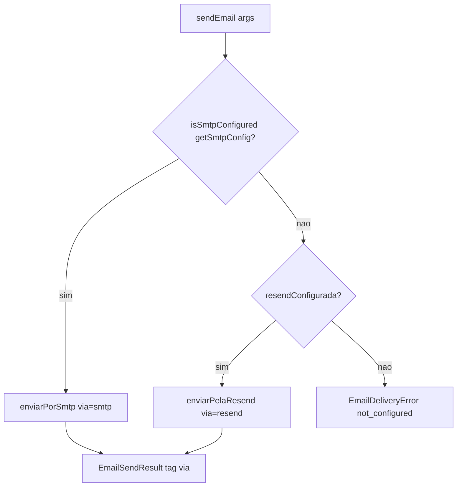

# Fluxogramas — Canais e mensageria

> 🟢 CONFIRMADO salvo indicação. Fontes: `lib/channels/**`, `lib/waha/**`, `lib/inbox/**`, `lib/atendimento/**`.
> Nível `detalhado`: um fluxo por módulo + fluxos por função com lógica não-trivial.

## Ingest WAHA — mensagem inbound vira conversa+mensagem (`lib/waha/ingest.ts`)



## `ehEcoDeEnvioNosso` — eco do nosso envio vs digitação humana (`ingest.ts:76`)


> Regra: gravar é tolerante (dupe > perda); silenciar o bot é estrito (não silencia na dúvida).

## `semSufixoDeChat` — guarda ReDoS (`ingest.ts`)

```mermaid
flowchart TD
  A[chatId controlado por atacante] --> B[lastIndexOf nos 4 terminadores de linha]
  B --> C[indexOf @ depois da ultima quebra]
  C --> D{achou @?}
  D -- sim --> E[slice ate o @ — O(n) linear]
  D -- nao --> F[string inteira]
```
> Substitui `replace(/@.*$/,"")` que era O(n^2) sobre payload.from. 1MB em 0.7ms.

## `capabilitiesOf` + janela 24h (`capabilities.ts` + `janela.ts`)



## Efeitos pós-entrada — a ordem é a regra (`pos-entrada.ts:150`)



## Comando da conversa — máquina de estados (`inbox/comando-da-conversa.ts`)


> `silencioVigente`: valor ilegível = SILENCIADO (fail-closed). Janela 24h e status fechado ficam FORA de propósito.

## Fronteira de serviço — CAS por revisão (`atendimento/fronteira.ts`)


> `demandaTrocou`=false quando expected.demanda_id===null (abrir 1a demanda nao e novo serviço).

## Roteador de e-mail — por configuração, nunca por falha (`email/roteador.ts`)


> Sem fallback em falha: greylisting 4xx faria double-send e esconderia erro. Erros nao achatados para send_failed.
