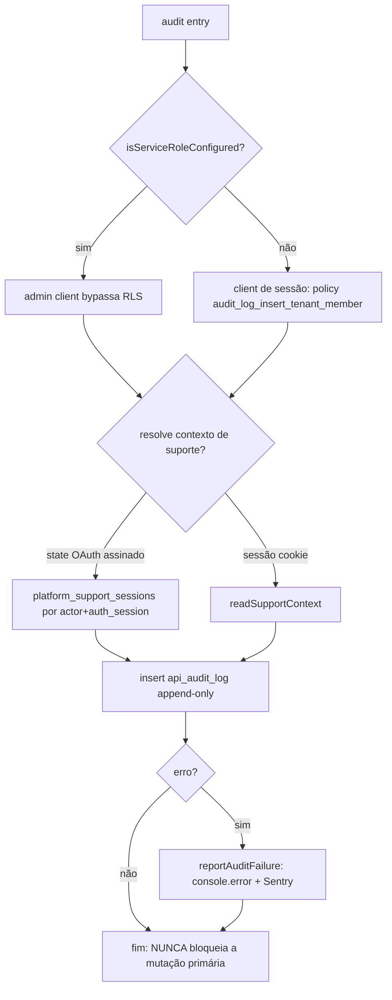
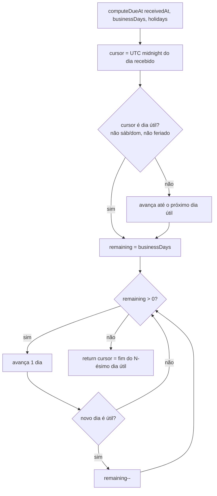
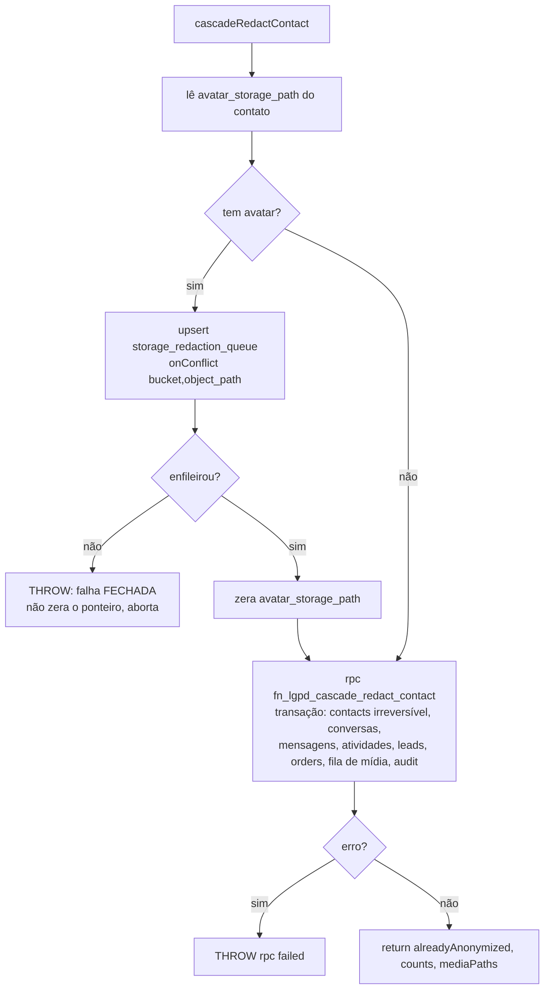
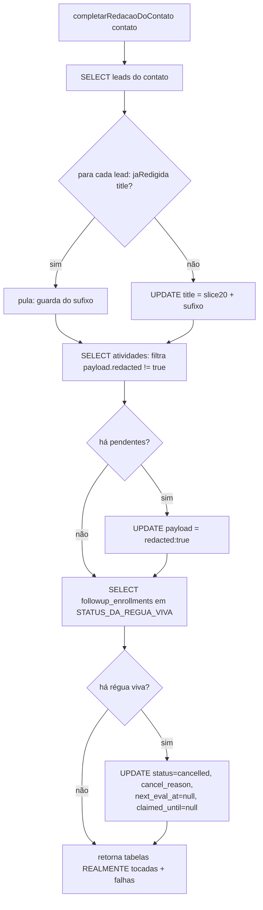
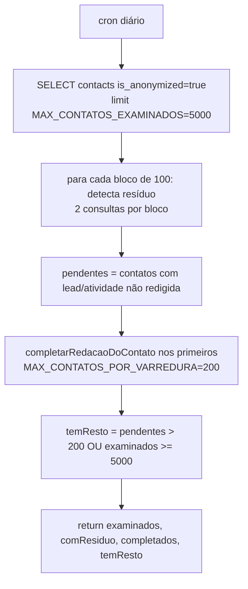
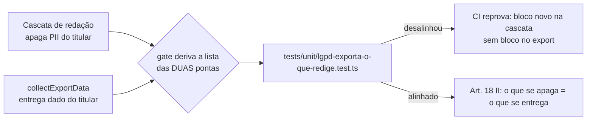
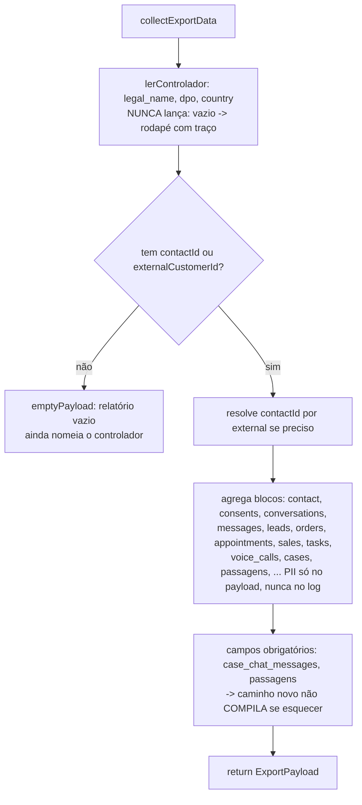
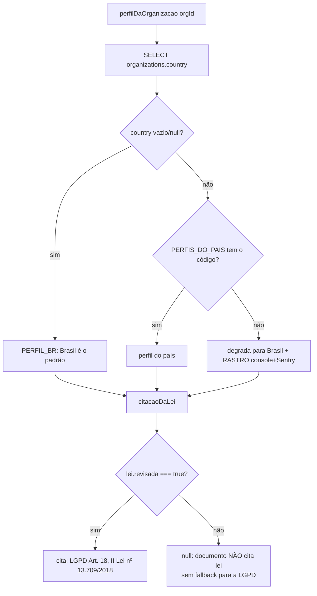
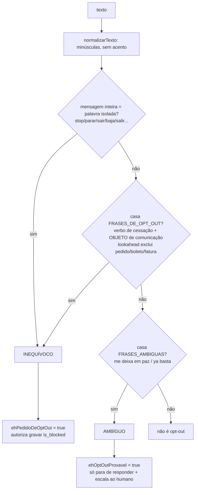
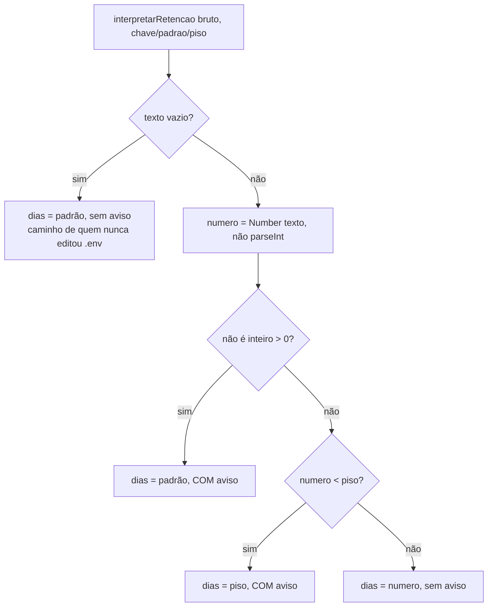

# Fluxogramas — Compliance (LGPD, legal, opt-out, retenção, audit)

> Gerado pelo Arqueólogo (Reversa) — Unidade 9.
> Cobre `lib/lgpd/`, `lib/legal/`, `lib/opt-out/`, `lib/retencao/`, `lib/audit/`.
> Nível `detalhado`: fluxograma por módulo + por função de lógica não-trivial.

---

## 1. Trilha de auditoria — `audit` (`audit/index.ts`)

> Fire-and-forget: a falha do audit não bloqueia a mutação (doutrina), mas é barulhenta (Sentry) —
> senão a trilha inteira poderia parar sem ninguém ver.

---

## 2. SLA em dias úteis — `computeDueAt` (`lgpd/sla.ts`)

---

## 3. Cascata de anonimização — `cascadeRedactContact` (`lgpd/redact-cascade.ts`)

> A foto é enfileirada ANTES da RPC de propósito: a RPC zera o ponteiro; enfileirar depois deixaria o
> arquivo órfão no bucket (rosto guardado de quem foi "anonimizado").

---

## 4. Passos 2-4 idempotentes — `completarRedacaoDoContato` (`lgpd/cascata.ts`)

> SELECT antes de UPDATE em todos os passos: sem isso a varredura diária reescreveria dado já certo e a
> auditoria registraria efeito todo dia. `cancelled` não está em STATUS_DA_REGUA_VIVA → a 2ª passada não
> acha nada (idempotência).

---

## 5. Varredura sem clique — `varrerRedacoesIncompletas` (`lgpd/cascata.ts`)

> Dois tetos DIFERENTES (5000 leitura, 200 conserto) evitam starvation: um só faria a rodada olhar
> sempre os mesmos 200 e nunca alcançar o contato 201.

---

## 6. Export de acesso — invariante redige ⇔ exporta (`lgpd/export-collector.ts`)

---

## 7. Perfil do país e citação da lei — `perfilDaOrganizacao` (`legal/perfil-do-pais.ts`)

---

## 8. Opt-out por intenção — `ehPedidoDeOptOut` / `ehOptOutProvavel` (`opt-out/deteccao.ts`)

> A palavra solta no meio da frase NÃO conta ("tem como parar a dor?" não bloqueia). O bloqueio
> definitivo só vem do inequívoco; o ambíguo escala para uma pessoa confirmar.

---

## 9. Retenção — `interpretarRetencao` (`retencao/politica.ts`)

> O piso de VERDADE mora no SQL (`greatest(..., piso)`) e vale até para `psql` na mão; esta cópia serve
> para o operador ver no log que o valor dele foi elevado. Exceção: a captação (DELETE do admin client)
> tem o piso só aqui no TS.
