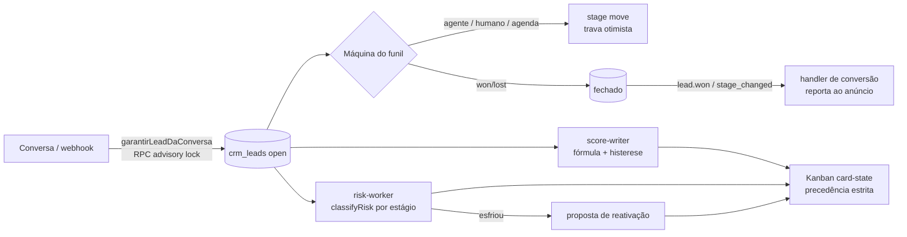
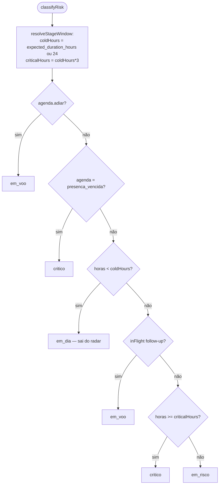
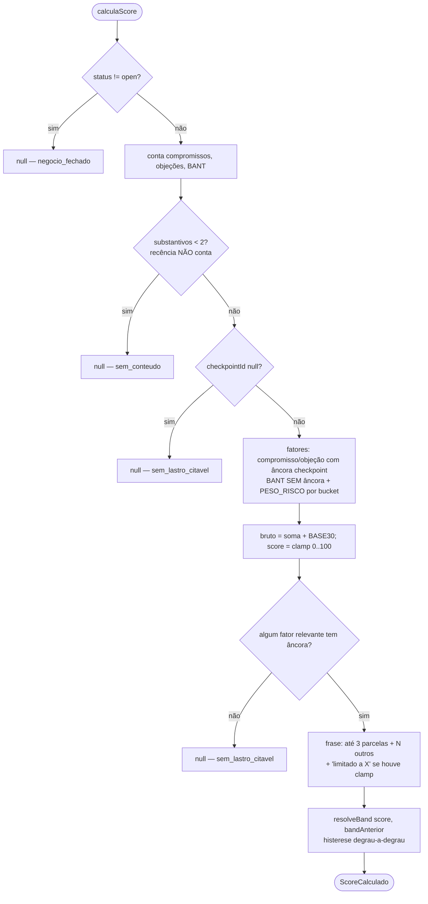
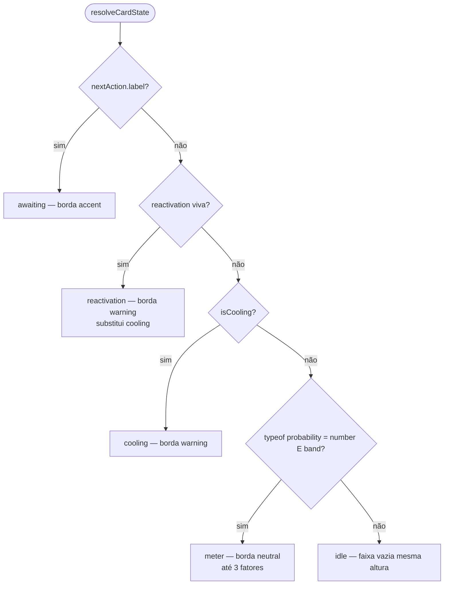
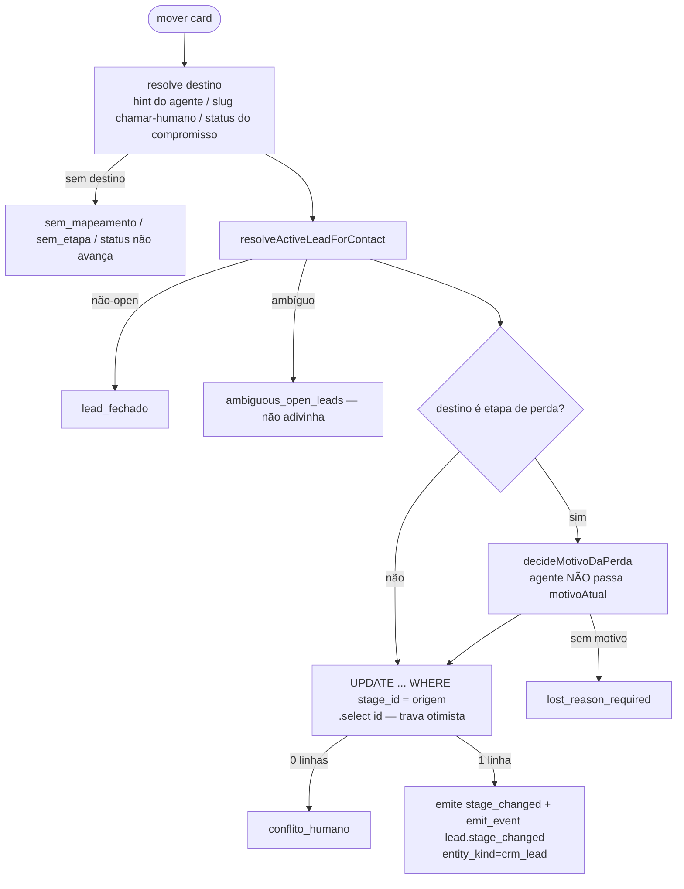
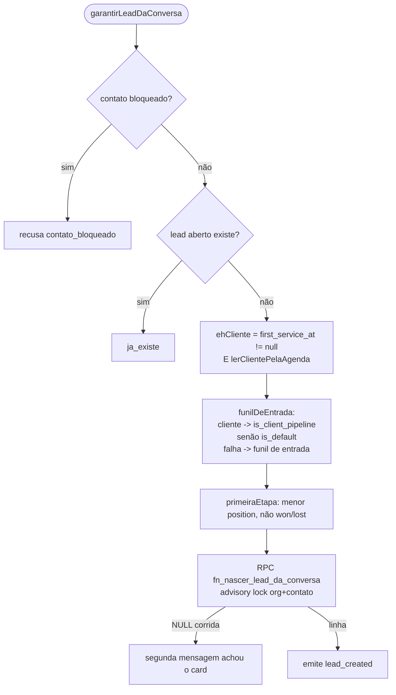
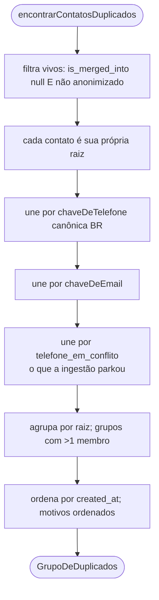
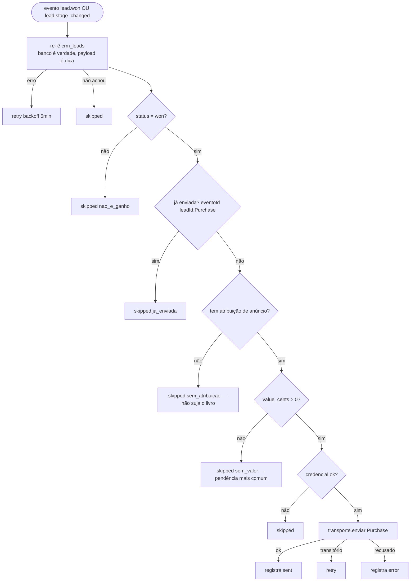
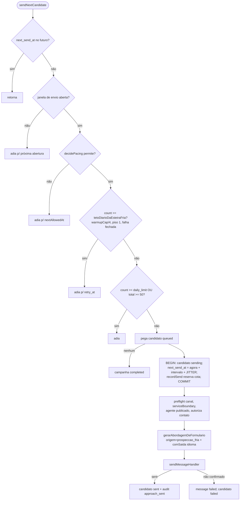
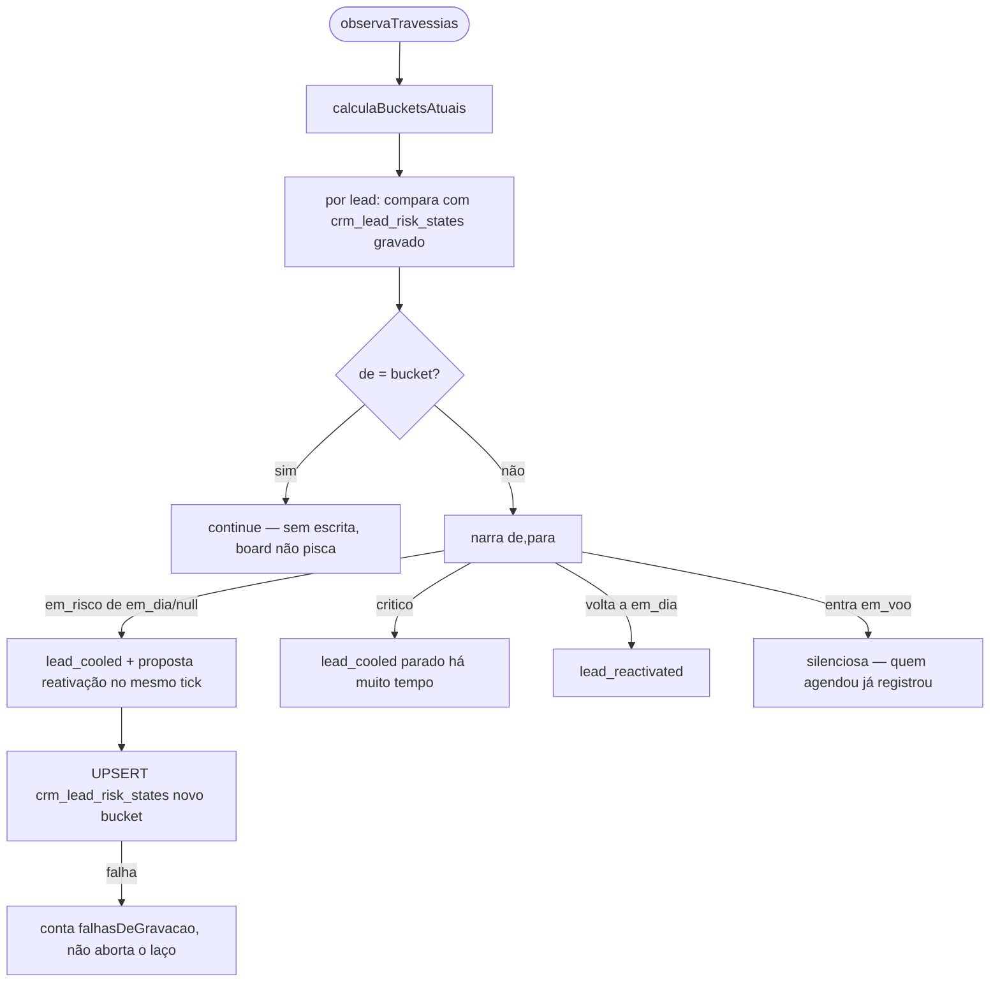

# Fluxogramas — Unidade 5: CRM e Funil

> Gerado pelo Arqueólogo (Reversa) — nível **detalhado**
> Cobre leads (score/risco/ciclo de vida), funil, kanban, contatos, tags, conversões e prospecção.
> Escala: 🟢 CONFIRMADO · 🟡 INFERIDO · 🔴 LACUNA

---

## 5.0 Visão geral — o ciclo de vida do negócio 🟢

---

## 5.1 `classifyRisk` — bucket por estágio 🟢 — `leads/risk-radar.ts`

---

## 5.2 `calculaScore` — fórmula com lastro 🟢 — `leads/score-formula.ts`

---

## 5.3 `resolveCardState` — precedência estrita da faixa ③ 🟢 — `kanban/card-state.ts`

> Um card mostra SÓ o que exige decisão agora. `probability` null ≠ 0.

---

## 5.4 Movimentador de card com trava otimista 🟢 — `agent-stage-sync` / `handoff-stage-move` / `appointment-stage-move`

---

## 5.5 Nascimento do lead 🟢 — `leads/nascimento-do-lead.ts`

---

## 5.6 Detecção de duplicados — union-find 🟢 — `contacts/duplicados.ts`

> Critérios se encadeiam (A~B tel, B~C email → os três). `principalSugerido` = atividade mais recente.

---

## 5.7 Handler de conversão — duas portas 🟢 — `conversoes/envio.handler.ts`

---

## 5.8 Tick de prospecção fria 🟢 — `prospecting/worker.ts::sendNextCandidate`

> Falha `escopo=candidato` marca o item e segue; qualquer outra pausa a campanha.

---

## 5.9 Worker de risco — travessia narrada 🟢 — `leads/risk-worker.ts`

