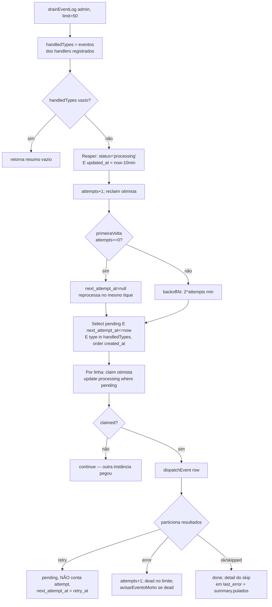
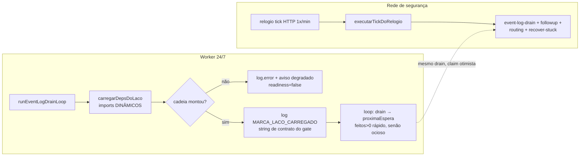
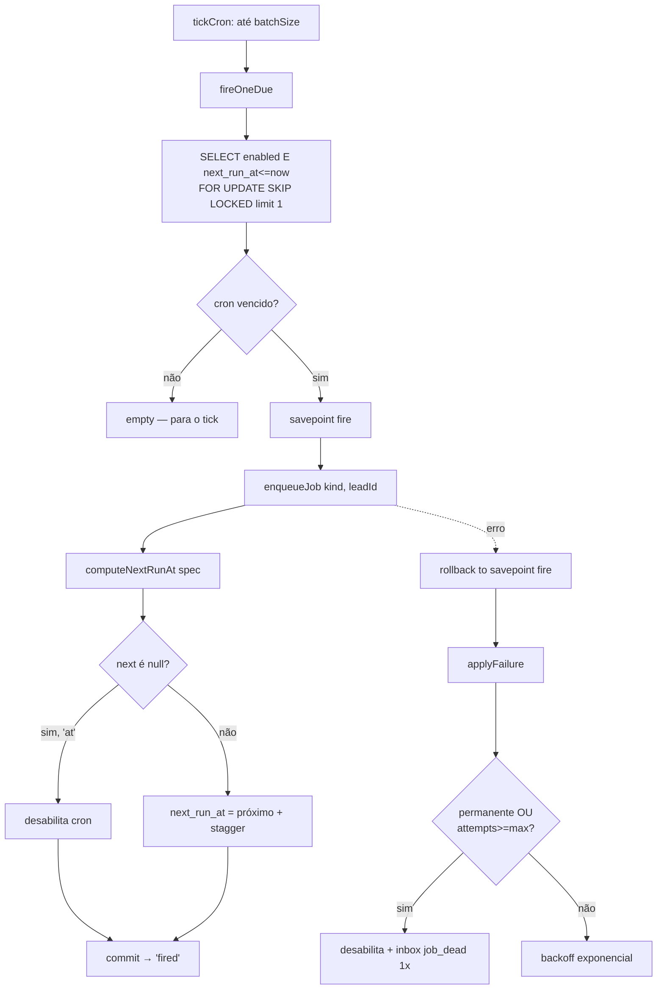
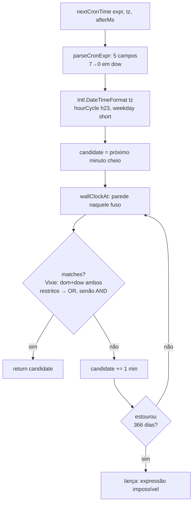
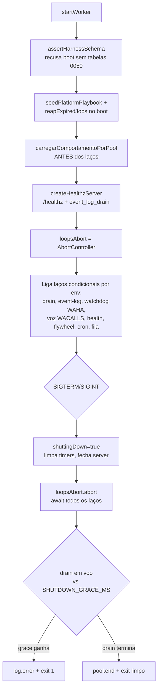
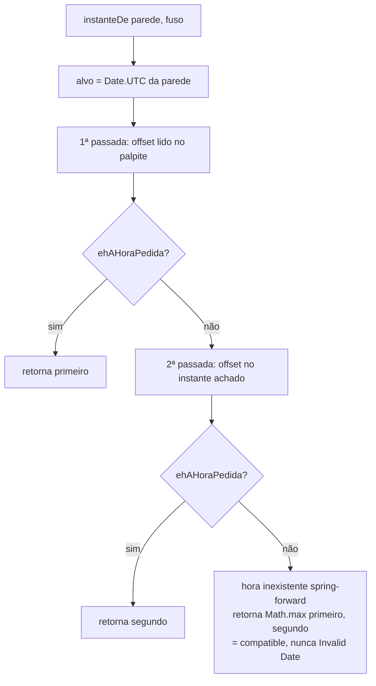

# Fluxogramas — Eventos e tempo real

> Gerado pelo Arqueólogo (Reversa) — Unidade 12.
> Cobre `lib/event-log/`, `lib/realtime/`, `lib/relogio/`, `lib/tempo/`, `lib/agent-engine/cron/`, `workers/`.

---

## 1. Drain do event_log — `drainEventLog` (`event-log/drain.ts`)

---

## 2. Laço do worker vs. rede de segurança do cron

---

## 3. Ciclo de vida de um cron — `fireOneDue` (`agent-engine/cron/scheduler.ts`)

---

## 4. Cron tz-aware com DST — `nextCronTime` (`agent-engine/cron/schedule.ts`)

---

## 5. Boot e shutdown do worker — `startWorker` (`workers/agent-worker/main.ts`)

---

## 6. Resolução de hora de parede num fuso — `instanteDe` (`agenda/fuso.ts`)

