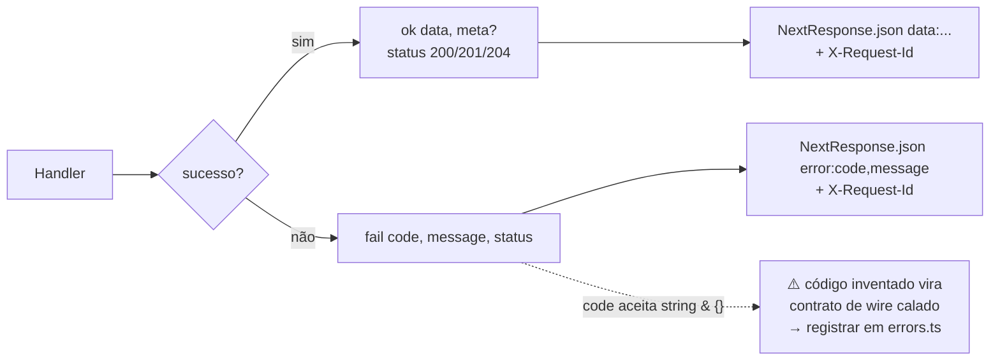
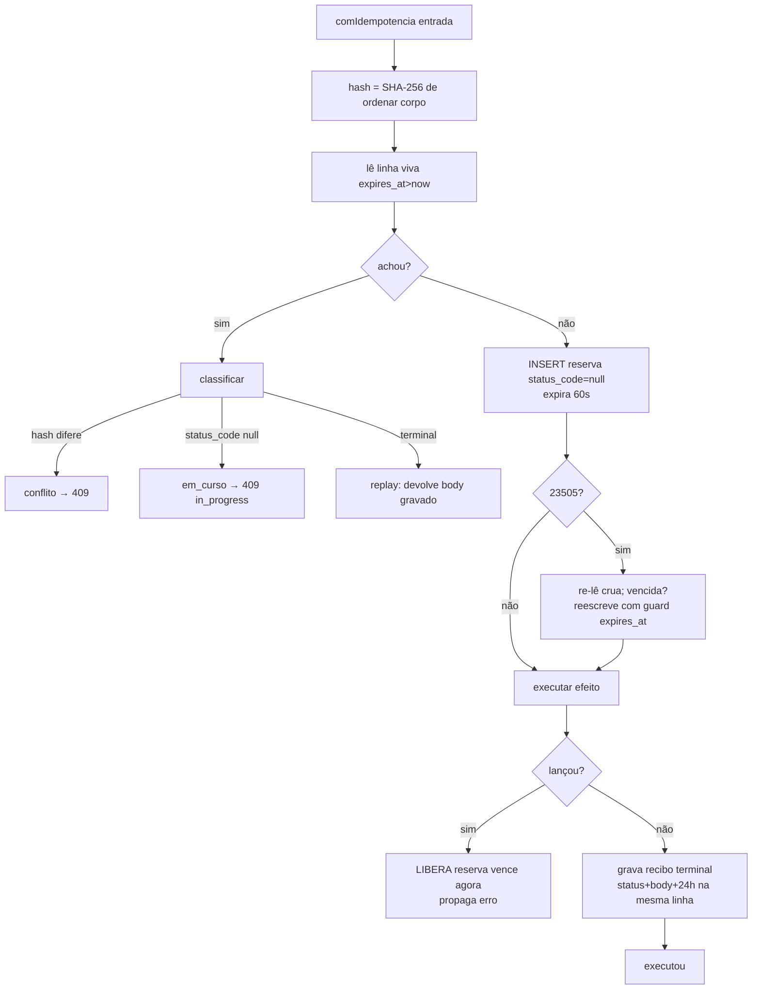
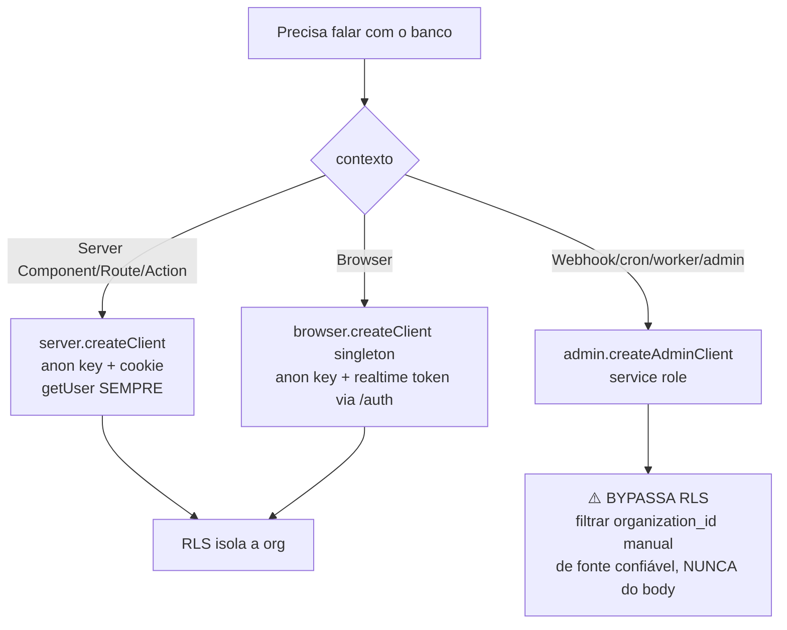
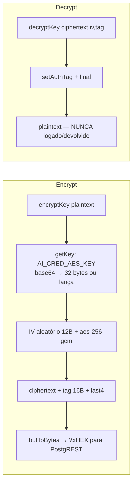
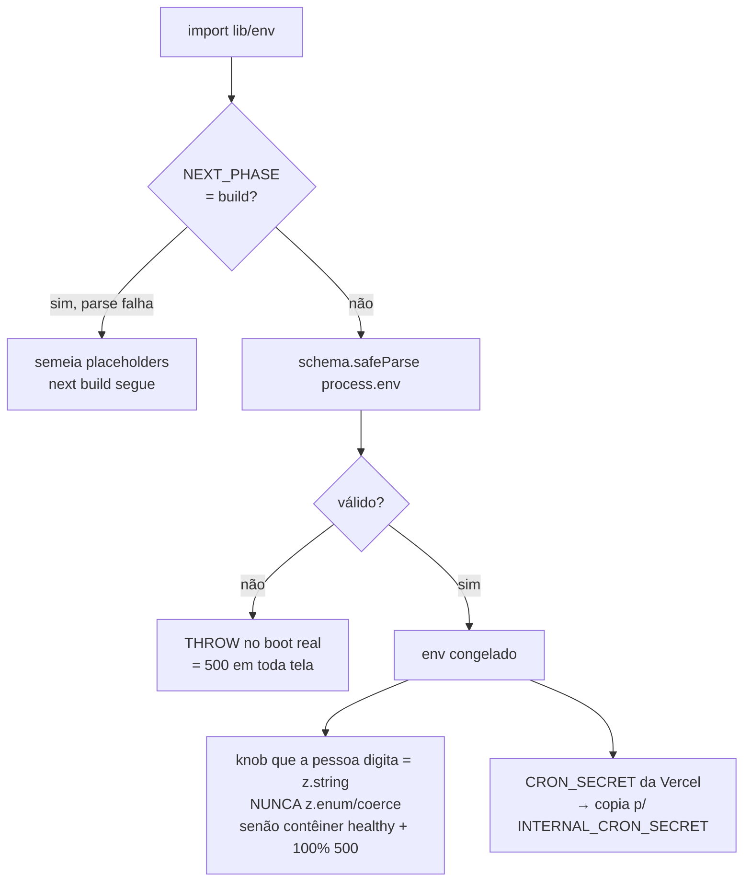
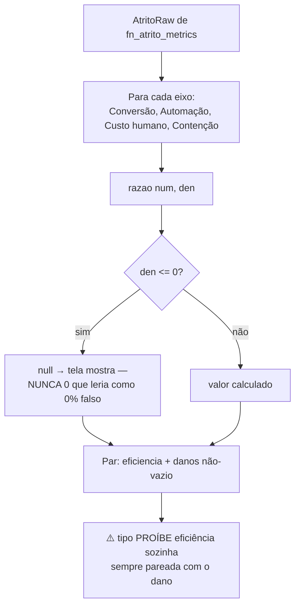

# Fluxogramas — Infra transversal e relatórios

> Gerado pelo Arqueólogo (Reversa) — Unidade 13.
> Cobre `lib/api/`, `lib/supabase/`, `lib/crypto/`, `lib/env.ts`, `lib/i18n/`, `lib/reports/`, `lib/metrics/`.

---

## 1. Envelope de resposta — `ok`/`fail` (`api/wrappers.ts`)

---

## 2. Idempotência com fecho de corrida — `comIdempotencia` (`api/idempotency.ts`)

---

## 3. Os três clients Supabase e a decisão de RLS

---

## 4. Cifra AES-GCM — `encryptKey`/`decryptKey` (`crypto/aes_gcm.ts`)

---

## 5. Contrato de env — `lib/env.ts` (parse no import)

---

## 6. Índice de Atrito — `montarPares` (`metrics/atrito.ts`)

