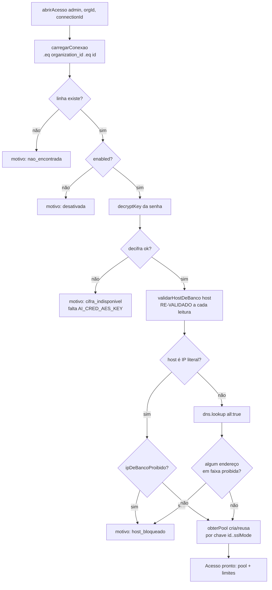
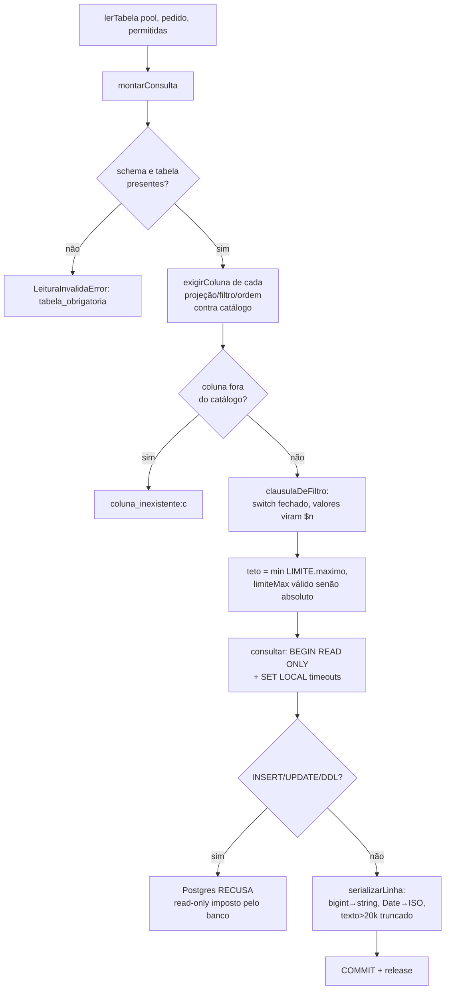
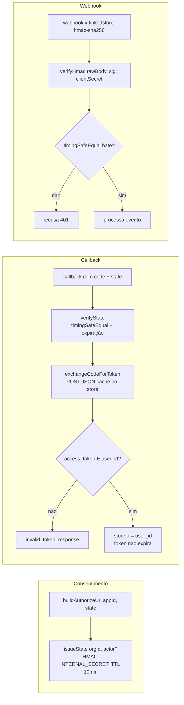
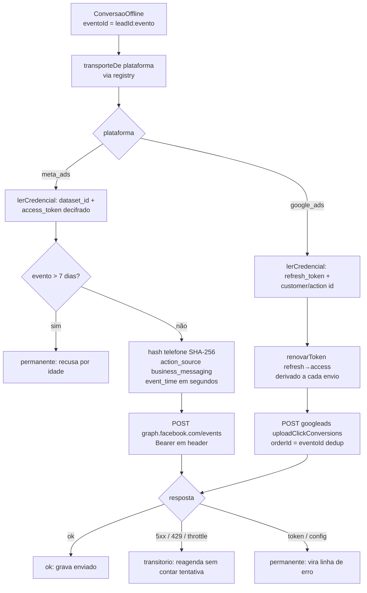
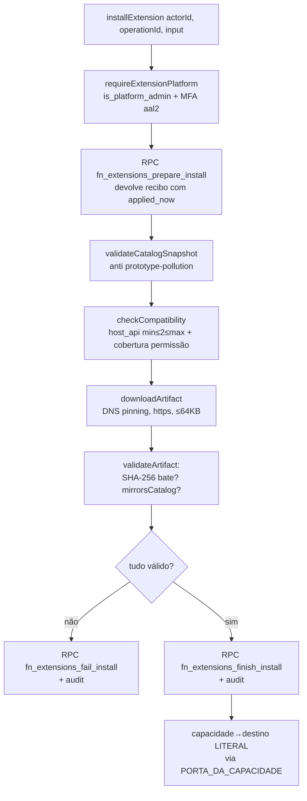
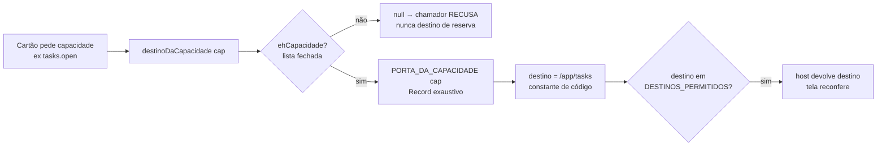

# Fluxogramas — Integrações externas

> Gerado pelo Arqueólogo (Reversa) — Unidade 11.
> Cobre `lib/external-db/`, `lib/nuvemshop/`, `lib/plataformas-de-anuncio/`, `lib/extensions/`.

---

## 1. Abrir acesso a banco externo — `abrirAcesso` (`external-db/acesso.ts`)

---

## 2. Leitura só-leitura montada no servidor — `lerTabela` (`external-db/leitura.ts`)

---

## 3. OAuth Nuvemshop + verificação de webhook HMAC (`nuvemshop/oauth.ts`)

---

## 4. Envio de conversão offline — transporte por plataforma (`plataformas-de-anuncio/`)

---

## 5. Instalar extensão declarativa — `installExtension` (`extensions/service.ts`)

---

## 6. Modelo de capacidade — tradução nome→destino (`extensions/capacidades.ts`)

