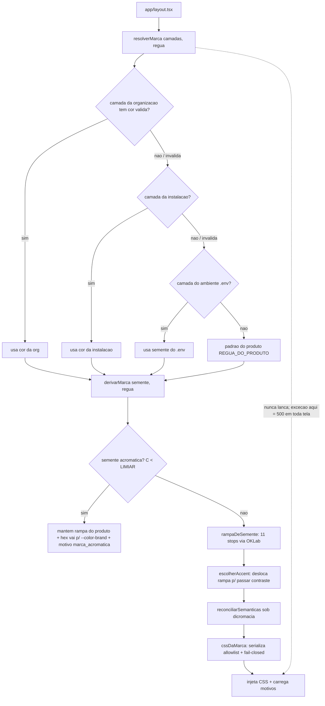
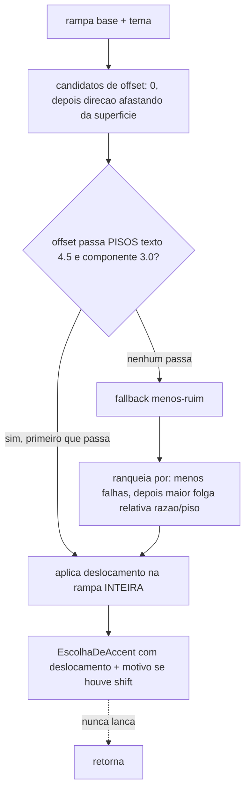
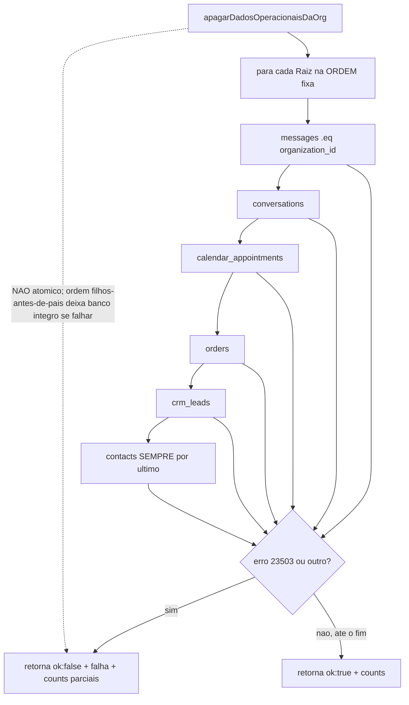
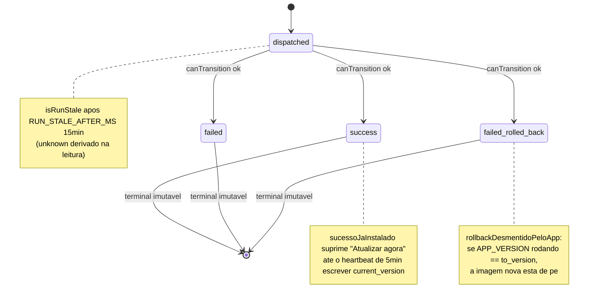
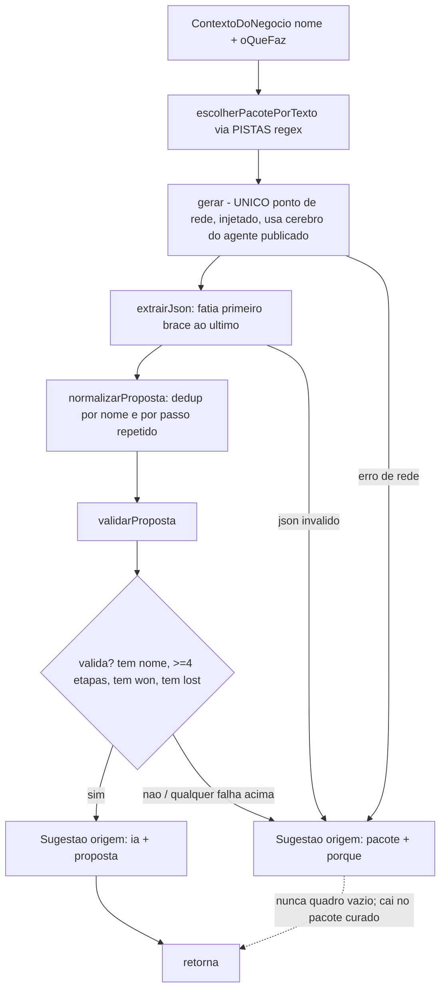
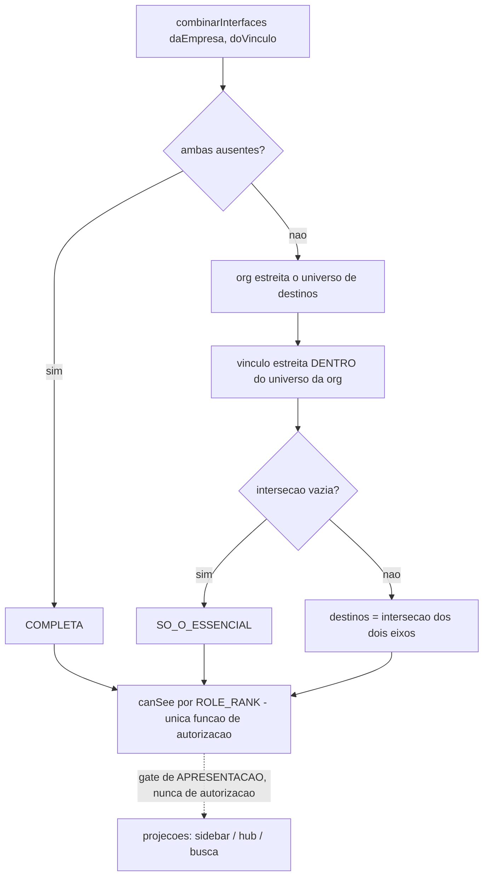
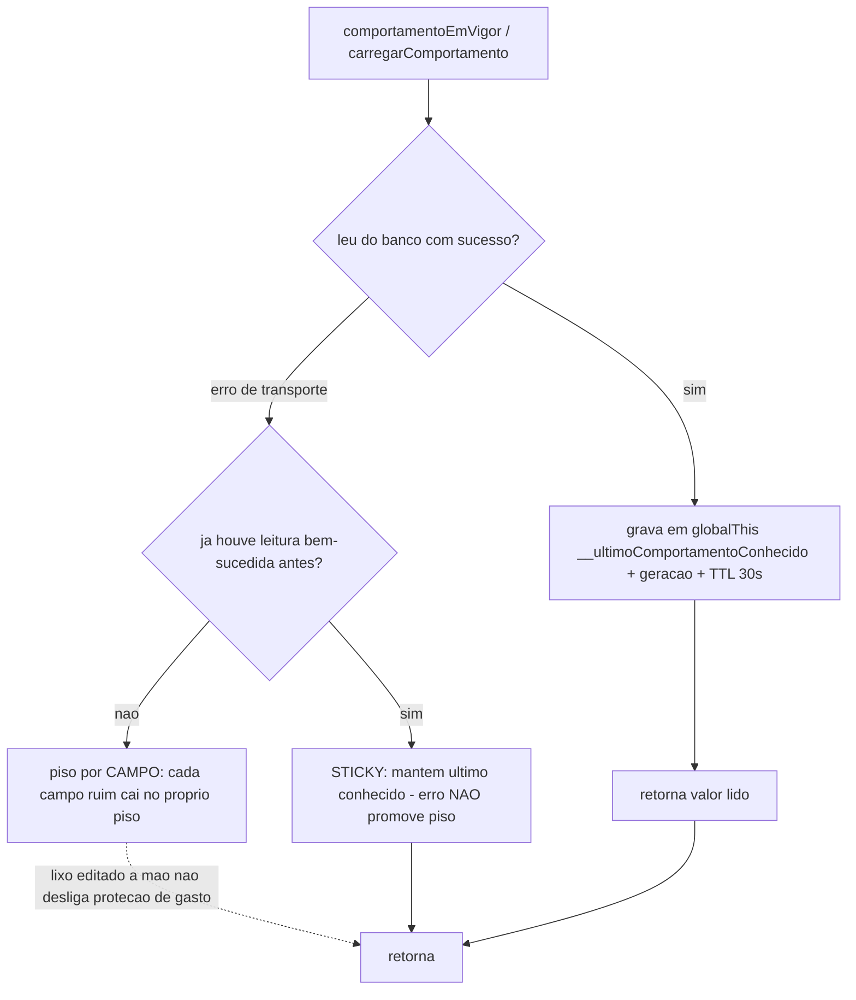

# Fluxogramas — Plataforma e operação

> Unidade 10 do Arqueólogo. Módulos: `settings`, `onboarding`, `instalacao`, `branding`, `navigation`, `system`, `operacao`.
> Diagramas Mermaid dos fluxos não-triviais. 🟢 CONFIRMADO salvo indicação.

## 10.1 Resolução da marca (white-label) no render

## 10.2 Deslocamento de accent por contraste (escolherAccent)

## 10.3 Reset de dados operacionais (ordem carga por FK RESTRICT)

## 10.4 Máquina de estado da rodada de update (update-run.ts)

## 10.5 Sugestão de funil no onboarding (sugerirFunil)

## 10.6 Interseção de interface (empresa × vínculo)

## 10.7 Leitura sticky de comportamento da instalação

