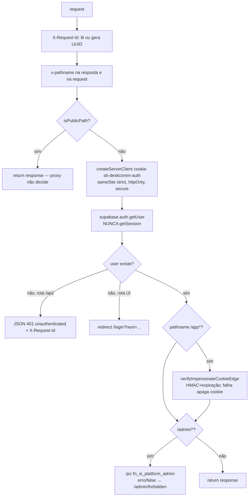
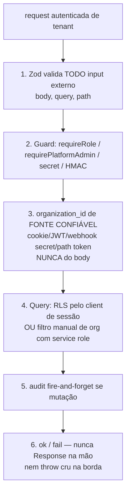
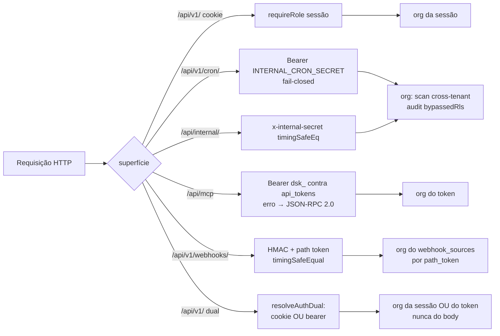
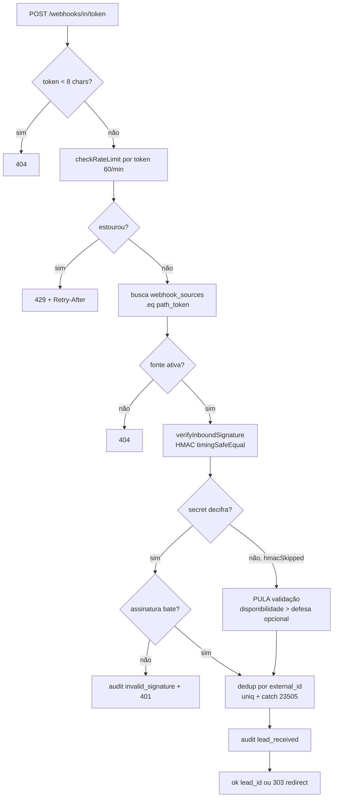
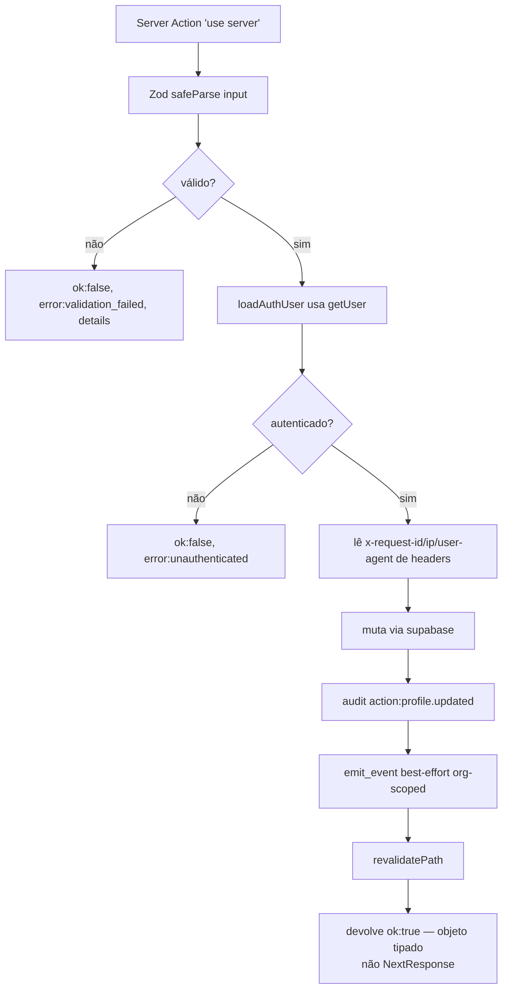

# Fluxogramas — Superfície HTTP

> Gerado pelo Arqueólogo (Reversa) — Unidade 14.
> Cobre `proxy.ts`, `app/api/**` (route handlers) e Server Actions `app/actions/`.

---

## 1. Middleware de borda — `proxy` (`proxy.ts`)

---

## 2. Receita canônica de route handler (6 passos)

---

## 3. As superfícies não-cookie e seus guards

---

## 4. Webhook de captação — `webhooks/in/[token]` (HMAC + idempotência)

---

## 5. Server Action — padrão (`app/actions/settings/updateProfile.ts`)

