# Fluxogramas — Unidade 4: Voz / Telefonia

> Gerado pelo Arqueólogo (Reversa) — nível **detalhado**
> Cobre os dois canais de voz: WaCalls (WhatsApp, humano/WebRTC) e SIP (Asterisk, IA/AudioSocket).
> Escala: 🟢 CONFIRMADO · 🟡 INFERIDO · 🔴 LACUNA

---

## 4.0 Visão geral — dois canais, uma tabela 🟢

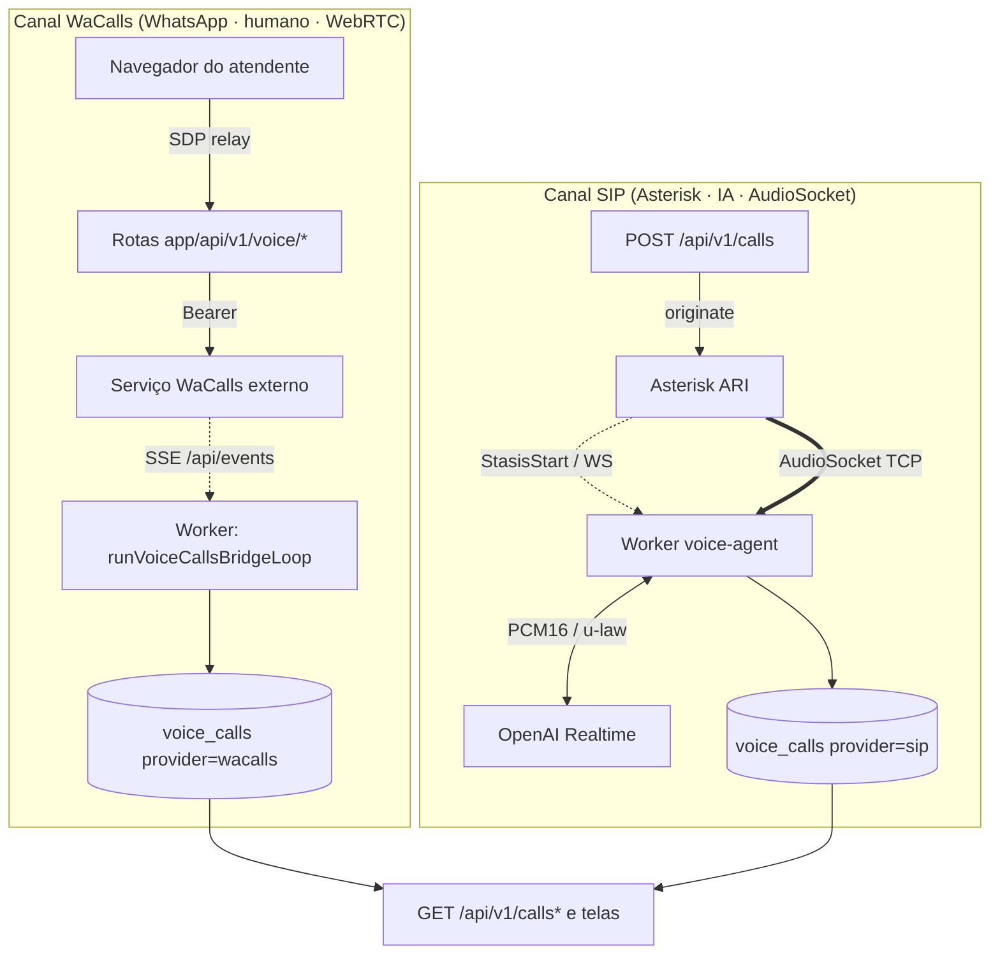

---

## 4.1 Opt-in: a regra das duas perguntas 🟢 — `voice/opt-in.ts`

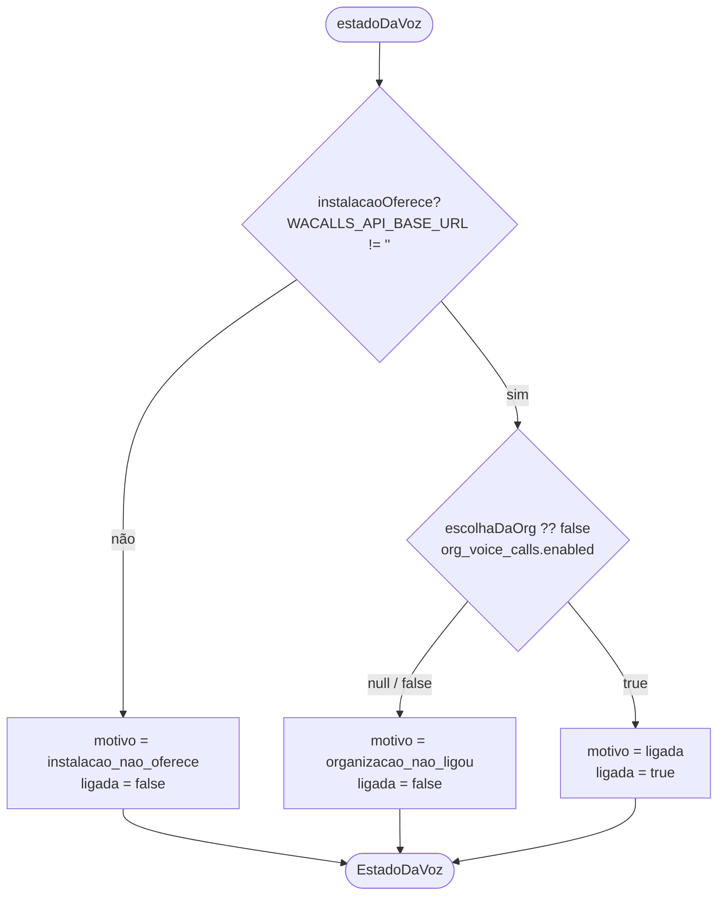

> A combinação é `instalacaoOferece && (escolhaDaOrg ?? false)` — nunca `??`. Ausência de linha = off.

---

## 4.2 Guarda de rota 🟢 — `voice/guarda.ts::exigirVozLigada`

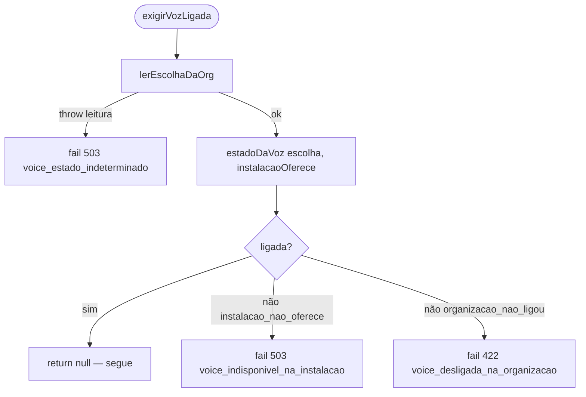

> Falha **fechada** (erro vira recusa). Rotas de **desligar** NÃO passam por esta guarda.

---

## 4.3 Desparear 🟢 — `voice/desparear.ts::despareaVoz` (ordem é regra)

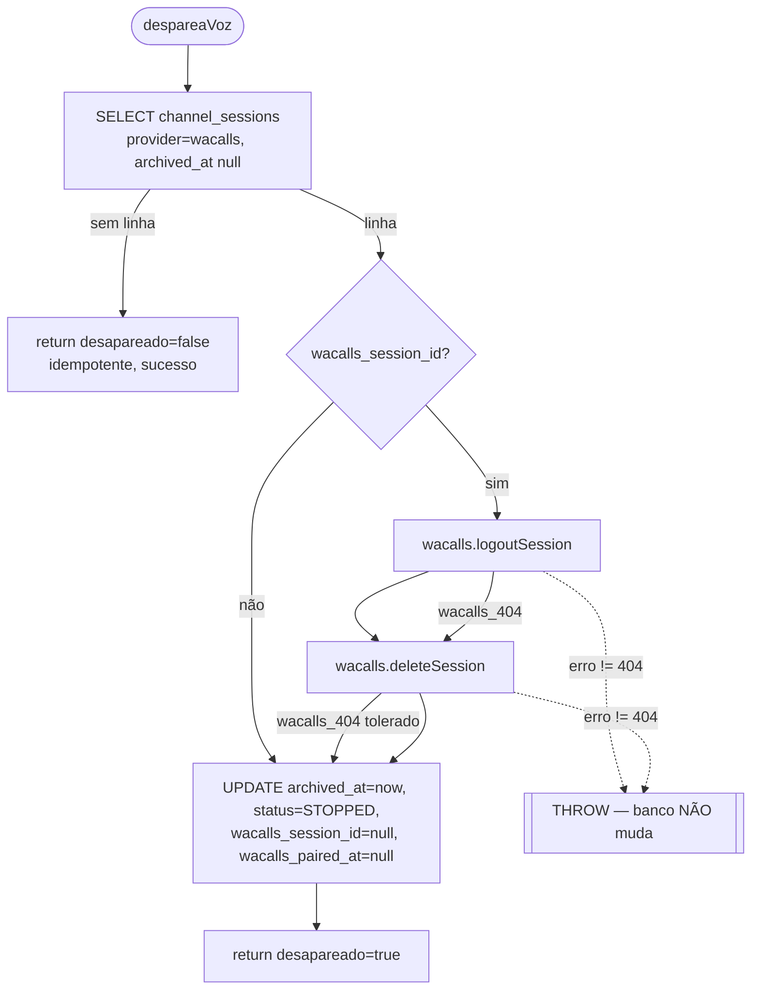

> `logout` → `delete` → banco. Banco só muda depois que o WaCalls confirmou. `404` é tolerado.

---

## 4.4 Número discável — grafia certa do celular 🟢 — `voice/numero-discavel.ts`

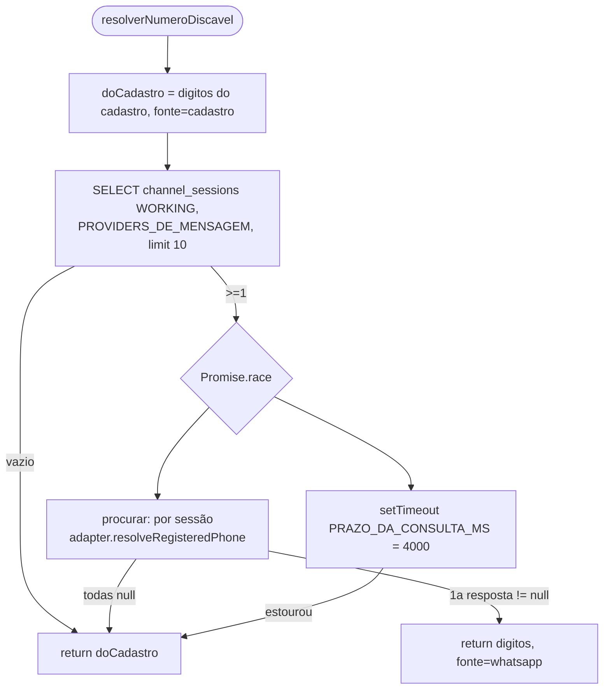

> Falha **ABERTA**: qualquer falha/timeout → disca o cadastro (comportamento anterior).

---

## 4.5 Ponte de eventos WaCalls — despacho SSE 🟢 — `wacalls/events-bridge.ts::despacharEventoWacalls`

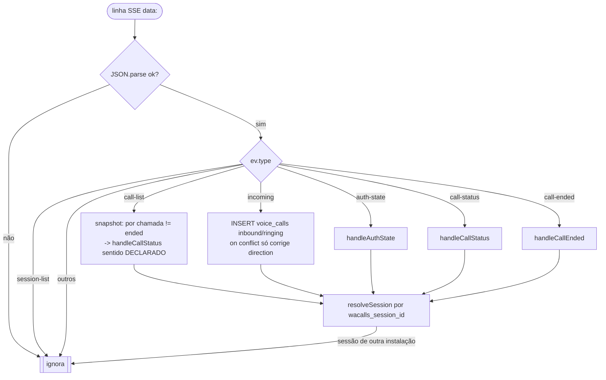

---

## 4.6 `handleCallStatus` — inferência de sentido + upsert 🟢

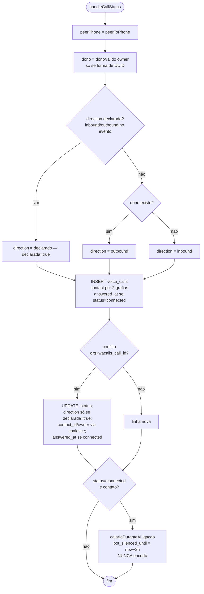

---

## 4.7 `handleCallEnded` — fechamento e efeitos 🟢

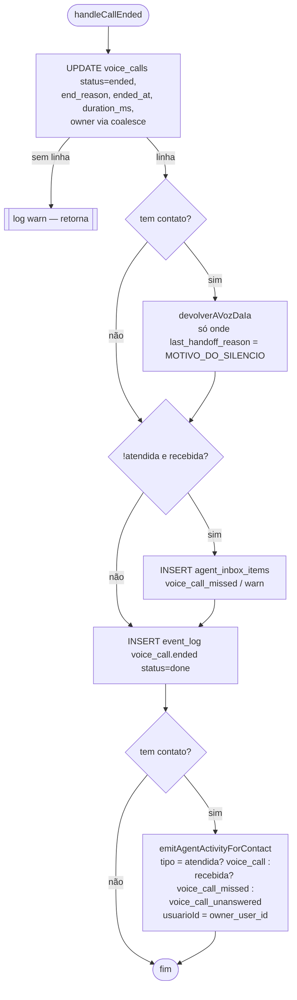

> `voice_call` quebra o silêncio do negócio; `voice_call_missed`/`voice_call_unanswered` **não**.

---

## 4.8 `handleAuthState` — pareamento / desvínculo 🟢

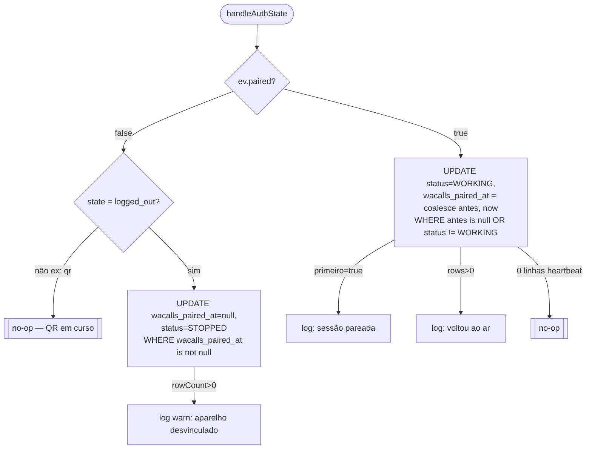

---

## 4.9 Canal SIP — chamada de SAÍDA 🟢 — `POST /api/v1/calls` → `originateCall`

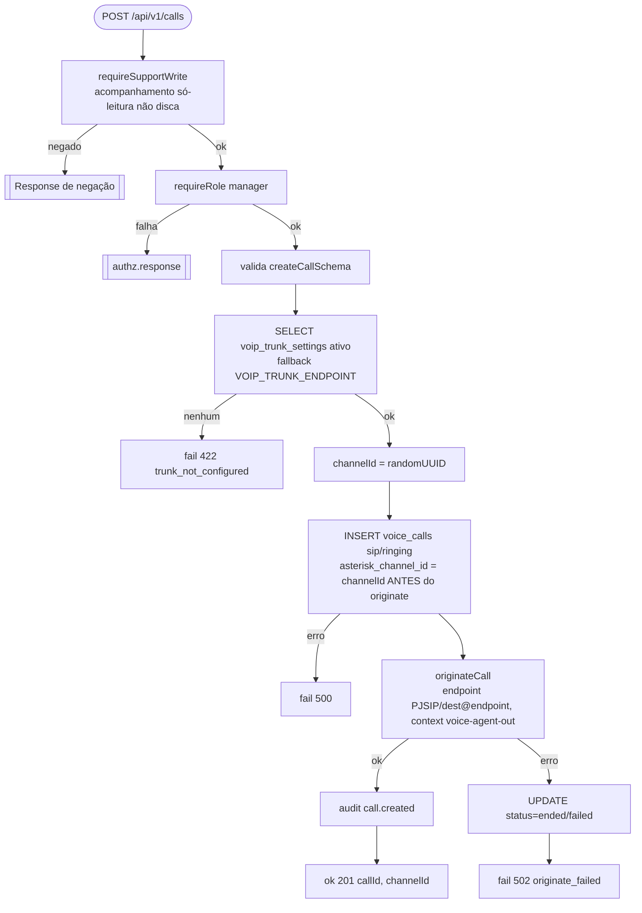

> `channelId` gerado ANTES fecha a race com o StasisStart (processo separado, via WebSocket).

---

## 4.10 Canal SIP — chamada de ENTRADA + AudioSocket 🟢 — `workers/voice-agent/index.ts`

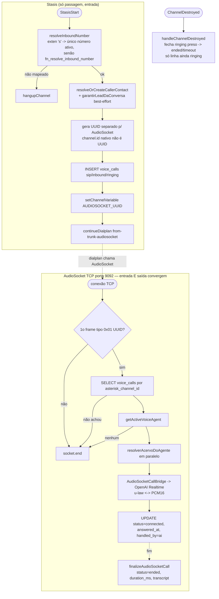

---

## 4.11 Loop de vida da ponte SSE 🟢 — `runVoiceCallsBridgeLoop`

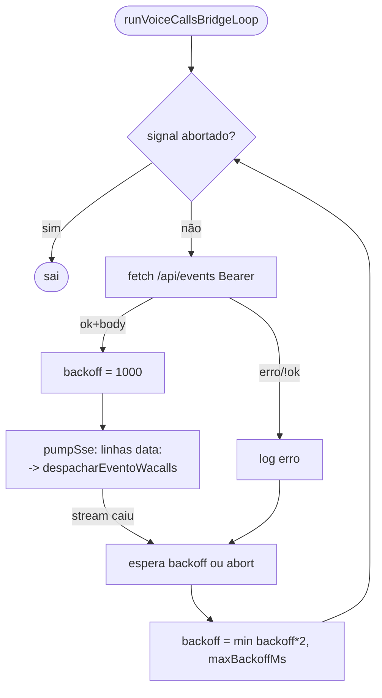
