# Máquinas de Estado — DeskcommCRM

> Gerado pelo Detetive (Reversa) — fase de Interpretação · nível **detalhado**
> Escala de confiança: 🟢 CONFIRMADO · 🟡 INFERIDO · 🔴 LACUNA
> Fontes: `code-analysis.md`, `data-dictionary.md`, CHECKs de migration citados no dicionário.

Cada entidade com campo de estado aparece com: valores possíveis, transições permitidas e seus
gatilhos, terminalidade e um diagrama Mermaid. Onde o CHECK do banco garante os valores, a máquina
é 🟢; onde a transição é inferida do fluxo de código, é 🟡.

---

## 1. Estágio do agente no funil (`LeadStage`) 🟢

Máquina de estados do funil abstrato que o agente de IA navega (F2-10). Grafo fixo em
`agent-engine/agent/lead-state.ts` (`LEAD_STAGE_TRANSITIONS`), validado no código antes de
persistir. Idempotente no mesmo estágio. `won` e `lost` são terminais.

**Estados:** `new`, `contacted`, `qualifying`, `qualified`, `negotiating`, `won`, `lost`.

**Regras 🟢:**
- Qualquer estágio não-terminal pode ir para `lost` (perda a qualquer momento).
- Avanço é estritamente sequencial (não pula etapas): `new → contacted → qualifying → qualified → negotiating → won`.
- `next_action_seq` incrementa só quando `next_action` é reescrita (identidade da proposta para autorização humana).

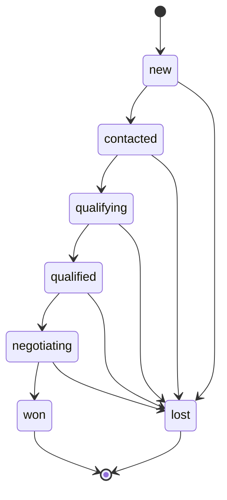

---

## 2. Status do lead no CRM (`crm_leads.status`) 🟢

Status persistido do negócio, distinto do `LeadStage` do agente. Escrito pelo **trigger** no
fechamento (não pela aplicação). Fonte: `data-dictionary.md` (Unidade 5).

**Estados:** `open`, `won`, `lost`.

**Regras 🟢:**
- `won`/`lost` são escritos pelo trigger quando a etapa (`crm_stages`) marcada `is_won`/`is_lost`
  recebe o lead; `closed_at` é carimbado junto.
- `lost` exige `lost_reason` (vocabulário canônico ∪ `settings.lost_reasons`).
- Mover para outro pipeline **não** é transição de status: é **clonagem** (P-01, pipeline imutável).
  O motivo de perda `moved_to_another_pipeline` fecha o original mas é excluído das métricas.

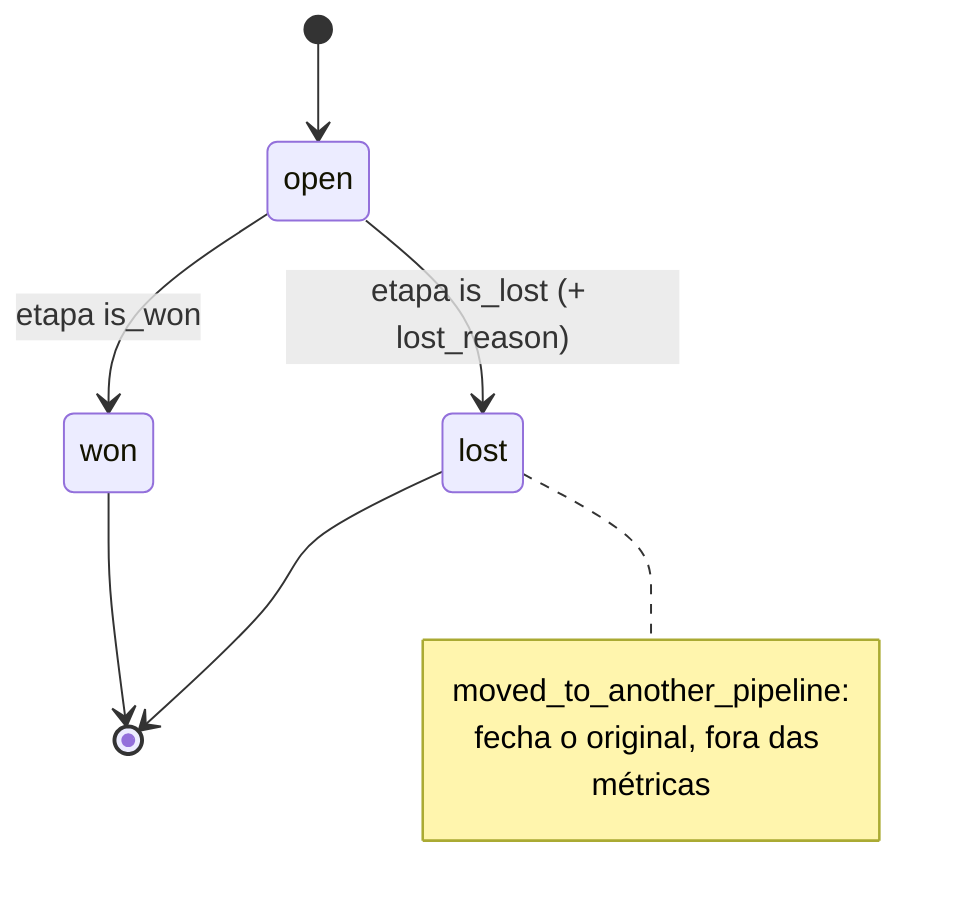

---

## 3. Compromisso da agenda (`calendar_appointments.status`) 🟢

CHECK da migration 0176. "Marcado ≠ confirmado": nasce `pending`. Fonte: `data-dictionary.md`
(Unidade 6).

**Estados:** `pending`, `confirmed`, `cancelled`, `completed`, `no_show`.

**Regras 🟢/🟡:**
- 🟢 Nasce `pending` (`aguarda_confirmacao`) quando o tipo `requires_confirmation`.
- 🟡 `confirmed` por confirmação (tool `crm_confirm` / ação humana).
- 🟡 `completed`/`no_show` são desfechos (`crm_set_appointment_outcome`), pós-horário.
- 🟢 Compromisso `cancelled` **não** enfileira entrega de link (guarda corrigida no commit `d43a2ac14`).
- 🟢 `SITUACOES_VIVAS` alimentam o índice parcial `calendar_appointments_org_vivos_idx`.

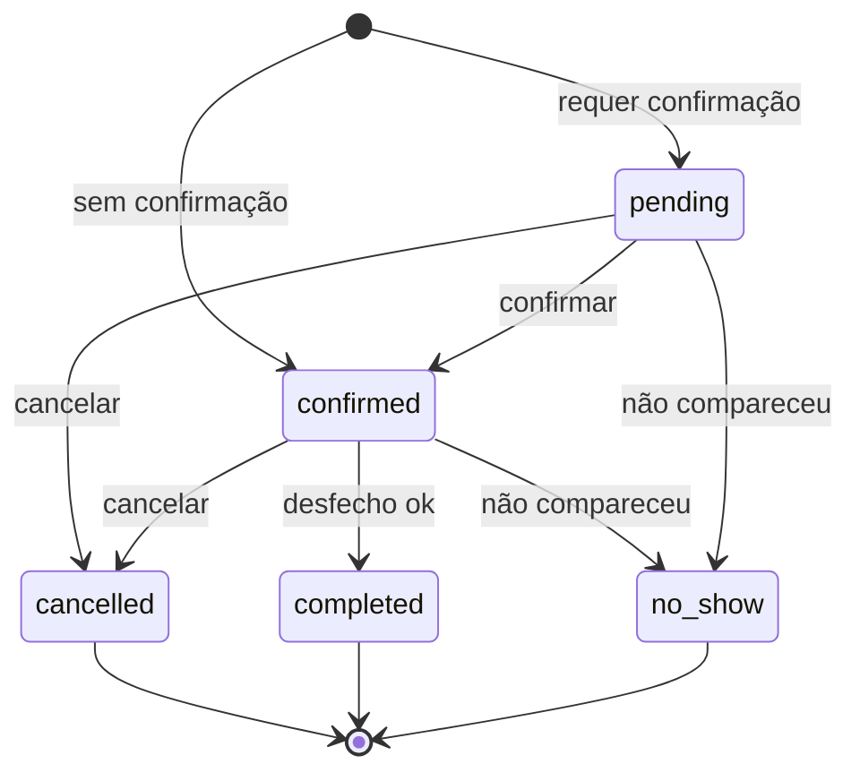

---

## 4. Estado do Google Meet no compromisso (`meeting_state`) 🟢

Sub-máquina do link de reunião, ortogonal ao `status`. Fonte: `data-dictionary.md` (Unidade 6).

**Estados:** `not_requested`, `pending`, `ready`, `failed`, `cancelled`.

**Regra 🟢:** o compromisso chega ao cliente **mesmo sem** Meet (`meeting_state=failed`; commit
`f220852c3`) — o link não é bloqueante.

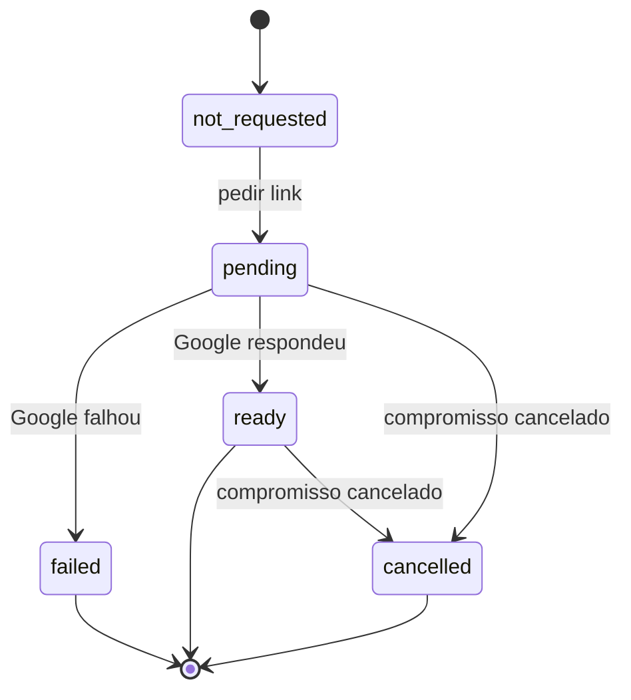

---

## 5. Caso humano (`human_cases.status`) 🟢

Loop assíncrono IA↔humano (spec 15). Transições implementadas como CTEs de statement único
condicionais (`WHERE status=precondição`, atômicas). Fonte: `code-analysis.md` (Unidade 1.5).

**Estados abertos:** `awaiting_human`, `awaiting_lead`.
**Terminais:** `resolved`, `escalated`, `cancelled`.

**Eventos (`CaseEventKind`):** opened, human_replied, lead_asked, lead_provided, lead_unresponsive,
resolved, escalated, cancelled, agent_noted, alert_sent.

**Regras 🟢:**
- `case_reply_turn`: a resposta de um humano re-injeta um turno. `REENTRY_ACTIONS =
  ['resolved','need_lead_info']`; `EXPECTED_STATUS_FOR_ACTION = {resolved:'resolved',
  need_lead_info:'awaiting_lead'}`.
- `resolved` é TERMINAL.
- `crm_resume_ai_attendance` **só pessoa** (ator `ai_agent` é recusado).

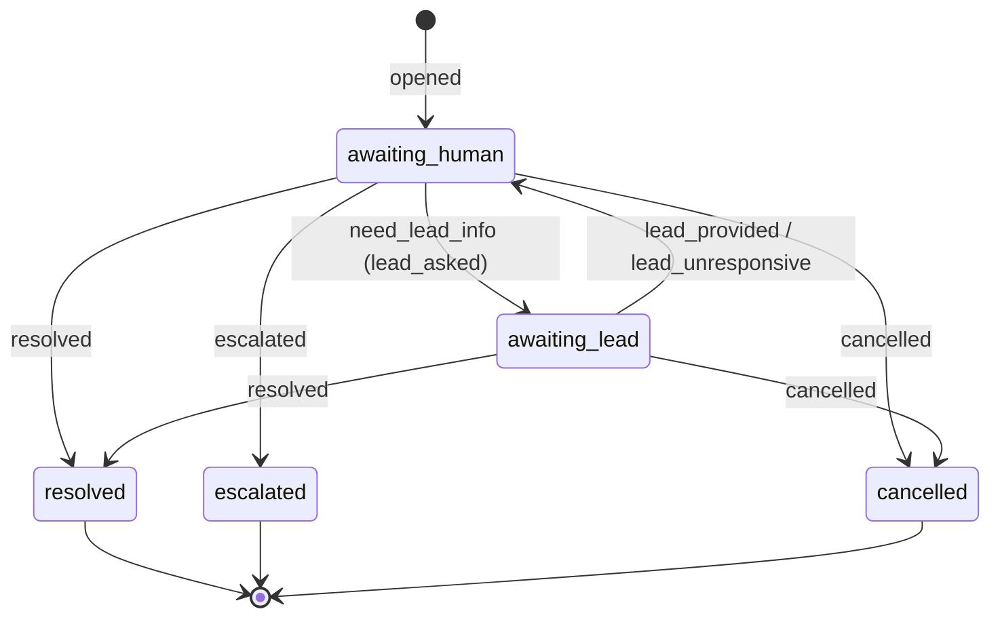

---

## 6. Inscrição em fluxo de follow-up (`followup_enrollments.status`) 🟢

Event sourcing do follow-up. Uma inscrição viva por `(org, pointer, contact)`. Fonte:
`data-dictionary.md` (Unidade 7), `followup/node-handlers.ts`.

**Estados:** `active`, `waiting_reply`, `dormente`, `paused_handoff`, `paused_manual`, `completed`,
`cancelled`, `dead`.
**Terminais:** `completed`, `cancelled`, `dead`.

**Regras 🟢/🟡:**
- 🟢 `waiting_reply`: nó `match_reply`/`ai_classify` aguardando resposta (com `grace_timeout_ms ≥ 15min`).
- 🟢 `paused_handoff`: pausada por handoff ativo; retoma com `RESUME_GRACE_MS`.
- 🟢 `paused_manual`: pausada por operador.
- 🟢 `dormente`: aguardando `next_eval_at` distante.
- 🟢 `dead`: esgotou `max_attempts` (backoff `[30s,60s,5m,15m,1h]`) ou `MAX_STEPS=80`.
- 🟢 `outcome` em terminais: `converted`, `exhausted`, `replied`, `handoff`, `opted_out`.

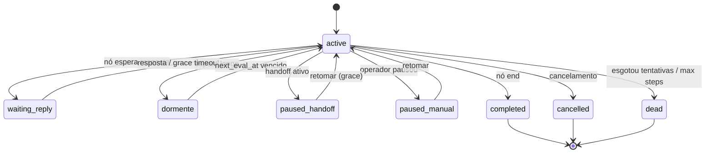

---

## 7. Chamada de voz (`voice_calls.status`) 🟢

Vocabulário cru do upstream WaCalls; SIP compartilha a tabela (migration 0348). Fonte:
`data-dictionary.md` (Unidade 4).

**Estados (durável):** `starting`, `ringing`, `connected`, `ended`.
**Derivação para a API (`mapStatusParaApi`):** `connected→in_progress`; `≠ended → ringing`;
`ended`+`end_reason`: `timeout→no_answer`, `busy→busy`, `failed→failed`, `cancelled→canceled`,
senão `completed`.

**Regras 🟢:**
- `answered_at` carimbado só em `connected` (`null` = nunca atendida).
- `duration_ms = answered_at ? ended-answered : null` (não é generated column).
- Recebida não atendida → `agent_inbox_items kind='voice_call_missed'`.

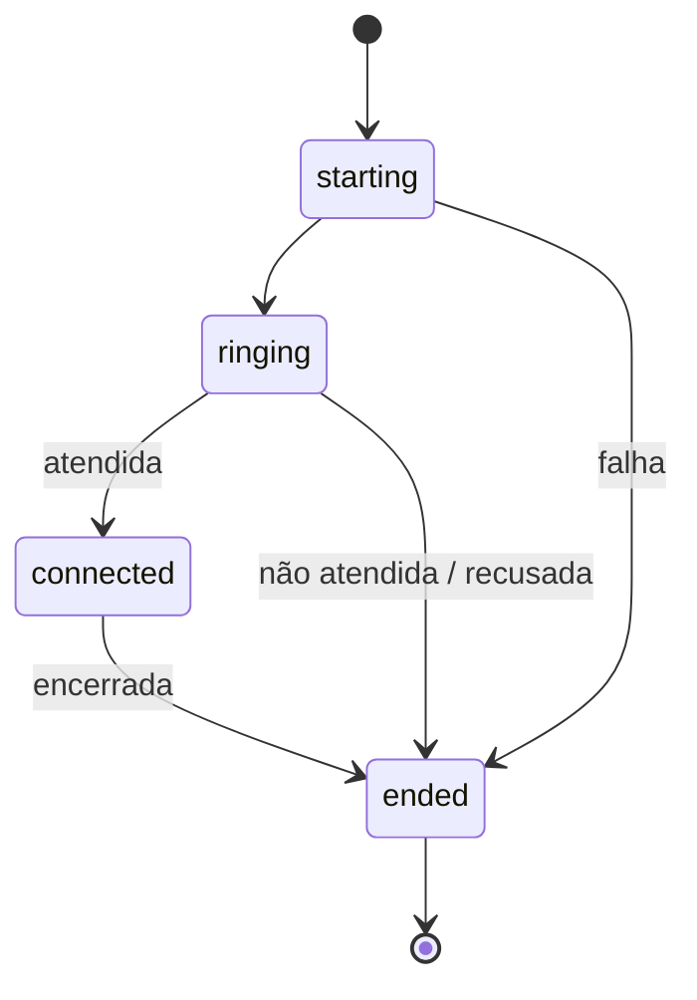

---

## 8. Sessão de canal (`channel_sessions.status`) 🟢

Estado da conexão de um número/conta ao provedor. Só `WORKING` é utilizável. Fonte:
`code-analysis.md`/`data-dictionary.md` (Unidade 3, `estado.ts`).

**Estados:** `STARTING`, `SCAN_QR_CODE`, `WORKING`, `STOPPED`, `FAILED`.

**Regras 🟢:**
- `STATUS_QUE_AVISAM = [SCAN_QR_CODE, FAILED, STOPPED]` (STARTING excluído = boot normal).
- `sincronizarSaudeDaConexao` dedup por episódio (`escalated_status`); só quem observou pode fechar.

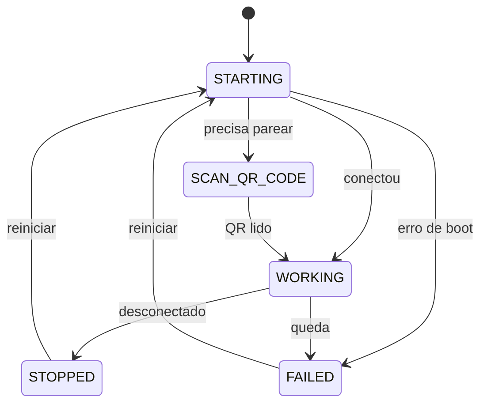

---

## 9. Comando da conversa (`inbox/comando-da-conversa.ts`) 🟢

Quem controla a conversa (derivado, não uma coluna única). Fonte: `data-dictionary.md` (Unidade 3).

**Estados (`Comando`):** `humano`, `automatico`, `ninguem`, `aguardando`, `encerrada`.
**Motivos de silêncio (`MotivoDoSilencio`):** atendente_no_comando, contato_travado, pausado,
resposta_humana_recente, contato_descadastrado.

**Regras 🟢:**
- `STATUS_ENCERRADOS = [closed, archived, resolved]` → `encerrada`.
- Sentinelas de silêncio do bot: `bot_silenced_until = 'infinity'` (handoff irrevogável) /
  `'-infinity'`.
- Handoff: `automatico → humano` via `performHumanHandoff` (`force_human=true`,
  conversa `ai_handling → pending`).

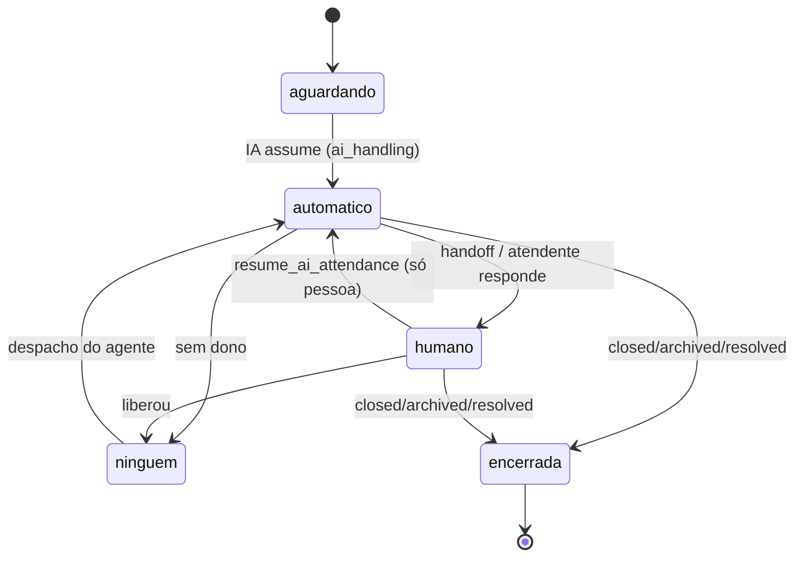

---

## 10. Pedido LGPD (`lgpd_requests.status`) 🟢

CHECK do banco. Fonte: `data-dictionary.md` (Unidade 9).

**Estados:** `received`, `processing`, `completed`, `failed`, `pending_review`.

**Regras 🟢:**
- `pending_review` = precisa de decisão humana (a IA nunca anonimiza).
- SLA: aviso em D+5 (`data_request`) / D+10 (`redact`); `due_at` carimbado na entrada.
- `attempts` com teto; `failed` após esgotamento.

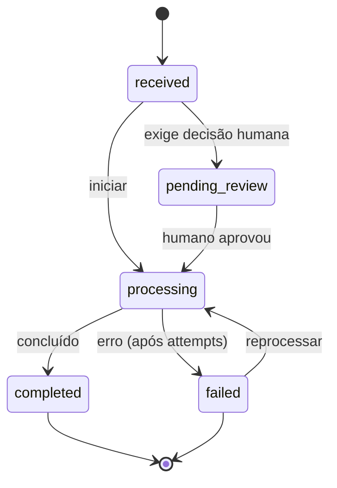

---

## 11. Campanha de prospecção (`prospecting_campaigns.status`) 🟢

Fonte: `data-dictionary.md` (Unidade 5).

**Estados:** `running`, `paused`, `completed`.
**Sub-estado de busca (`search_status`):** starting, running, unknown, ... (🟡 conjunto não fechado
no dicionário).

**Regras 🟢:**
- Teto global de 50 envios/24h; esteira anda a `FATOR_DA_ESTEIRA_FRIA = 4` do ritmo normal.
- Candidato (`prospecting_candidates.status`): `queued → sending → sent | failed`.

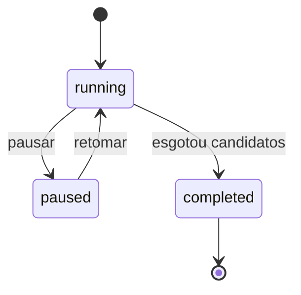

Candidato:

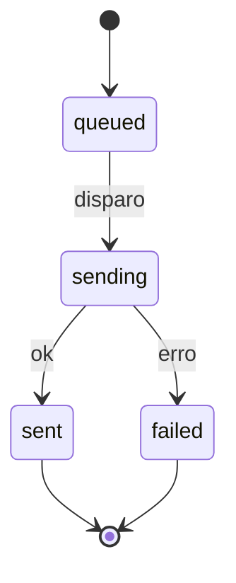

---

## 12. Job da fila do agente (`agent_engine job_queue.status`) 🟢

Fonte: `code-analysis.md` (Unidade 1.11), `data-dictionary.md` (Unidade 12).

**Estados:** `pending`, `running`, `done`, `failed`, `dead`.

**Regras 🟢:**
- `attempts++` no CLAIM; `max_attempts` default 5.
- `completeJob` exige `status='running' AND locked_by AND locked_at=acquiredAt` (exactly-once).
- `failJob`: backoff `power(2,attempts-1)*10` cap 120s; ao esgotar → `dead` + inbox `job_dead`.
- `cancelJob`: terminal, sem retry. `reapExpiredJobs`: `running` expirado (visibility timeout 10min)
  volta a `pending`.

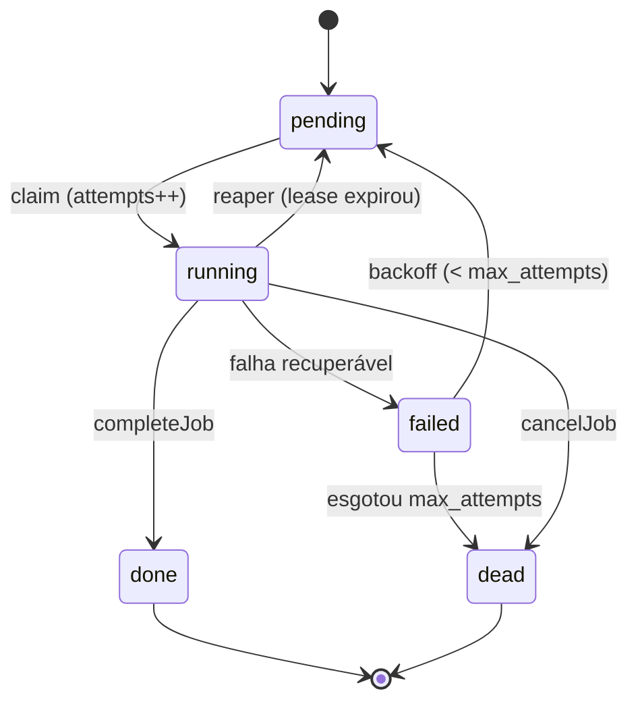

---

## 13. Conexão de agenda Google (`calendar_connections.status`) 🟢

CHECK da migration 0177. Fonte: `data-dictionary.md` (Unidade 6).

**Estados:** `connecting`, `healthy`, `token_expired`, `scope_missing`, `disconnected`,
`rate_limited`, `error`.

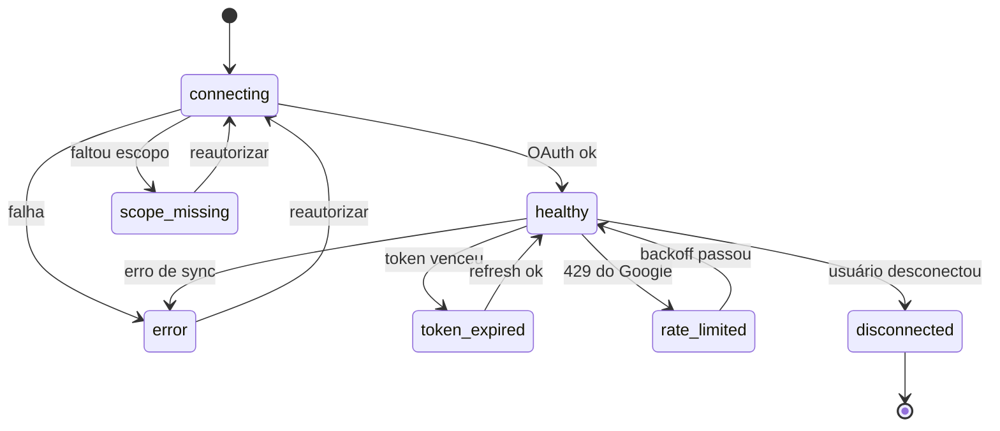

---

## Máquina de estados — `prospecting_campaigns` 🟢

> Fechada pela migration `20260921030100_0369_prospeccao_nativa.sql:16` (e `baseline.sql`). [Revisão] usuário apontou a migration em 2026-09-23; era 🔴.

Dois campos de estado independentes:

- **`status`** (ciclo de vida da campanha), default `draft`, CHECK `('draft','running','paused','completed')`.
- **`search_status`** (execução da busca de leads), default `starting`, CHECK `('starting','running','succeeded','failed','unknown')`.

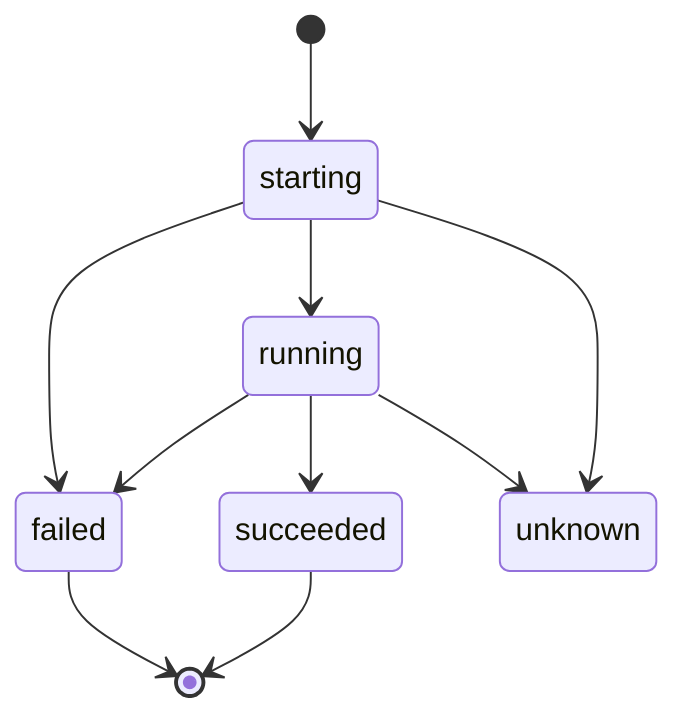

> `unknown` é o estado de degradação (execução perdida/indeterminada). O CHECK garante o conjunto fechado; transições acima são 🟡 (o CHECK fixa os valores, a ordem entre eles é inferida do fluxo de busca).

---

## Transições de `calendar_appointments` 🟢 (ator) / 🟡 (guarda temporal)

> [Revisão] usuário confirmou em 2026-09-23: **apenas agente IA e operador** disparam as transições (confirmar/completar/no_show). O **cliente/lead nunca** dispara diretamente. Era 🔴.

- Atores autorizados: **agente IA** (via tool MCP) e **operador** (via CRM). Cliente não transiciona.
- 🟡 Guarda de ordem temporal (ex.: `no_show` só após a hora do compromisso; não `completar` agendamento futuro) permanece inferida — não localizada como CHECK/trigger explícito; confirmar com o Data Master ao documentar o schema de agenda.

---

## Lacunas 🔴

- 🔴 O convite de time (`StatusConvite`: pendente/aceito/expirado/revogado) é **derivado**, nunca
  coluna — a "máquina" é uma projeção de timestamps (`accepted_at`, `revoked_at`, `expires_at`),
  não transições persistidas. Documentada aqui como nota, não como diagrama de transições.
