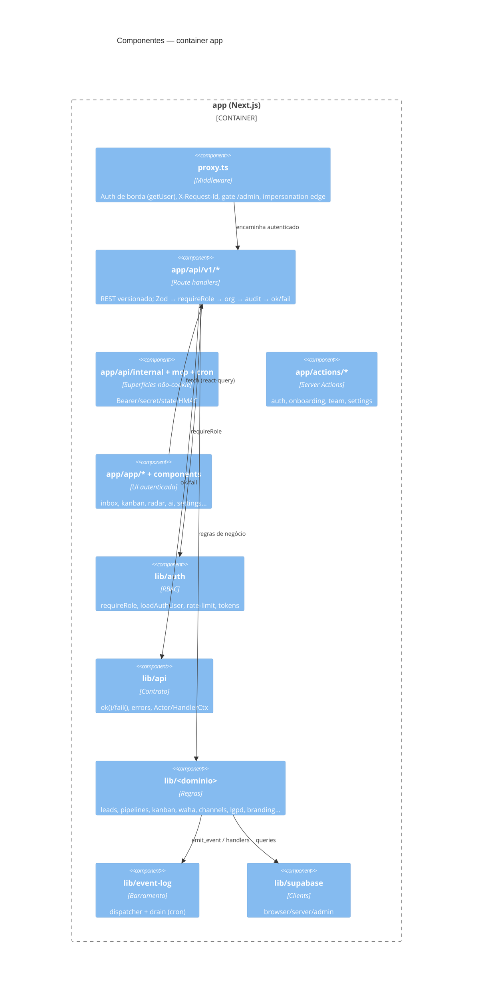
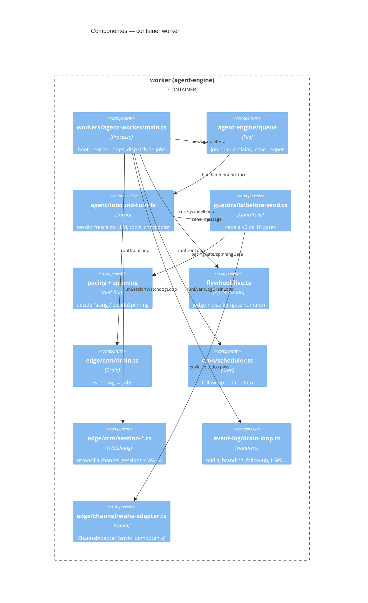

# C4 Nível 3 — Componentes — DeskcommCRM

> Gerado pelo **Arquiteto** (Reversa) · 🟢 CONFIRMADO. Foco nos dois containers mais relevantes: `app` e `worker`.

## Container `app` (Next.js) — componentes internos

## Container `worker` (agent-engine) — componentes internos

## Responsabilidades-chave 🟢

- **`proxy.ts`** é o gate de borda; **`requireRole`** é o gate por rota (role do banco + MFA de sessão).
- **`before-send`** é o único caminho de saída do agente ao canal (10 gates, advisory lock por número).
- **`drain`** transforma `event_log` em `job_queue`; o `event-log/drain-loop` roda os handlers de eventos (mídia/branding/LGPD/follow-up) no ritmo do worker além do cron.
- **`watchdog`** mantém `channel_sessions` coerente com o WAHA e redirige `queued`.
