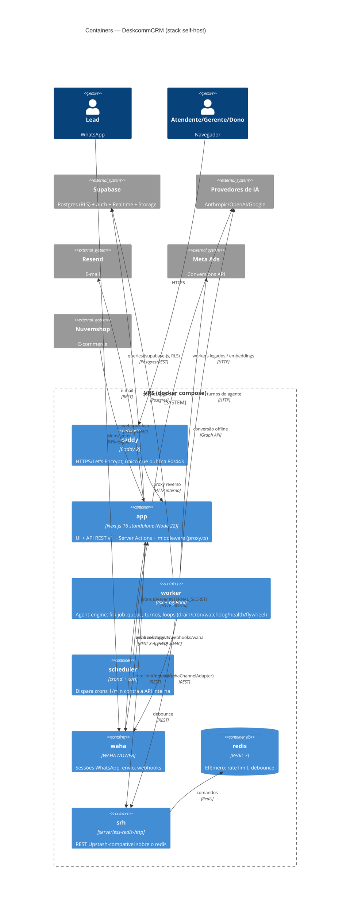

# C4 Nível 2 — Containers — DeskcommCRM

> Gerado pelo **Arquiteto** (Reversa) · 🟢 CONFIRMADO (`docker-compose.prod.yml`, `next.config.ts`, `workers/`)

## Notas de topologia 🟢

- **Só o Caddy publica portas** (80/443); todo o resto vive na rede interna `internal`.
- **Tetos de memória medidos** (VPS 3,8 GB): app 768m, worker 512m, waha 1280m, scheduler — para o OOM killer não derrubar o CRM inteiro.
- **Healthcheck do app é TCP puro** (não `/api/v1/health`, que dá 503 se WAHA/Redis caem — derrubaria o Caddy junto).
- **Imagens publicadas com `:stable`** (última release), não `:latest` (topo da main). `build:` fica ao lado como escape.
- **Supabase é externo** ao compose (serviço gerenciado ou instância própria) — 🟡 o modo exato de provisão não está no compose de prod.
- **`docker-compose.traefik.yml`** adiciona labels de roteamento quando a VPS já tem proxy próprio (Hostinger/Coolify/Dokploy); esquecer o 2º `-f` deixa o domínio em 404 com container `healthy`.
