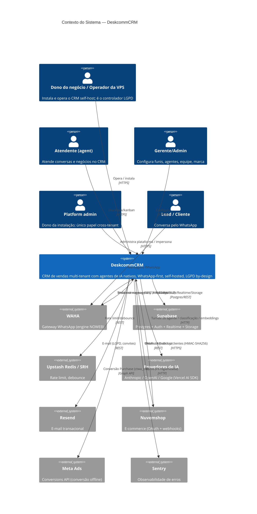

# C4 Nível 1 — Contexto — DeskcommCRM

> Gerado pelo **Arquiteto** (Reversa) · 🟢 CONFIRMADO

## Personas 🟢

- **Lead/Cliente:** conversa pelo WhatsApp; nunca acessa o CRM.
- **Atendente (`agent`):** trabalha inbox e kanban; escopo de visibilidade configurável.
- **Gerente/Admin (`manager`/`admin`):** configura funis, agentes, equipe, marca, anti-ban.
- **Dono/Operador:** instala na VPS; é o **controlador LGPD** (`organizations.legal_name`).
- **Platform admin:** único papel cross-tenant; pode impersonar tenants (sessão de suporte).

## Sistemas externos 🟢

Ver tabela de integrações em `architecture.md` §5. Todos os webhooks entrantes verificam HMAC (fail-closed). Google Ads é conhecido mas sem transporte (declarado `null`).
