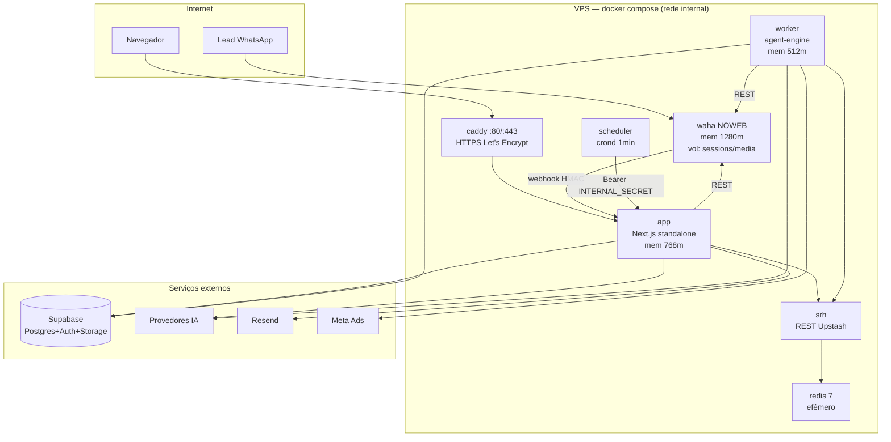

# Deployment e Infraestrutura — DeskcommCRM

> Gerado pelo **Arquiteto** (Reversa) em 2026-09-10 · Nível: **Detalhado**
> 🟢 CONFIRMADO (`docker-compose.prod.yml`, `Dockerfile*`, `.github/workflows/`, `next.config.ts`, `Caddyfile`)

## 1. Topologia self-host (VPS) 🟢

## 2. Imagens Docker 🟢

| Imagem | Dockerfile | Publicação |
|---|---|---|
| `deskcommcrm` (app) | `Dockerfile` | CI (`publish-image.yml`), tags `stable`/`latest` |
| `deskcomm-worker` | `Dockerfile.worker` | CI |
| `deskcomm-scheduler` | `Dockerfile.scheduler` | CI |

**Leis de packaging** (`docs/doctrine/packaging.md`, ADR `docs/adr/0001`):
- Nenhum serviço de `docker-compose.prod.yml` **constrói** na máquina do cliente — todo serviço declara `image:`; `build:` só como escape ao lado.
- **Publicação é ato do CI**, nunca da máquina do dev (build ARM local não roda em VPS amd64).
- Instalação aponta para **número de versão** (`:stable`), nunca tag móvel. `latest` = topo da main.
- Dependência upstream (WAHA) com **tag fixa** (`latest-2026.7.2`), nunca republicada (licenciada).
- Bump de versão não pode exigir que o operador edite arquivo à mão.

## 3. Configuração de runtime 🟢

- **`app` em modo `standalone`** (`next.config.ts`): `output: "standalone"` (exceto na Vercel). `outputFileTracingIncludes` inclui `@swc/helpers` explicitamente (o trace não os pegava → MODULE_NOT_FOUND em runtime).
- **`NEXT_PUBLIC_*` reais vêm em RUNTIME** (`env_file: .env`), lidos pelo browser via `<PublicEnvScript/>` e pelo servidor via `lib/env.ts` — imagem genérica pré-buildada, sem rebuild por cliente.
- **Headers de segurança** (`next.config.ts`): `X-Content-Type-Options`, `X-Frame-Options: DENY`, `Referrer-Policy`, `Permissions-Policy` (microphone=self para PTT).
- **Sentry** via `withSentryConfig` (tunnelRoute `/monitoring`).

## 4. Healthchecks e resiliência 🟢

- **app:** probe TCP puro na 3000 (não `/api/v1/health` — 503 se WAHA/Redis caem derrubaria o Caddy).
- **worker:** `GET /healthz` (:8787) — contagem de `job_queue` + saúde de sessões.
- **redis:** `redis-cli ping`. **Tetos de memória** medidos para o OOM killer isolar a vítima. `restart: unless-stopped` em todos.
- **WAHA:** `WHATSAPP_RESTART_ALL_SESSIONS=True` (retoma sessões pareadas no restart, sem re-QR). Volumes `waha-data` (sessões) e `waha-media` — perder = re-parear.

## 5. CI/CD 🟢

| Workflow | Job | Gate obrigatório na main |
|---|---|---|
| `ci.yml` | `verify` (typecheck+lint+unit) | ✅ |
| `ci.yml` | `invariants` (test:db — RLS/governança em pg efêmero) | ✅ |
| `perf.yml` | `build-and-size` (next build) | ✅ |
| `e2e.yml` | specs Playwright contra Supabase local + baseline | ✅ |
| `publish-image.yml` | `imagens-ok` (3 imagens Docker constroem) | ✅ |
| `release.yml` | corte de release por fragmentos | — |
| `relogio.yml` / `acolhida.yml` | relógio Hobby / acolhida | — |

**Checks obrigatórios** (branch protection): `verify, build-and-size, invariants, e2e, imagens-ok`.

## 6. Proxy reverso alternativo 🟢

`docker-compose.traefik.yml`: para VPS que já tem proxy próprio (Hostinger/Coolify/Dokploy), dá ao container `app` as labels de roteamento. **Todo `up -d` leva os dois arquivos de compose** (`-f prod -f traefik`); esquecer o segundo recria o container sem labels → domínio em 404 com container `healthy` (healthcheck é TCP interno, não sabe de roteamento). Runbook: `docs/runbooks/deploy.md`.

## 7. Persistência e migrations 🟢

- **`supabase/baseline.sql`** = o que o self-host aplica (apêndice idempotente por mudança de schema).
- **`supabase/migrations/*.sql`** (~213) — nunca editar aplicadas; corrigir com migration nova.
- Toda mudança de schema: migration versionada + apêndice no baseline + linha no MANIFEST (os três juntos).

## 8. 🟡 Lacunas

- Provisão do Supabase (gerenciado vs self-hosted) não está no compose de prod — 🔴.
- `hostgator-setup-kit/` (kit de instalação assistida) não lido em detalhe — 🟡.
- Estratégia de backup do Postgres/Storage não confirmada no código lido — 🔴.
