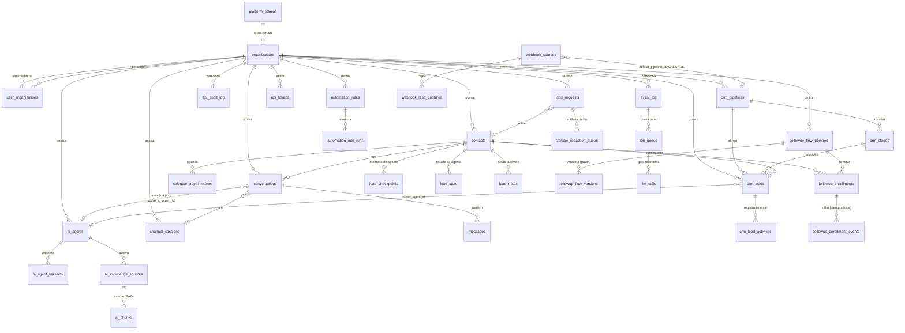

# ERD Completo — DeskcommCRM

> Gerado pelo **Arquiteto** (Reversa) · 🟢 CONFIRMADO (colunas de `lib/database.types.ts` + queries) · 🟡 cardinalidades inferidas
>
> **Nota:** o **Data Master** produzirá o ERD definitivo (constraints, triggers, índices, todas as ~213 migrations).
> Este ERD cobre as entidades de domínio centrais e seus relacionamentos observados no código.

## Entidades e chaves 🟢

Ver colunas detalhadas em `data-dictionary.md`. Destaques de FK/cardinalidade:

| Relacionamento | Cardinalidade | FK / Notas |
|---|---|---|
| organization → * | 1:N | `organization_id` em toda tabela tenant-aware (RLS) |
| pipeline → stages | 1:N | `crm_stages.pipeline_id` |
| pipeline ← leads | 1:N | `crm_leads.pipeline_id` (ON DELETE RESTRICT) |
| stage ← leads | 1:N | `crm_leads.stage_id` (ON DELETE RESTRICT) |
| contact → leads | 1:N | `crm_leads.contact_id` (1 lead aberto por vez, N no histórico) |
| conversation → messages | 1:N | `messages.conversation_id`; `unique(org, external_id)` |
| agent → versions | 1:N | `ai_agent_versions.agent_id` |
| knowledge_source → chunks | 1:N | `ai_chunks` (versionado) |
| pointer → versions | 1:N | `followup_flow_versions` (graph jsonb) |
| pointer ← enrollments | 1:N | 1 enrollment vivo por lead/org |
| enrollment → events | 1:N | `idempotency_key` |
| webhook_source → pipeline | N:1 | `default_pipeline_id` (ON DELETE **CASCADE** — apagar funil apagaria a fonte) |
| lgpd_request → storage_redaction_queue | 1:N | `unique(bucket, object_path)` |

## Cardinalidades notáveis 🟢

- **contact 1:N crm_leads:** um lead ABERTO por contato, mas N no histórico (uma demanda por vez).
- **conversation N:1 channel_session:** a conversa acontece por uma sessão de número.
- **crm_lead N:1 ai_agent (owner_agent_id):** o negócio pode ter dono agente ou humano (`owner_kind`).

## 🔴 Lacunas

- FKs exatas, `ON DELETE`, índices parciais e triggers vêm das migrations — Data Master.
- Tabelas auxiliares não mapeadas aqui (ex.: `before_send_traces`, `send_ledger`, `cron_jobs`, `flywheel_*`, `demandas`/`demanda_conversas`, `orders`, `platform_support_sessions`, `platform_branding`, `attendant_availability`) — ver `data-dictionary.md`.
