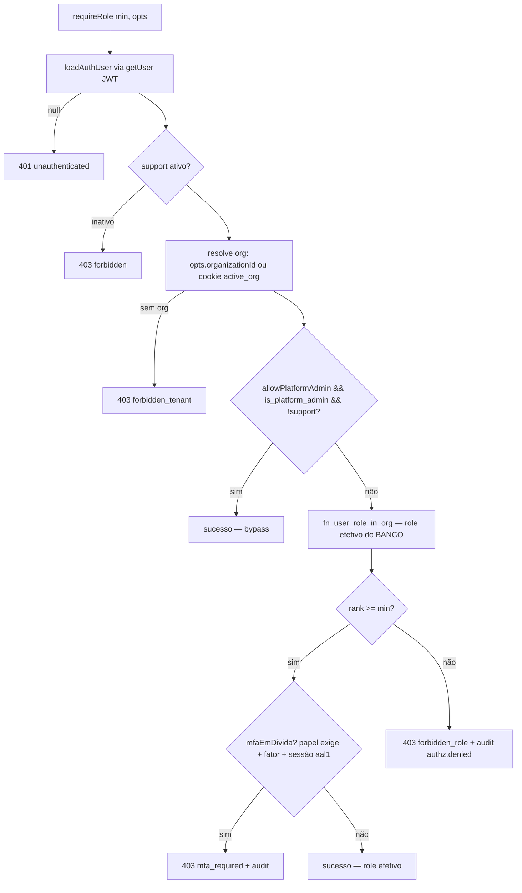
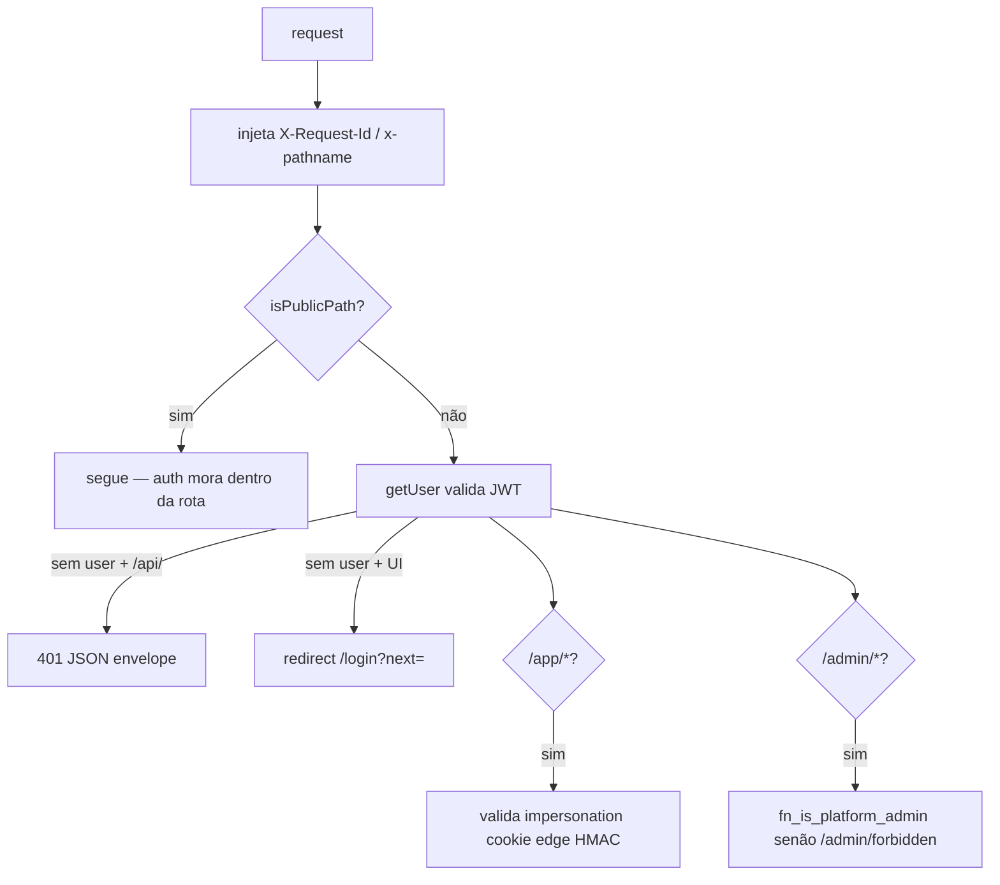
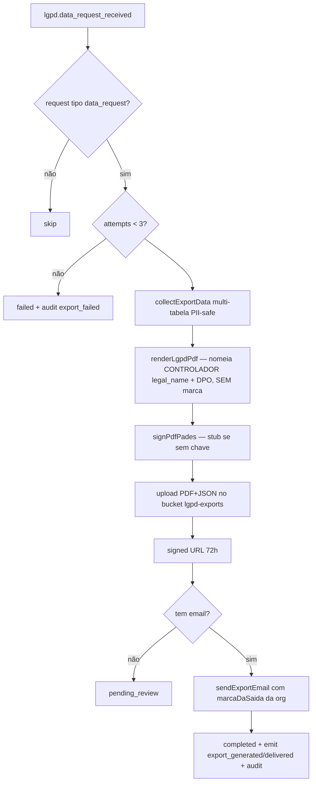
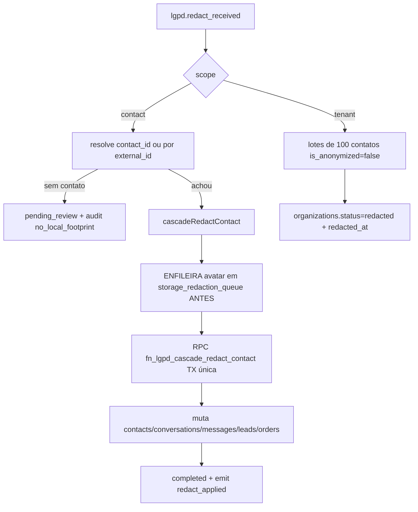

# Fluxograma — Autorização (RBAC) e LGPD

> Gerado pelo **Arqueólogo** · Módulos: `lib/auth/require-role.ts`, `proxy.ts`, `lib/lgpd/` 🟢

## `requireRole` — gate canônico de rota

## Auth de borda (`proxy.ts`)

## LGPD — export (Art. 18 II)

## LGPD — redação (cascata)

**Invariante crítica:** o avatar é enfileirado ANTES de zerar o ponteiro — senão a imagem fica órfã no bucket ("mesmo que não ter anonimizado"). Falha ao enfileirar aborta a cascata (fail-closed).
