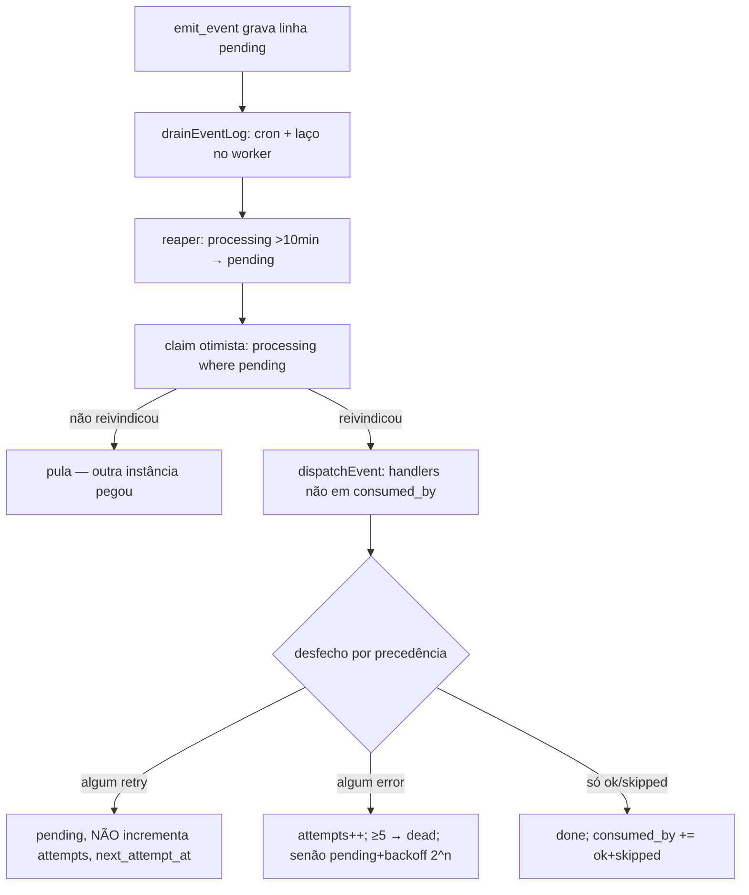
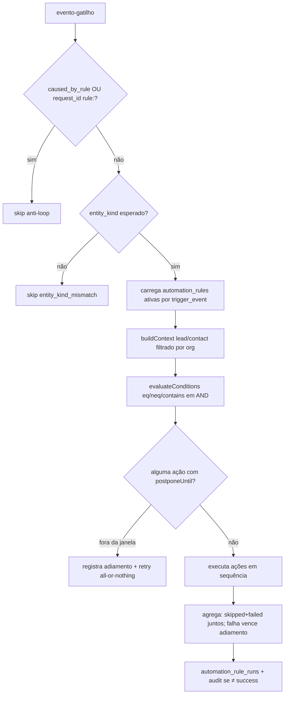
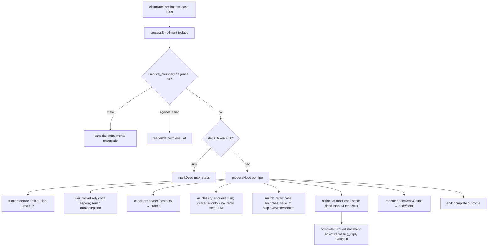
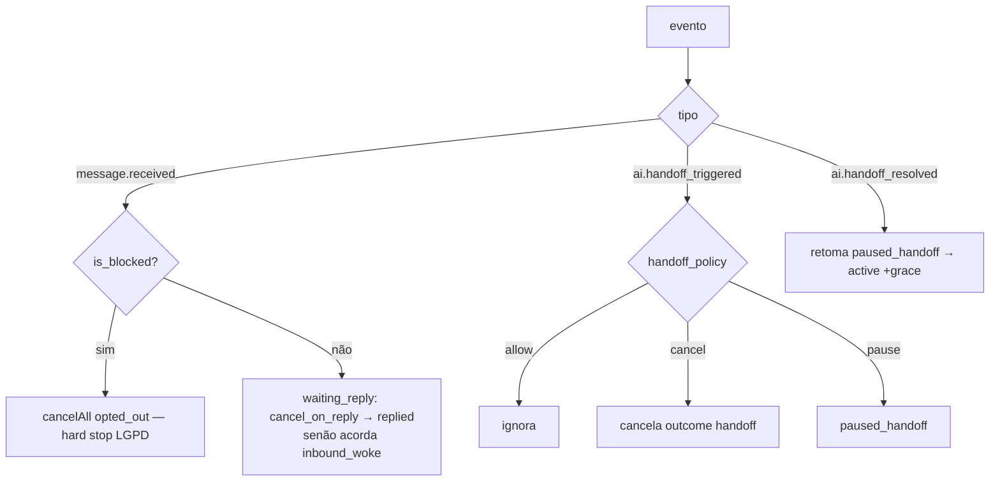

# Fluxograma — Follow-up, automação e barramento de eventos

> Gerado pelo **Arqueólogo** · Módulos: `lib/followup/`, `lib/automation/engine.ts`, `lib/event-log/` 🟢

## Barramento de eventos (`event_log` drain)

**15 handlers em ordem deliberada:** `followupReactivity` (antes do LLM), aiResponse, aiSentiment, aiHandoffFromSentiment, ragIndexer, lgpdExport, lgpdRedact, automationRules, followupGatilhoEtapa/Caso/Presenca, mediaPersist/Derive, webPushInbound, `conversaoDeVenda` (por último — não pode segurar quem escreve no banco).

## Motor de automação (`runAutomationForEvent`)

## Máquina de follow-up (`processNode`)

## Reatividade do follow-up (`applyReactivityEvent`)

**Outcomes:** `converted | replied | exhausted | opted_out | handoff`. `conversion_rate = converted / terminal` (terminal = completed+cancelled; `dead` excluído — é falha de infra).
