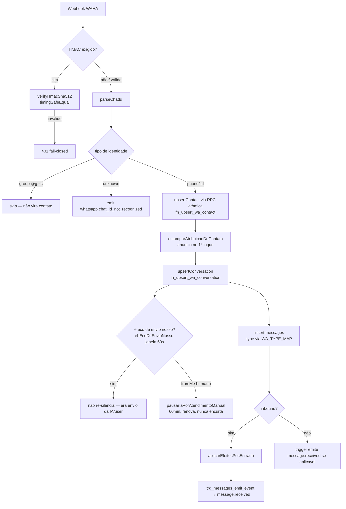
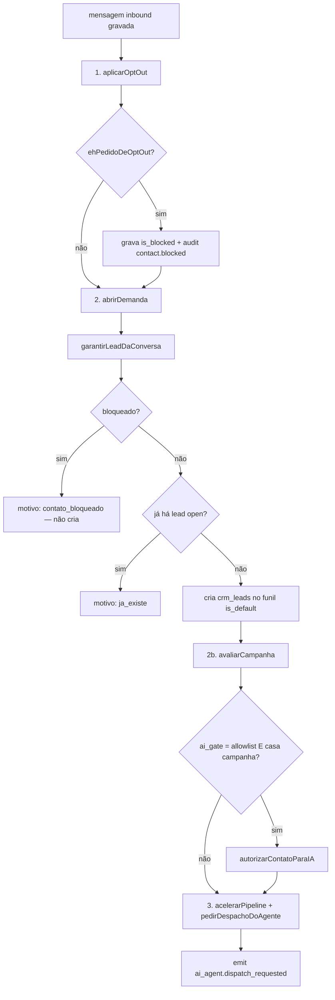

# Fluxograma — Ingestão de mensagem (WhatsApp → CRM)

> Gerado pelo **Arqueólogo** · Módulo: `lib/waha/ingest.ts` + `lib/channels/pos-entrada.ts` 🟢

## Visão geral do fluxo

## `aplicarEfeitosPosEntrada` — a ordem é regra de negócio

**Invariante:** cada passo falha "para dentro" (log estruturado), NUNCA lança — uma exceção viraria 500 para o provider e uma tempestade de reentregas. Inverter opt-out↔lead faria quem pediu para sair virar oportunidade no funil.
