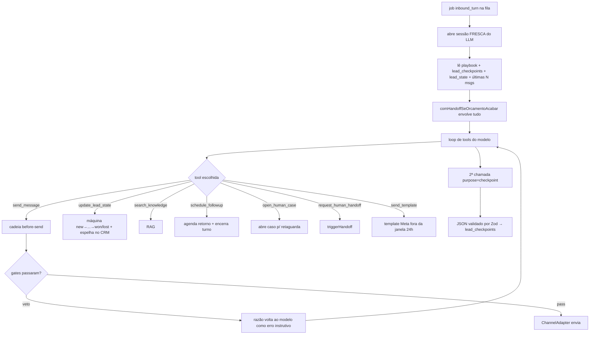
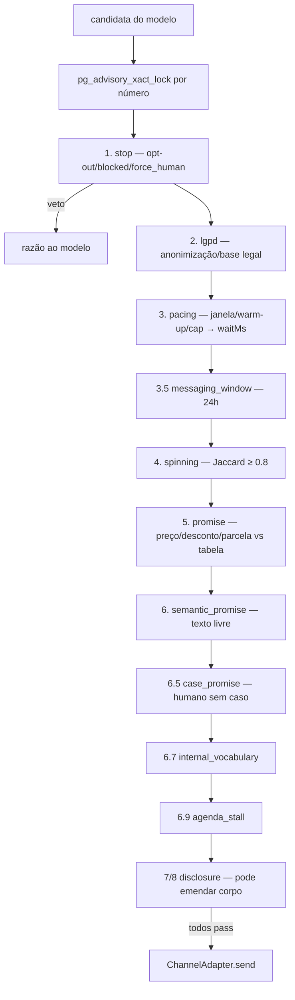
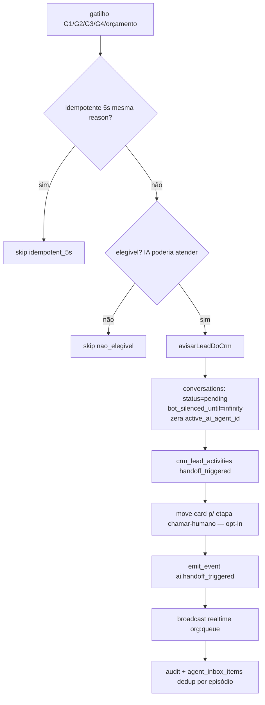

# Fluxograma — Turno do agente de IA e guardrails de saída

> Gerado pelo **Arqueólogo** · Módulos: `lib/agent-engine/agent/inbound-turn.ts` + `guardrails/before-send.ts` 🟢

## Turno do agente rico (`inbound_turn`)

**Regras duras:** texto direto do modelo nunca vira mensagem (só `send_message`). Orçamento estourado em QUALQUER chamada (mesmo `classifyStage`) devolve à fila humana. Teto `DEFAULT_MAX_SENDS_PER_TURN=3`.

## Cadeia `before-send` (ordem versionada v6)

**Defaults assimétricos:** `internalVocabularyEnforced` ausente = DESARMADO; `spinningEnforced` ausente = ARMADO; `messagingWindow` ausente = FECHADA. Cada veredito vira linha em `before_send_traces` (auditável por run).

## Handoff bot→humano (`triggerHandoff`)

