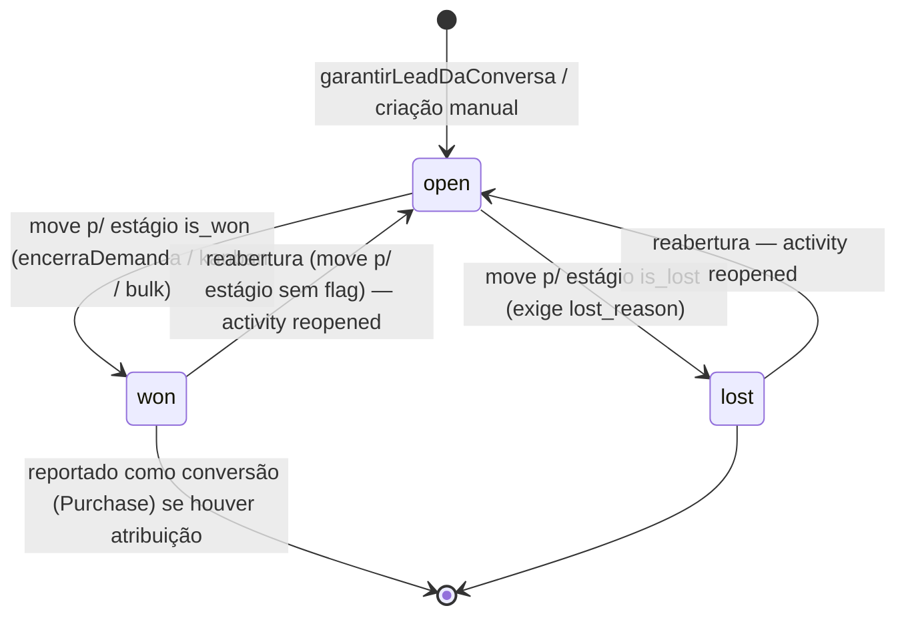
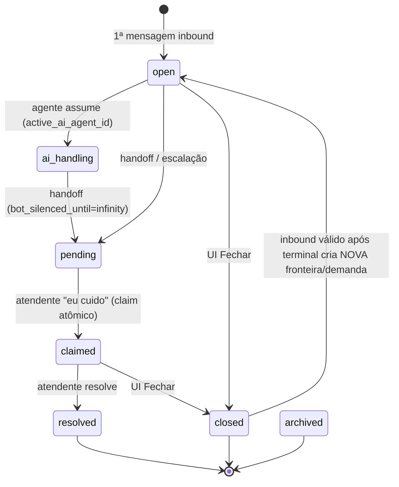
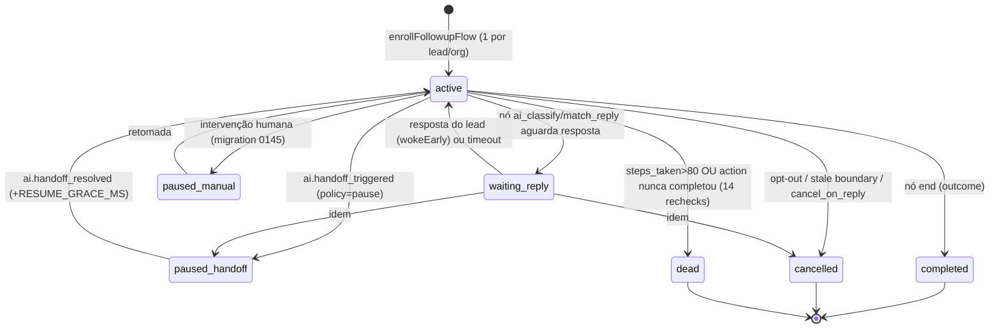
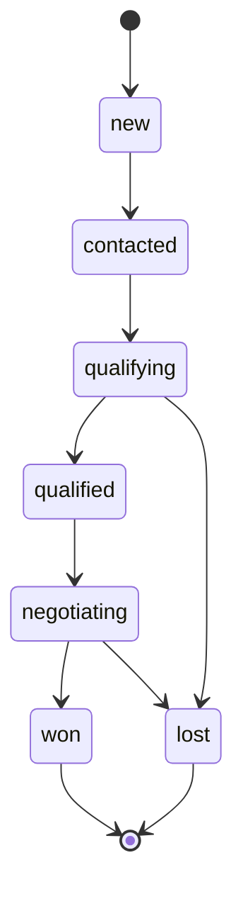
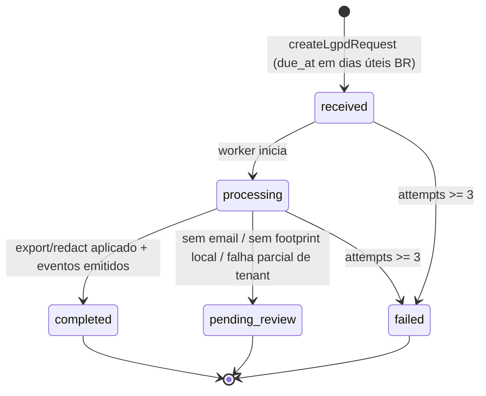
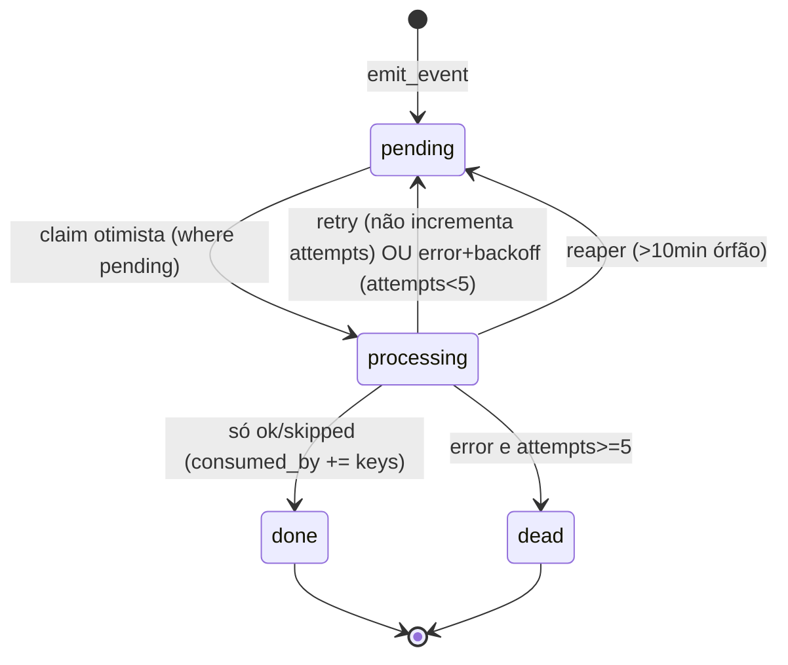
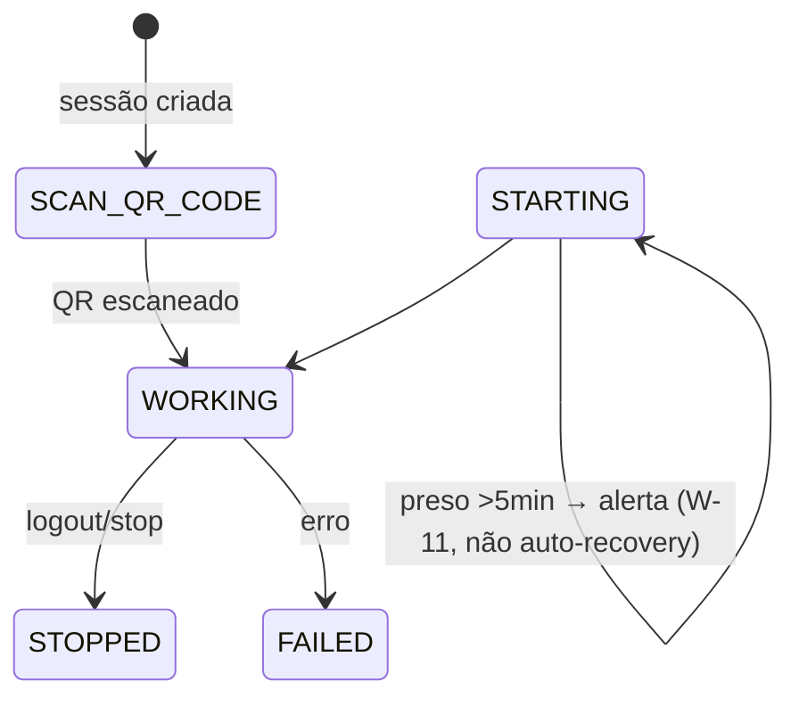
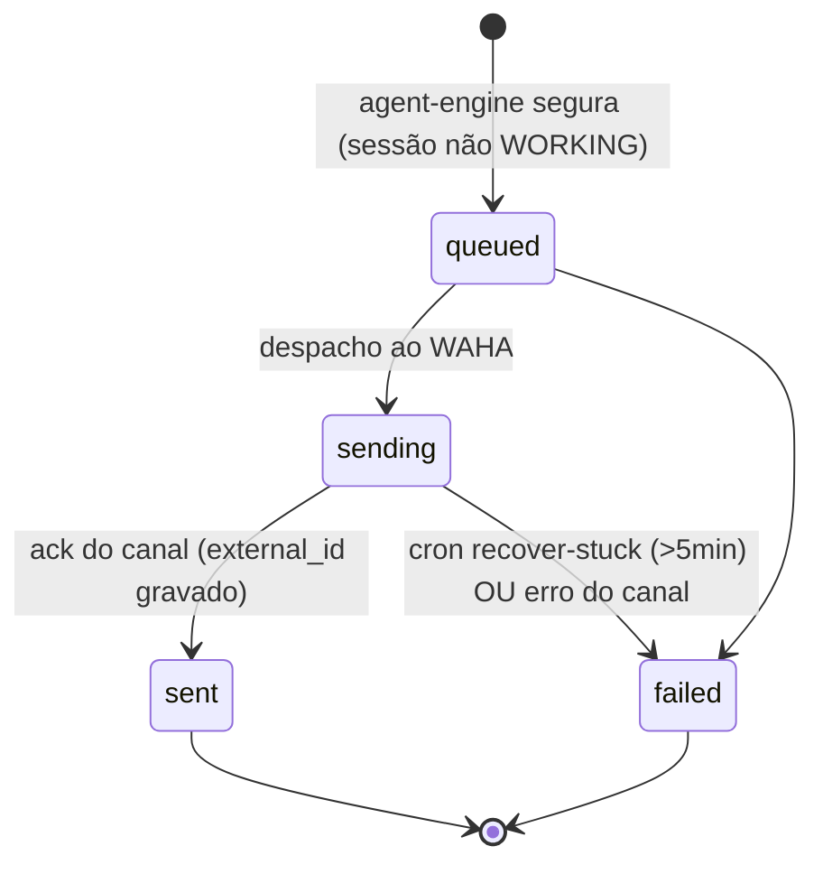

# Máquinas de Estado — DeskcommCRM

> Gerado pelo **Detetive** (Reversa) em 2026-09-10 · Nível: **Detalhado**
> 🟢 CONFIRMADO no código · 🟡 INFERIDO · 🔴 LACUNA

---

## 1. `crm_leads.status` — negócio/demanda 🟢

Estados: `open`, `won`, `lost`. Status e `closed_at` são escritos pelo trigger `fn_crm_lead_close_on_stage` ao mover para estágio com flag — nunca à mão (`encerramento.ts`, regra P-02).

**Regras:** `lost` exige `lost_reason` (P-03, 422). Reabertura é auditada (P-04). Encerrar é idempotente (`jaEstava`). Lead `won` com atribuição de anúncio dispara `conversaoDeVendaHandler`.

---

## 2. `conversations.status` — conversa 🟢/🟡

Vocabulário (regra AT-01): `open`, `pending`, `ai_handling`, `claimed`, `closed`, `resolved`, `archived` (os 3 últimos terminais).

**Silêncio do bot** (`bot_silenced_until`): `infinity` = handoff formal (nunca reassume); prazo finito = pausa por atendimento manual (60min, renova, nunca encurta maior). `service_revision` avança ao tocar estado terminal ou trocar de demanda (migration 0222). 🟡 alguns estados intermediários (`ai_handling`/`claimed`) inferidos do vocabulário do catálogo.

---

## 3. `followup_enrollments.status` — follow-up 🟢

**Outcomes** (só em terminais): `converted | replied | exhausted | opted_out | handoff`. **terminal** (denominador de conversão) = `completed + cancelled`; `dead` é excluído (falha de infra). `completeTurnForEnrollment` só avança se status ∈ {active, waiting_reply} (lista positiva — turno stale não sobrescreve intervenção humana).

---

## 4. `lead_state.stage` — funil interno do agente 🟢

Máquina de qualificação BANT que o agente marca via `update_lead_state` (só o próximo estágio válido; regressão rejeitada). Espelhada no CRM via `agent_stage_hint`.

**Ponte para o funil do tenant** (`agent-stage-sync.ts`): o passo do agente → estágio nomeado via `crm_stages.agent_stage_hint`. `sem_mapeamento` não move (não inventa semântica); trava otimista impede atropelar movimento humano (`conflito_humano`).

---

## 5. `lgpd_requests.status` — pedido LGPD 🟢

**Tipos:** `data_request` (export), `redact`, `store_redact`. **Scope:** `contact` | `tenant`. Redação de tenant marca `organizations.status='redacted'`.

---

## 6. `event_log.status` — barramento de eventos 🟢

**Precedência de desfecho:** retry > error > sucesso. Backoff exponencial `2^n` min. `consumed_by` garante idempotência de retry por handler.

---

## 7. `channel_sessions.status` — sessão WhatsApp 🟡

Estados do WAHA repassados: `WORKING`, `SCAN_QR_CODE`, `STARTING`, `STOPPED`, `FAILED` (entre outros). 🟡 vocabulário do WAHA, não enum próprio.

**W-11:** sessão presa em `STARTING` >5min gera alerta + escala (não tenta auto-recovery — perder sessão em silêncio é pior). O watchdog reconcilia `channel_sessions` × WAHA e redirige `queued`.

---

## 8. `messages.status` — mensagem 🟢

**W-12:** `sending` >5min vira `failed` (cron); `queued` não entra (tem dono — o engine reagenda por `SEND_QUEUED_RETRY_MS`).
